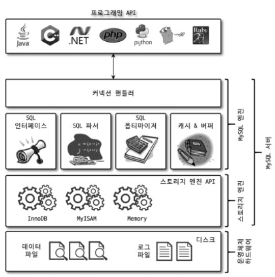
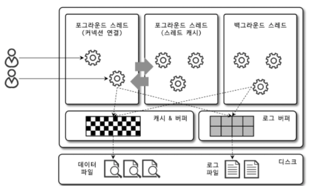
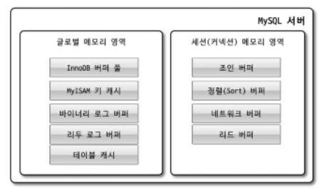
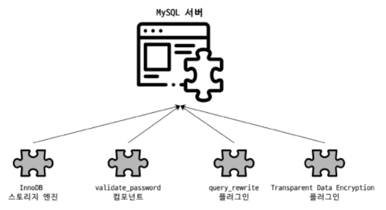
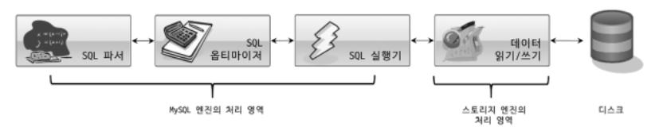
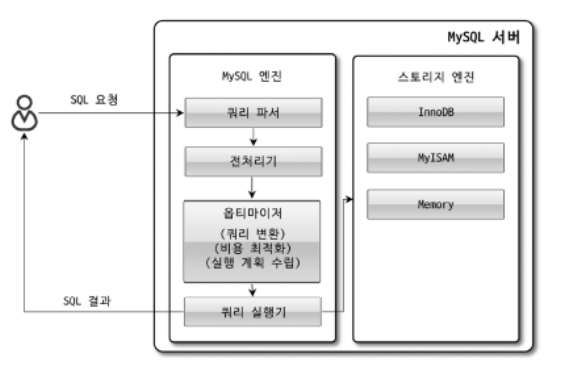
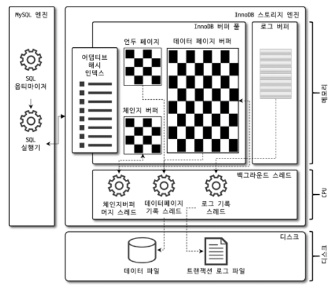
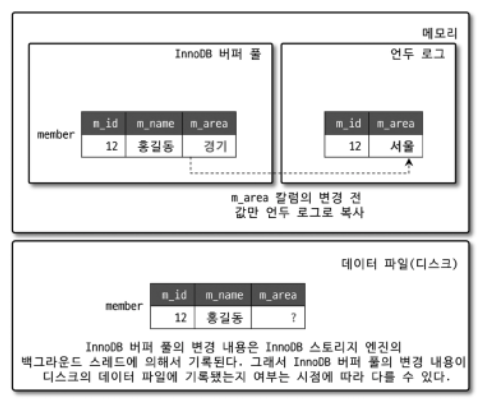
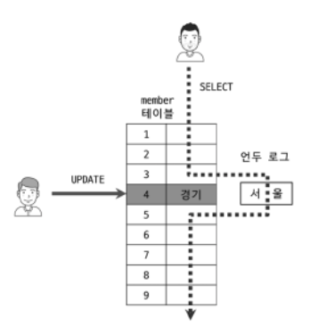

# 4. 아키텍처

- MySQL 서버는 사람의 머리 역할을 담당하는 MySQL엔진과 손발 역할을 담딩하는 스토리지 엔진으로 구분
- mysql 엔진과 mysql 서버에서 기본적으로 제공되는 InnoDB 스토리지 엔진과 MyISAM 스토리지 엔진을 알아보자.

## 4.1 MySQL엔진 아키텍처

- 그림으로 훑어보면 아래와 같다.

</img>

- mysql은 대부분의 프로그래밍 언어로 접근 가능

### 4.1.1.1 MySQL엔진

MySQL엔진은 클라이언트로부터의 접속 및 쿼리요청을 처리하는 커넥션 핸들러와 SQL파서 및 전처리기, 쿼리의 최적화된 실행을 위한 옵티마이저가 중심을 이룬다. 또한 MySQL은 표준 SQL(ANSI SQL) 문법을 지원하기 때문에 표준문법에 따라 작성된 쿼리는 타 DBMS와 호환되어 실행될 수 있다.

### 4.1.1.2 스토리지 엔진

MySQL 엔진은 요청된 SQL 문장을 분석하거나 최적화하는 등 DBMS의 두뇌에 해당하는 처리를 수행하고, 실제 데이터를 디스크 스토리지에 저장하거나 디스크 스토리지로부터 데이터를 읽어오는 부분은
스토리지엔진이 전담한다. MySQL서버에서 **MySQL엔진은 하나지만 스토리지 엔진은 여러개**를 동시에 사용할 수 있다. 다음 예제와 같이 테이블이 사용할 스토리지엔진을 지정하면 이후 해당 테이블의 모든 읽기 작업이나 변경작업은 정의된 스토리지 엔진이 처리한다.

> mysql > CREATE TABLE test_tb (fd1 INT, fd2 INT) ENGINE=INNODB;

위 test_tb는 InnoDB 스토리지엔진을 사용하도록 정의. 이제 test_tb에 대해 INSERT, UPDATE, DELETE, SELECT 등의 작업이 발생하면 InnoDB 스토리지엔진이 작동.
그리고 각 엔진은 성능 향상을 위해 키 캐시(MyISAM)나 InnoDB 버퍼풀(InnoDB)과 같은 기능을 내장함

### 4.1.1.3 핸들러 API

핸들러 API : MySOL 엔진의 쿼리 실행기에서 데이터를 쓰거나 읽어야 할 때는 각 스토리지 엔진에 쓰기 또는 읽기를 요청하는데, 이러한 요청을 핸들러(Handler) 요청이라하고, 여기서 사용되는 API를 말한다.

## 4.1.2 MySQL 스레딩 구조

</img>그림4.2

- mysql 서버는 프로세스 기반이 아닌 스레드 기반으로 작동.
- 크게 포그라운드(foreground) 스레드, 백그라운드(background) 스레드로 구분.

### 4.1.2.1 포그라운드 스레드(클라이언트 스레드)

- 포그라운드 스레드는 최소 mysql 서버에 접속한 클라이언트의 수만큼 존재하며 클라이언트가 요청하는 쿼리문을 처리.
- 클라이언트가 사용을 종료하면 스레드는 스레드 캐시로 돌아간다.
- 포그라운드 스레드는 데이터를 MySQL의 데이터 버퍼나 캐시로부터 가져오며, 버퍼나 캐시에 없는경 우에는 직접디스크에서 가져와서 작업을 처리.
- MYISAM 테이블 : 디스크 쓰기도 포그라운드 쓰레드가
- InnoDB 테이블 : 데이터 버퍼나 캐시까지만 포그라운드가, 버퍼로부터 디스크까지 기록 작업은 백그라운드가 한다.

> mysql에서 사용자 스레드와 클라이언트 스레드는 같은 의미로 사용됨. mysql 서버에서 접속하면 mysql 서버는 그 클라이언트의 요청을 처리해줄 스레드를 생성해 그 클라이언트에게 할당. 이 스레드는 DBMS 앞단에서 클러이언트와 소통한다.

### 4.1.2.2 백그라운드 스레드

- MYISAM과 달리 **InnoDB**는 다음과 같이 여러 작업을 백그라운드 스레드가 담당한다.

  - insert 버퍼를 병합하는 스레드
  - **로그를 디스크로 기록**
  - **InnoDB의 버퍼 풀의 데이터를 디스크에 기록**
  - 데이터를 버퍼로 읽어옴
  - 잠금이나 데드락을 모니터링

- 사용자의 요청 처리 중에 **쓰기 작업은 지연될 수 있지만 읽기 작업은 지연될 수 없음.**
- 하여 대부분의 DBMS는 대부분 쓰기 작업을 버퍼링해서 일괄 처리함(InnoDB 역시 이 방식, MYISAM은 이 방식X)
- 해서 InnoDB는 INSERT, UPDATE, DELETE 쿼리로 데이터가 변경되는 경우 데이터가 디스크의 파일로 완전히 저장할때까지 기다리지 않아도 된다.

## 4.1.3 메모리 할당 및 사용 구조

</img> 그림 4.3

- mysql에서 메모리 공간은 크게 글로벌 영역과 로컬 메모리 영역으로 나뉨
- 글로벌 메모리 영역은 mysql 서버가 시작되면서 운영체제로부터 할당받음
- 글로벌 메모리 영역과 로컬 메모리 영역은 mysql 서버 내에 존재하는 스레드가 공유해서 사용하는 공간인지 여부에 따라 구분된다.

### 4.1.3.1 글로벌 메모리 영역

- 클라이언트 스레드의 수와 무관하게 하나의 메모리 공간만 할당됨
- 모든 스레드에 의해 공유됨
- 대표적인 글로벌 메모리 영역은 다음과 같음

  - 테이블 캐시
  - innoDB 버퍼 풀
  - innoDB 어댑티브 해시 인덱스
  - innoDB 리두 로그 버퍼

### 4.1.3.2 로컬 메모리 영역 (세션 메모리 영역)

- 클라이언트 스레드가 쿼리를 처리하는데 사용하는 메모리 영역 (대표적으로 커넥션 버퍼, 정렬 버퍼가 있음)
- 클라이언트 스레드가 사용하는 메모리 공간이라고 해서 **클라이언트 메모리 영역**이라고도 한다.
- 클라이언트와 MySQL 서버와의 커넥
  션을 세션이라고 하기 때문에 로컬 메모리 영역을 **세션 메모리 영역**이라고도 표현한다
- 로컬 메모리는 각 클라이언트 스레드 별로 할당되며 공유하지 않음
- 대표적인 로컬 메모리 영역은 다음과 같음

  - 정렬 버퍼
  - 조인 버퍼
  - 바이너리 로그 캐시
  - 네트워크 버퍼

## 4.1.4 플러그인

</img> 그림 4.4

- 플러그인해서 사용할수 있는 것은 스토리지 엔진 전문 검색 엔진을 위한 검색어파서(인덱싱할 키워드를 분리해 내는
  작업), 사용자의 인증을 위한 Native Authentication 과CachingSHA-2Authentication등도 모두 플러그인으로 구현되어 제공

- MySQL에서 쿼리가 실행되는 과정을 크게 그림4. 5와 같이 나눈다면 거의 대부분의 작업이 MysQL 엔진에서 처리되고,마지막'데이터읽기/쓰기' 작업만 스토리지 엔진에 의해 처리된다 -> 즉 mysql의 스토리지 엔진을 바꾸는 것은 DBMS의 일부의 기능만 수정된다는 의미

  </img> 그림 4.5

> MySQL의 핸들러란?  
> MySQL 엔진이 각 스토리지 엔진에게 데이터를 읽어오거나 저장하도록 명령하려면 반드시 핸들러를 통해야한다

- GROUP BY나 ORDER BY 등과 같은 복잡한 처리는 스토리지 엔진 영역이 아닌 MYSQL 엔진의 처리 영역인 '쿼리 실행기'에서 처리됨

> 하나의 쿼리 작업은 여러 하위 작업으로 나뉘는데,
> 각 하위 작업이 MySQL 엔진영역에서 실행되는지, 스토리지 엔진 영역에서 실행되는지 알아야한다.

## 4.1.5 컴포넌트

MySQL은 플러그인의 단점을 보완하기 위해 컴포넌트를 제공한다.

## 4.1.6 쿼리 실행 구조

</img> 그림 4.6

위 그림은 쿼리 실행을 간략하게 나타낸것임. 다음과 같이 기능별로 나눠볼 수 있음.

### 4.1.6.1 쿼리 파서

쿼리 파서는 들어온 쿼리 문장을 토큰으로 분리해 트리 형태의 구조로 만들어낸다. 쿼리 문장의 기본 문법 오류는 여기서 발견되고 사용자에게 오류 메시지를 전달한다.

### 4.1.6.2 전처리기

파서 과정에서 만들어진 트리를 기반으로 쿼리 문장에 구조적인 문제점이 있는지 확인. 각 토큰을 테이블 이름, 내장 함수와 같은 개체를 매핑해 해당 객체의 존재 여부와 객체의 접근 권한을 확인. 실제 존재하지 않거나 권한상 사용할 수 없는 개체의 토큰은 이 단계에서 걸러짐.

### 4.1.6.3 옵티마이저

사용자의 요청으로 들어온 쿼리 문장을 저렴한 비용으로 가장 빠르게 처리할지를 결정. DBMS의 두뇌. 옵티마이저의 역할은 매우 중요하다.

### 4.1.6.4 실행 엔진

옵티마이저가 두뇌라면 실행 엔진은 손과 발.  
옵티마이저 - 회사 경영진  
실행 엔진 - 중간 관리자  
핸들러 - 각 업무의 실무자

옵티마이저가 GROUP BY를 처리하기 위해 임시 테이블을 사용하기로 결정한 예시는 다음과 같다.

1. 실행 엔진이 핸들러에게 임시 테이블을 만들라고 명령
2. 다시 실행 엔진은 WHERE 절에 일치하는 레코드를 가져오라고 핸들러에세 요청
3. 읽어온 레코드들을 1번에서 준비한 임시 테이블로 저장하도록 핸들러에게 요청
4. 데이터가 준비된 임시 테이블에서 필요한 방식으로 데이터를 읽어오라고 핸들러에게 요청
5. 최종적으로 실행엔진은 결과를 사용자나 다른 모듈로 넘김

--> 실행 엔진은 만들어진 계획대로 각 핸들러에게 요청해서 받은 결과를 또 다른 핸들러 요청의 입력으로 연결

### 4.1.6.5 핸들러(스토리지 엔진)

핸들러는 MySQL 서버의 가장 밑단에서 MySQL 실행 엔진의 요청에 따라 데이터를 디스크로 저장하고 읽어오는 역할을 한다.  
핸들러는 결국 스토리지 엔진을 의미한다.

## 4.1.7 복제

MySQL에서 복제는 매우 중요한 역할을 담당한다. 이는 별도의 장에서 다루도록 한다.

## 4.1.8 쿼리 캐시

- 쿼리 캐시는 SQL의 실행 결과를 메모리에 캐시하고
- 동일SQL 쿼리가 실행되면 테이블을 읽지 않고 즉시 결과를 반환하기 때문에 매우 빠른 성능을 보였다.
- 그러나! 쿼리 캐시는 테이블의 데이터가 변경되면 캐시에 저장된 결과중 변경된 테이블과관련된 것들은모두삭 제(Invalidate)해야함!
- 이는 심각한 동시 처리성능 저하와 버그를 유발한다
- 결국 MySOL 8.0으로 올라오면서 쿼리 캐시는 MySOL서버의 기능에서 완전히 제거됨

## 4.1.9 스레드 풀

MySOL 엔터프라이즈 에디션은 스레드풀(Thread Pool) 기능 O, MySOL 커뮤니티 에디션은 스레드풀 기능 X
해서 Percona Server에서 제공하는 스레드풀 기능을 살펴볼 것임.
Percona Server의 스레드풀은 플러그인 형태로 작동하게 구현되어있음
커뮤니 티에디션에서도 스레드풀 기능을 사용하고자 한다면 동일버전의 Percona Server에서 스레드풀 플러그인 라이브러리(thread_pool.so파일)를 MySQL 커뮤니티 에디션 서버에 설치(INSTALPLLUGIN명령)해서 사용

- 스레드풀은 내부적으로 사용자의 요청을 처리하는 스레드 개수를 줄여서 동시 처리되는 요청이 많다 하더라도 MySOL 서버의 CPU가 제한된 개수의 스레드 처리에만 집중할 수 있게 해서 서버의 자원소모를 줄이는 것이 목적
- 그런데 스레드 풀이 서비스에 유의미한 성능향상을 보여주는 경우는 드물다.
- 물론 제한된 수의 스레드만으로 CPU가 처리하도록 적절히 유도한다면 CPU의 프로세서 친화도(Processor affinity도 높이고 운영체제 입장에서는 불필요한 컨텍스트스위치(Context switch)를 줄여서 오버헤드를 낮출수 있다.

## 4.1.10 트랜잭션 지원 메타데이터

데이터베이스 서버에서 테이블의 구조정보와 스토어드프로 그램 등의 정보를 데이터 딕셔너리 또는 메타데이터라고 한다.

- MySQL 8.0 버전부터 테이블의 구조 정보나 스토어드 프로그램의 코드 관련 정보를 모두 InnoDB의 테이블에 저장.
- MySQL 서버가 작동하는 데 기본적으로 필요한 테이블들(시스템 테이블)을 모두 InnoDB 스토리지 엔진을 사용하는 것이다.
- 시스템 테이블과 데이터 딕셔너리 정보들을 모두 모아서 mysql DB에 저장하는데, 이는 mysql.ibd라는 이름의 테이블스페이스에 저장됨. 해서 \*.ibd 파일은 주의해서 다뤄야함

# 4.2 InnoDB 스토리지 엔진 아키텍처

InnoDB는 MySQL의 스토리지 엔진 중 유일하게 레코드 기반의 잠금을 지원하며, 이 때문에 높은 동시성 처리가 가능하며 안정적이고 성능이 뛰어나다
(아래 그림은 InnoDB의 대략적인 구조)

</img> 그림 4.9

### 4.2.1 프라이머리 키에 의한 클러스터링

- InnoDB의 모든 테이블들은 기본적으로 **프라이머리 키를 기준**으로 클러스터링되어 저장됨. 즉 프라이머리 키 값의 순서대로 디스크에 저장됨.
  - 모든 세컨더리 인덱스는 레코드의 주소 대신 프라이머리 키의 값을 논리적인 주소로 사용한다.
  - 프라이머리 키가 클러스터링 인덱스이기 때문에 프라이머리 키를 이용한 레인지 스캔은 매우 빠르다.
  - 결과적으로 쿼리의 실행 계획에서 프라이머리 키는 기본적으로 다른 보조 인덱스에 비해 비중이 높게 설정(쿼리의 실행계획에서 다른 보조 인덱스보다 프라이머리키가 선택될 확률이 높음)된다.

### 4.2.2 외래 키 지원

- 외래 키는 InnoDB 스토리지 엔진 레벨에서 지원하는 기능으로 MyISAM이나 MEMORY 테이블에서는 사용할 수 없다.
- 외래 키는 데이터베이스 서버 운영의 불편함 때문에 서비스용 데이터베이스에서는 생성하지 않는 경우가 있다.
- InnoDB에서 외래키는 부모 테이블과 자식테이블 모두 해당 칼럼에 인덱스 생성이 필요 -> 변경시에는 반드시 부모 테이블이나 자식 테이블에 데이터가 있는지 체크하는 작업이 필요 ->
  잠금이 여러 테이블로 전파 ->
  그로인해 데드락이 발생할 때가많음
- 수동으로 데이터를 적재하거나 스키마 변경 등의 관리 작업이 실패할 수 있다.
- 이런 경우에는 임시로 **foreign_key_checks** 시스템 변수를 0FF로 설정하면 외래키 관계에대한 체크 작업을 일시적으로 멈출수 있다.

  > mysql> SET foreign_key_checks=OFF;  
  > ...  
  > ... 작업 실행  
  > ...  
  > mysql> SET foreign_key_checks=ON;

- 외래키 체크를 일시적으로 중지한 상태에서 외래키 관계를 가진 부모테이블의 레코드를 삭제했다면 반드시 자식테이블의 레코드도 삭제해서 일관성을 맞춰준 후 다시 외래키 체크기능을 활성화해야한다.
- foreign_key_checks가 비활성화되면 외래키 관계의 부모 테이블에 대한 작업(ON DELETE CASCADE와 ON UPDATE CASCADE 옵션)도 무시하게 된다.

> 참고
> foreign_key_checks 시스템 변수는 적용 범위를 GLOBAL과 SESSION 모두로 설정 가능한 변수다. 그래서 이런 작업을 할때는 반드시 현재 실행하는 세션에서만 외래 키 체크 기능을 멈추게 해야한다.  
> mysql> SET foreign_key_checks=OFF; //GLOBAL  
> mysql> SET SESSION foreign_key_checks=OFF; //SESSION

### 4.2.3 MVCC(Multi Version Concurreny Control)

일반적으로 레코드 레벨의 트랜잭션을 지원하는 DBMS가 제공하는 기능.  
MVCC의 목적은 잠금을 사용하지 않는 일관된 읽기를 제공하는 것.  
InnoDB는 언두로그(Undo Log)를 이용해 이 기능을 구현함.
멀티 버전이라 함은 하나의 레코드에 대해 여러 개의 버전이 동시에 관리된다는 의미.

> Undo log  
> update나 delete와 같은 쿼리를 사용하여 데이터를 변경했을 때, 변경 전의 데이터를 보관해두는 곳이다.
> update 문을 실행시키고 commit를 하면 테이블의 데이터를 수정하기 전에 undo log에 update 이전의 데이터를 보관한다.
> 그리고 나서 테이블을 update한다. 만약 commit이 아닌 rollback을 한다면 undo log에 있는 데이터를 테이블 레코드에 덮어쓴다.

> 버퍼 풀  
> InnoDB가 엑세스할 때, 테이블 및 인덱스 데이터를 캐시하는 메인 메모리 영역. 즉 자주 사용하는 데이터를 메모리에서 직접 처리할 수 있도록하여 처리 속도를 높인다.

이해를 위해 격리 수준이 READ_COMMITED인 mysql 서버에서 InnoDB 스토리지 엔진을 사용하는 테이블의 데이터 변경을 어떻게 처리하는지 그림으로 살펴보자.

MEMBER (id-pk, name, area)와 같은 테이블이 있을 때 아래와 같은 insert 문을 실행시켰다고 해보자.

> mysql> INSERT INTO member(id, name, area) values (12, "홍길동", "서울");  
> mysql> commit;

위 insert문이 실행되면 데이터베이스의 상태는 아래 그림 4.10과 같을 것이다.  
</img> 그림 4.10

이제 아래와 같은 UPDATE문을 실행하면 그림 4.11과 같을 것이다.

> mysql > UPDATE member SER area = "경기" where id = 12;

</img> 그림 4.11

- update 문이 실행되면 커밋여부와 관계없이 InnoDB의 버퍼 풀은 새로운 값인 "경기"로 변경
- 디스크의 데이터 파일에는 체크 포인트나 InnoDB의 Write 스레드에 의해 새로운 값으로 업데이트되어 있을 수도 아닐 수도.
- 그런데 일반적으로 InnoDB가 ACID를 보장하기 때문에 InnoDB의 버퍼풀과 데이터 파일을 같은 상태라고 생각해도 무방.
- **commit 이나 rollback 되지 않을 상태에서 다른 사용자가 아래 쿼리로 작업중인 레코드를 조회하면 버퍼 풀과 데이터 파일 중 어느 곳에서 데이터를 조회할까??**
  - 정답은 mysql의 시스템 변수에 설정된 격리 수준에 따라 다르다.
  - READ_UNCOMMITED :InnoDB의 버퍼풀이 현재 가지고 있는 변경된 데이터를 읽어서 반환
  - READ_COMMITED(REPEATABLE_READ, SERIALIZABLE)인 경우에는 아직 커밋되지 않았기 때문에 변경되기 이전의 데이터인 Undo 영역의 데이터를 반환.
- 이러한 과정을 DBMS에서 MVCC라고 한다.
- 즉 하나의 레코드에 대해 2개의 버전이 유지되고, 필요에 따라 어느 데이터가 보여지는지 여러가지 상황에 따라 달라지는 구조
- COMMIT을 하면 InnoDB는 더 이상의 변경 작업 없이 지금의 상태를 영구적인 데이터로 만든다.
- 하지만 ROLLBACK을 하면 InnoDB는 Undo 영역에 있는 백업된 데이터를 InnoDB 버퍼 풀로 다시 복구하고, 언두 영역의 내용을 삭제해버림.
- COMMIT을 한다고 언두 영역의 백업 데이터가 바로 삭제되는 것은 아님.

## 4.2.4 잠금 없는 일관된 읽기(Non-Locking Consistent Read)

InnoDB 스토리지 엔진은 MVCC 기술을 사용하여 잠금을 걸지 않고 읽기 작업을 수행.  
잠금을 걸지 않기 때문에 InnoDB에서 읽기 작업은 다른 트랜잭션이 가지고 있는 잠금을 기다리지 않고, 읽기 작업이 가능.

격리 수준이 READ_COMMITED, READ_COMMITED, REPEATALBE_READ 수준인 경우 INSERT와 연결되지 않은 순수한 SELECT작업은 다른 트랜잭션의 변경 작업과 관계없이 항상 잠금을 대기하지 않고 바로 실행됨  
특정 사용가자 레코드를 변경하고 아직 커밋하지 않았다고 하더라도 이 변경 트랜잭션이 다른 사용자의 SELECT 작업을 방해하지 않음. 이를 '잠금 없는 일관된 읽기'라고 표현하며 InnoDB에서는 변경되기 이전의 데이터를 읽기 위해 언두 로그를 사용한다.  
</img> 그림 4.12

오래간 활성 상태인 트랜잭션으로 인해 mysql 서버가 느려지는 경우가 있음. 이는 일관된 읽기를 위해 언두로그를 삭제하지 못해서 그런거임. 해서 트랜잭션이 시작되어었다면 가능한 한 빠르게 커밋혹은 롤백을 하여 트랜잭션을 완료해야한다.

## 4.2.5 자동 데드락 감지

- InnoDB 스토리지 엔진은 내부적으로 잠금이 교착 상태에 빠지지 않았는지 체크하기 위해 잠금 대기 목록을 그래프(Wait-for list) 형태로 관리
- InnoDB의 데드락 감지 스레드가 주기적으로 잠금 대기 그래프를 검사하여 교착 상태의 트랜잭션이 있으면 그 중 하나를 강제로 종료
- 이때 언두 레코드를 더 적게 가진 트랜잭션이 일반적으로 롤백의 대상이 된다.
- 트랜잭션이 언두 레코드가 적다 == 롤백을 해도 언두 처리를 해야할 내용이 적다 == 트래잭션 강제 롤백으로 인한 mysql의 서버 부하도 덜하다.
- innodb_table_locks 시스템 변수를 활성화해야 InnoDB 스토리지 엔진의 내부 레코드 잠금과 테이블 레벨의 잠금까지 감지할 수 있다. (이를 활성화하는 것이 좋다.)
- 일반적으로 데드락 감지 스레드가 트랜잭션의 잠금 목록을 검사해서 데드락을 찾아내는 작업은 그렇게 부담되지 않지만, 동시 처리 스레드가 너무 많아지면 데드락 감지 스레드는 느려진다. 이렇게 데드락 감지 스레드가 느려지면 많은 CPU 자원을 소모해 서비스에 악영향을 끼칠 수 있다.
- 이를 위해 innodb_deadlock_detect 시스템 변수를 제공함. 이를 OFF로 하면 데드락 감지 스레드가 활성화되지 않는다. 즉 2개 이상의 트랜잭션에서 데드락이 발생하면 누군가가 중재하지 않기 때문에 무한정 대기할 수 있다.
- 하지만 innodb_lock_wait_timeout 시스템 변수를 활성화하면 이러한 데드락 상황에서 일정 시간이 지나면 자동으로 요청이 실패하고 에러 메시지를 띄운다. 해서 innodb_deadlock_detect를 OFF로 했다면 innodb_lock_wait_timeout를 기본값 50초보다 훨씬 작게 변경해서 사용하것이 좋다.

> 만약 PK와 세컨더리 인덱스를 기반으로 매우 높은 동시성 처리를 요구하는 서비스가 있다면 innodb_deadlock_detect를 비활성화하여 성능 비교를 해보자.

## 4.2.6 자동화된 장애 복구

InnoDB에는 손실이나 장애로부터 데이터를 보호하기 위한 여러가지 메커니즘이 있다. 이를 이용해 mysql서버가 시작될 때 완료하지 못한 트랜잭션이나 디스크에 일부만 기록된(Partial write) 데이터 페이지 등에 대한 일련의 복구 작업이 자동으로 진행된다.

- mysql 서버와 무관하게 디스크나 서버 하드웨어 이슈로 InnoDB 스토리지 엔진이 자동으로 복구를 못하는 일이 발생 가능.
- InnoDB 데이터 파일은 기본적으로 mysql 서버가 시작될 때 항상 자동복구를 수행함. 이 단계에서 자동으로 복구될 수 없는 손상이 있다면 자동 복구를 멈추고 서버는 종료됨.
- 이때는 mysql의 설정파일에 innodb_force_recovery 시스템 변수를 설정하여 mysql서버를 시작해야함.
- 이 값은 mysql 서버가 시작될 때 InnoDB 스토리지 엔진이 데이터 파일이나 로그 파일의 손상 여부 검사 과정을 선별적으로 진행할 수 있게 한다.

  - InnoDB의 로그 파일이 손상되었다면 6으로 설정하고 mysql서버 기동
  - InnoDB 테이블의 데이터 파일이 손상되었다면 1으로 설정하고 mysql서버 기동
  - 어떤 부분이 문제인지 알 수 없다면 1~6까지 바꿔가며 재시작해본다. (innodb_force_recovery값이 커질수록 데이터 손실 가능성이 커지고 복구 가능성은 작아진다.)

- mysql 서버가 기동되고 InnoDB 테이블이 인식되면 mysqldump를 이용해 데이터를 가능한 만큼 백업하고 그 데이터로 mysql 서버의 DB와 테이블을 다시 생성한다.
- innodb_force_recovery값이 0이 아닌 복구 모드에서 SELECT 이외의 INSERT, UPDATE, DELETE와 같은 쿼리는 수행이 불가능하다.
- 이러한 방법을 사용해서 복구를 시도했음에도 mysql 서버의 시작에 실패한다면 백업을 이용해 다시 구축하는 방법밖에는 없다.
- 백업이 있다면 마지막 백업으로 데이터베이스를 새로 구축하고, 바이너리 로그를 사용하여 최대한 장애 시점까지의 데이터를 복구할 수 있다.
- 마지막 풀 백업 시점부터 장애 시점까지의 바이너리 로그가 있다면 InnoDB의 복구보다 이를 이용한 복구가 데이터 손실이 더 적을 수 있다.
- 백업은 있지만 복제의 바이너리 로그가 없거나 손실되었다면 마지막 백업 시점까지만 복구가 가능하다.
