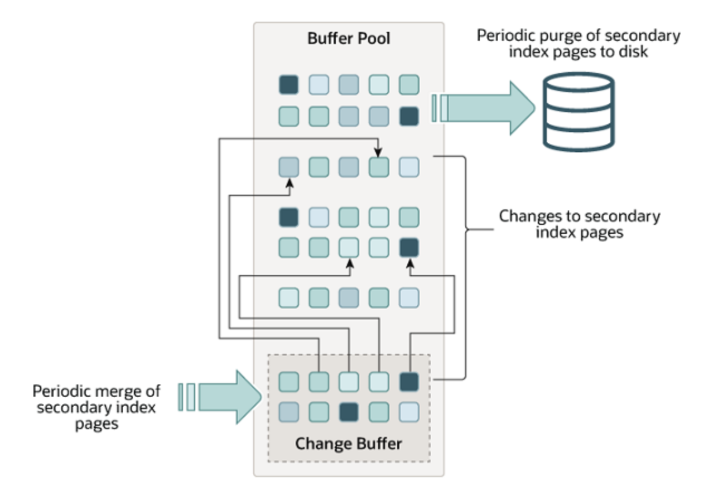

# 4. 아키텍처

- MySQL 서버는 사람의 머리 역할을 담당하는 MySQL엔진과 손발 역할을 담딩하는 스토리지 엔진으로 구분
- mysql 엔진과 mysql 서버에서 기본적으로 제공되는 InnoDB 스토리지 엔진과 MyISAM 스토리지 엔진을 알아보자.

## 4.1 MySQL엔진 아키텍처

- 그림으로 훑어보면 아래와 같다.

</img>

- mysql은 대부분의 프로그래밍 언어로 접근 가능

### 4.1.1.1 MySQL엔진

MySQL엔진은 클라이언트로부터의 접속 및 쿼리요청을 처리하는 커넥션 핸들러와 SQL파서 및 전처리기, 쿼리의 최적화된 실행을 위한 옵티마이저가 중심을 이룬다. 또한 MySQL은 표준 SQL(ANSI SQL) 문법을 지원하기 때문에 표준문법에 따라 작성된 쿼리는 타 DBMS와 호환되어 실행될 수 있다.

### 4.1.1.2 스토리지 엔진

MySQL 엔진은 요청된 SQL 문장을 분석하거나 최적화하는 등 DBMS의 두뇌에 해당하는 처리를 수행하고, 실제 데이터를 디스크 스토리지에 저장하거나 디스크 스토리지로부터 데이터를 읽어오는 부분은
스토리지엔진이 전담한다. MySQL서버에서 **MySQL엔진은 하나지만 스토리지 엔진은 여러개**를 동시에 사용할 수 있다. 다음 예제와 같이 테이블이 사용할 스토리지엔진을 지정하면 이후 해당 테이블의 모든 읽기 작업이나 변경작업은 정의된 스토리지 엔진이 처리한다.

> mysql > CREATE TABLE test_tb (fd1 INT, fd2 INT) ENGINE=INNODB;

위 test_tb는 InnoDB 스토리지엔진을 사용하도록 정의. 이제 test_tb에 대해 INSERT, UPDATE, DELETE, SELECT 등의 작업이 발생하면 InnoDB 스토리지엔진이 작동.
그리고 각 엔진은 성능 향상을 위해 키 캐시(MyISAM)나 InnoDB 버퍼풀(InnoDB)과 같은 기능을 내장함

### 4.1.1.3 핸들러 API

핸들러 API : MySOL 엔진의 쿼리 실행기에서 데이터를 쓰거나 읽어야 할 때는 각 스토리지 엔진에 쓰기 또는 읽기를 요청하는데, 이러한 요청을 핸들러(Handler) 요청이라하고, 여기서 사용되는 API를 말한다.

## 4.1.2 MySQL 스레딩 구조

</img>그림4.2

- mysql 서버는 프로세스 기반이 아닌 스레드 기반으로 작동.
- 크게 포그라운드(foreground) 스레드, 백그라운드(background) 스레드로 구분.

### 4.1.2.1 포그라운드 스레드(클라이언트 스레드)

- 포그라운드 스레드는 최소 mysql 서버에 접속한 클라이언트의 수만큼 존재하며 클라이언트가 요청하는 쿼리문을 처리.
- 클라이언트가 사용을 종료하면 스레드는 스레드 캐시로 돌아간다.
- 포그라운드 스레드는 데이터를 MySQL의 데이터 버퍼나 캐시로부터 가져오며, 버퍼나 캐시에 없는경 우에는 직접디스크에서 가져와서 작업을 처리.
- MYISAM 테이블 : 디스크 쓰기도 포그라운드 쓰레드가
- InnoDB 테이블 : 데이터 버퍼나 캐시까지만 포그라운드가, 버퍼로부터 디스크까지 기록 작업은 백그라운드가 한다.

> mysql에서 사용자 스레드와 클라이언트 스레드는 같은 의미로 사용됨. mysql 서버에서 접속하면 mysql 서버는 그 클라이언트의 요청을 처리해줄 스레드를 생성해 그 클라이언트에게 할당. 이 스레드는 DBMS 앞단에서 클러이언트와 소통한다.

### 4.1.2.2 백그라운드 스레드

- MYISAM과 달리 **InnoDB**는 다음과 같이 여러 작업을 백그라운드 스레드가 담당한다.

  - insert 버퍼를 병합하는 스레드
  - **로그를 디스크로 기록**
  - **InnoDB의 버퍼 풀의 데이터를 디스크에 기록**
  - 데이터를 버퍼로 읽어옴
  - 잠금이나 데드락을 모니터링

- 사용자의 요청 처리 중에 **쓰기 작업은 지연될 수 있지만 읽기 작업은 지연될 수 없음.**
- 하여 대부분의 DBMS는 대부분 쓰기 작업을 버퍼링해서 일괄 처리함(InnoDB 역시 이 방식, MYISAM은 이 방식X)
- 해서 InnoDB는 INSERT, UPDATE, DELETE 쿼리로 데이터가 변경되는 경우 데이터가 디스크의 파일로 완전히 저장할때까지 기다리지 않아도 된다.

## 4.1.3 메모리 할당 및 사용 구조

</img> 그림 4.3

- mysql에서 메모리 공간은 크게 글로벌 영역과 로컬 메모리 영역으로 나뉨
- 글로벌 메모리 영역은 mysql 서버가 시작되면서 운영체제로부터 할당받음
- 글로벌 메모리 영역과 로컬 메모리 영역은 mysql 서버 내에 존재하는 스레드가 공유해서 사용하는 공간인지 여부에 따라 구분된다.

### 4.1.3.1 글로벌 메모리 영역

- 클라이언트 스레드의 수와 무관하게 하나의 메모리 공간만 할당됨
- 모든 스레드에 의해 공유됨
- 대표적인 글로벌 메모리 영역은 다음과 같음

  - 테이블 캐시
  - innoDB 버퍼 풀
  - innoDB 어댑티브 해시 인덱스
  - innoDB 리두 로그 버퍼

### 4.1.3.2 로컬 메모리 영역 (세션 메모리 영역)

- 클라이언트 스레드가 쿼리를 처리하는데 사용하는 메모리 영역 (대표적으로 커넥션 버퍼, 정렬 버퍼가 있음)
- 클라이언트 스레드가 사용하는 메모리 공간이라고 해서 **클라이언트 메모리 영역**이라고도 한다.
- 클라이언트와 MySQL 서버와의 커넥
  션을 세션이라고 하기 때문에 로컬 메모리 영역을 **세션 메모리 영역**이라고도 표현한다
- 로컬 메모리는 각 클라이언트 스레드 별로 할당되며 공유하지 않음
- 대표적인 로컬 메모리 영역은 다음과 같음

  - 정렬 버퍼
  - 조인 버퍼
  - 바이너리 로그 캐시
  - 네트워크 버퍼

## 4.1.4 플러그인

</img> 그림 4.4

- 플러그인해서 사용할수 있는 것은 스토리지 엔진 전문 검색 엔진을 위한 검색어파서(인덱싱할 키워드를 분리해 내는
  작업), 사용자의 인증을 위한 Native Authentication 과CachingSHA-2Authentication등도 모두 플러그인으로 구현되어 제공

- MySQL에서 쿼리가 실행되는 과정을 크게 그림4. 5와 같이 나눈다면 거의 대부분의 작업이 MysQL 엔진에서 처리되고,마지막'데이터읽기/쓰기' 작업만 스토리지 엔진에 의해 처리된다 -> 즉 mysql의 스토리지 엔진을 바꾸는 것은 DBMS의 일부의 기능만 수정된다는 의미

  </img> 그림 4.5

> MySQL의 핸들러란?  
> MySQL 엔진이 각 스토리지 엔진에게 데이터를 읽어오거나 저장하도록 명령하려면 반드시 핸들러를 통해야한다

- GROUP BY나 ORDER BY 등과 같은 복잡한 처리는 스토리지 엔진 영역이 아닌 MYSQL 엔진의 처리 영역인 '쿼리 실행기'에서 처리됨

> 하나의 쿼리 작업은 여러 하위 작업으로 나뉘는데,
> 각 하위 작업이 MySQL 엔진영역에서 실행되는지, 스토리지 엔진 영역에서 실행되는지 알아야한다.

## 4.1.5 컴포넌트

MySQL은 플러그인의 단점을 보완하기 위해 컴포넌트를 제공한다.

## 4.1.6 쿼리 실행 구조

</img> 그림 4.6

위 그림은 쿼리 실행을 간략하게 나타낸것임. 다음과 같이 기능별로 나눠볼 수 있음.

### 4.1.6.1 쿼리 파서

쿼리 파서는 들어온 쿼리 문장을 토큰으로 분리해 트리 형태의 구조로 만들어낸다. 쿼리 문장의 기본 문법 오류는 여기서 발견되고 사용자에게 오류 메시지를 전달한다.

### 4.1.6.2 전처리기

파서 과정에서 만들어진 트리를 기반으로 쿼리 문장에 구조적인 문제점이 있는지 확인. 각 토큰을 테이블 이름, 내장 함수와 같은 개체를 매핑해 해당 객체의 존재 여부와 객체의 접근 권한을 확인. 실제 존재하지 않거나 권한상 사용할 수 없는 개체의 토큰은 이 단계에서 걸러짐.

### 4.1.6.3 옵티마이저

사용자의 요청으로 들어온 쿼리 문장을 저렴한 비용으로 가장 빠르게 처리할지를 결정. DBMS의 두뇌. 옵티마이저의 역할은 매우 중요하다.

### 4.1.6.4 실행 엔진

옵티마이저가 두뇌라면 실행 엔진은 손과 발.  
옵티마이저 - 회사 경영진  
실행 엔진 - 중간 관리자  
핸들러 - 각 업무의 실무자

옵티마이저가 GROUP BY를 처리하기 위해 임시 테이블을 사용하기로 결정한 예시는 다음과 같다.

1. 실행 엔진이 핸들러에게 임시 테이블을 만들라고 명령
2. 다시 실행 엔진은 WHERE 절에 일치하는 레코드를 가져오라고 핸들러에세 요청
3. 읽어온 레코드들을 1번에서 준비한 임시 테이블로 저장하도록 핸들러에게 요청
4. 데이터가 준비된 임시 테이블에서 필요한 방식으로 데이터를 읽어오라고 핸들러에게 요청
5. 최종적으로 실행엔진은 결과를 사용자나 다른 모듈로 넘김

--> 실행 엔진은 만들어진 계획대로 각 핸들러에게 요청해서 받은 결과를 또 다른 핸들러 요청의 입력으로 연결

### 4.1.6.5 핸들러(스토리지 엔진)

핸들러는 MySQL 서버의 가장 밑단에서 MySQL 실행 엔진의 요청에 따라 데이터를 디스크로 저장하고 읽어오는 역할을 한다.  
핸들러는 결국 스토리지 엔진을 의미한다.

## 4.1.7 복제

MySQL에서 복제는 매우 중요한 역할을 담당한다. 이는 별도의 장에서 다루도록 한다.

## 4.1.8 쿼리 캐시

- 쿼리 캐시는 SQL의 실행 결과를 메모리에 캐시하고
- 동일SQL 쿼리가 실행되면 테이블을 읽지 않고 즉시 결과를 반환하기 때문에 매우 빠른 성능을 보였다.
- 그러나! 쿼리 캐시는 테이블의 데이터가 변경되면 캐시에 저장된 결과중 변경된 테이블과관련된 것들은모두삭 제(Invalidate)해야함!
- 이는 심각한 동시 처리성능 저하와 버그를 유발한다
- 결국 MySOL 8.0으로 올라오면서 쿼리 캐시는 MySOL서버의 기능에서 완전히 제거됨

## 4.1.9 스레드 풀

MySOL 엔터프라이즈 에디션은 스레드풀(Thread Pool) 기능 O, MySOL 커뮤니티 에디션은 스레드풀 기능 X
해서 Percona Server에서 제공하는 스레드풀 기능을 살펴볼 것임.
Percona Server의 스레드풀은 플러그인 형태로 작동하게 구현되어있음
커뮤니 티에디션에서도 스레드풀 기능을 사용하고자 한다면 동일버전의 Percona Server에서 스레드풀 플러그인 라이브러리(thread_pool.so파일)를 MySQL 커뮤니티 에디션 서버에 설치(INSTALPLLUGIN명령)해서 사용

- 스레드풀은 내부적으로 사용자의 요청을 처리하는 스레드 개수를 줄여서 동시 처리되는 요청이 많다 하더라도 MySOL 서버의 CPU가 제한된 개수의 스레드 처리에만 집중할 수 있게 해서 서버의 자원소모를 줄이는 것이 목적
- 그런데 스레드 풀이 서비스에 유의미한 성능향상을 보여주는 경우는 드물다.
- 물론 제한된 수의 스레드만으로 CPU가 처리하도록 적절히 유도한다면 CPU의 프로세서 친화도(Processor affinity도 높이고 운영체제 입장에서는 불필요한 컨텍스트스위치(Context switch)를 줄여서 오버헤드를 낮출수 있다.

## 4.1.10 트랜잭션 지원 메타데이터

데이터베이스 서버에서 테이블의 구조정보와 스토어드프로 그램 등의 정보를 데이터 딕셔너리 또는 메타데이터라고 한다.

- MySQL 8.0 버전부터 테이블의 구조 정보나 스토어드 프로그램의 코드 관련 정보를 모두 InnoDB의 테이블에 저장.
- MySQL 서버가 작동하는 데 기본적으로 필요한 테이블들(시스템 테이블)을 모두 InnoDB 스토리지 엔진을 사용하는 것이다.
- 시스템 테이블과 데이터 딕셔너리 정보들을 모두 모아서 mysql DB에 저장하는데, 이는 mysql.ibd라는 이름의 테이블스페이스에 저장됨. 해서 \*.ibd 파일은 주의해서 다뤄야함

# 4.2 InnoDB 스토리지 엔진 아키텍처

InnoDB는 MySQL의 스토리지 엔진 중 유일하게 레코드 기반의 잠금을 지원하며, 이 때문에 높은 동시성 처리가 가능하며 안정적이고 성능이 뛰어나다
(아래 그림은 InnoDB의 대략적인 구조)

</img> 그림 4.9

### 4.2.1 프라이머리 키에 의한 클러스터링

- InnoDB의 모든 테이블들은 기본적으로 **프라이머리 키를 기준**으로 클러스터링되어 저장됨. 즉 프라이머리 키 값의 순서대로 디스크에 저장됨.
  - 모든 세컨더리 인덱스는 레코드의 주소 대신 프라이머리 키의 값을 논리적인 주소로 사용한다.
  - 프라이머리 키가 클러스터링 인덱스이기 때문에 프라이머리 키를 이용한 레인지 스캔은 매우 빠르다.
  - 결과적으로 쿼리의 실행 계획에서 프라이머리 키는 기본적으로 다른 보조 인덱스에 비해 비중이 높게 설정(쿼리의 실행계획에서 다른 보조 인덱스보다 프라이머리키가 선택될 확률이 높음)된다.

### 4.2.2 외래 키 지원

- 외래 키는 InnoDB 스토리지 엔진 레벨에서 지원하는 기능으로 MyISAM이나 MEMORY 테이블에서는 사용할 수 없다.
- 외래 키는 데이터베이스 서버 운영의 불편함 때문에 서비스용 데이터베이스에서는 생성하지 않는 경우가 있다.
- InnoDB에서 외래키는 부모 테이블과 자식테이블 모두 해당 칼럼에 인덱스 생성이 필요 -> 변경시에는 반드시 부모 테이블이나 자식 테이블에 데이터가 있는지 체크하는 작업이 필요 ->
  잠금이 여러 테이블로 전파 ->
  그로인해 데드락이 발생할 때가많음
- 수동으로 데이터를 적재하거나 스키마 변경 등의 관리 작업이 실패할 수 있다.
- 이런 경우에는 임시로 **foreign_key_checks** 시스템 변수를 0FF로 설정하면 외래키 관계에대한 체크 작업을 일시적으로 멈출수 있다.

  > mysql> SET foreign_key_checks=OFF;  
  > ...  
  > ... 작업 실행  
  > ...  
  > mysql> SET foreign_key_checks=ON;

- 외래키 체크를 일시적으로 중지한 상태에서 외래키 관계를 가진 부모테이블의 레코드를 삭제했다면 반드시 자식테이블의 레코드도 삭제해서 일관성을 맞춰준 후 다시 외래키 체크기능을 활성화해야한다.
- foreign_key_checks가 비활성화되면 외래키 관계의 부모 테이블에 대한 작업(ON DELETE CASCADE와 ON UPDATE CASCADE 옵션)도 무시하게 된다.

> 참고
> foreign_key_checks 시스템 변수는 적용 범위를 GLOBAL과 SESSION 모두로 설정 가능한 변수다. 그래서 이런 작업을 할때는 반드시 현재 실행하는 세션에서만 외래 키 체크 기능을 멈추게 해야한다.  
> mysql> SET foreign_key_checks=OFF; //GLOBAL  
> mysql> SET SESSION foreign_key_checks=OFF; //SESSION

### 4.2.3 MVCC(Multi Version Concurreny Control)

일반적으로 레코드 레벨의 트랜잭션을 지원하는 DBMS가 제공하는 기능.  
MVCC의 목적은 잠금을 사용하지 않는 일관된 읽기를 제공하는 것.  
InnoDB는 언두로그(Undo Log)를 이용해 이 기능을 구현함.
멀티 버전이라 함은 하나의 레코드에 대해 여러 개의 버전이 동시에 관리된다는 의미.

> Undo log  
> update나 delete와 같은 쿼리를 사용하여 데이터를 변경했을 때, 변경 전의 데이터를 보관해두는 곳이다.
> update 문을 실행시키고 commit를 하면 테이블의 데이터를 수정하기 전에 undo log에 update 이전의 데이터를 보관한다.
> 그리고 나서 테이블을 update한다. 만약 commit이 아닌 rollback을 한다면 undo log에 있는 데이터를 테이블 레코드에 덮어쓴다.

> 버퍼 풀  
> InnoDB가 엑세스할 때, 테이블 및 인덱스 데이터를 캐시하는 메인 메모리 영역. 즉 자주 사용하는 데이터를 메모리에서 직접 처리할 수 있도록하여 처리 속도를 높인다.

이해를 위해 격리 수준이 READ_COMMITED인 mysql 서버에서 InnoDB 스토리지 엔진을 사용하는 테이블의 데이터 변경을 어떻게 처리하는지 그림으로 살펴보자.

MEMBER (id-pk, name, area)와 같은 테이블이 있을 때 아래와 같은 insert 문을 실행시켰다고 해보자.

> mysql> INSERT INTO member(id, name, area) values (12, "홍길동", "서울");  
> mysql> commit;

위 insert문이 실행되면 데이터베이스의 상태는 아래 그림 4.10과 같을 것이다.  
</img> 그림 4.10

이제 아래와 같은 UPDATE문을 실행하면 그림 4.11과 같을 것이다.

> mysql > UPDATE member SER area = "경기" where id = 12;

</img> 그림 4.11

- update 문이 실행되면 커밋여부와 관계없이 InnoDB의 버퍼 풀은 새로운 값인 "경기"로 변경
- 디스크의 데이터 파일에는 체크 포인트나 InnoDB의 Write 스레드에 의해 새로운 값으로 업데이트되어 있을 수도 아닐 수도.
- 그런데 일반적으로 InnoDB가 ACID를 보장하기 때문에 InnoDB의 버퍼풀과 데이터 파일을 같은 상태라고 생각해도 무방.
- **commit 이나 rollback 되지 않을 상태에서 다른 사용자가 아래 쿼리로 작업중인 레코드를 조회하면 버퍼 풀과 데이터 파일 중 어느 곳에서 데이터를 조회할까??**
  - 정답은 mysql의 시스템 변수에 설정된 격리 수준에 따라 다르다.
  - READ_UNCOMMITED :InnoDB의 버퍼풀이 현재 가지고 있는 변경된 데이터를 읽어서 반환
  - READ_COMMITED(REPEATABLE_READ, SERIALIZABLE)인 경우에는 아직 커밋되지 않았기 때문에 변경되기 이전의 데이터인 Undo 영역의 데이터를 반환.
- 이러한 과정을 DBMS에서 MVCC라고 한다.
- 즉 하나의 레코드에 대해 2개의 버전이 유지되고, 필요에 따라 어느 데이터가 보여지는지 여러가지 상황에 따라 달라지는 구조
- COMMIT을 하면 InnoDB는 더 이상의 변경 작업 없이 지금의 상태를 영구적인 데이터로 만든다.
- 하지만 ROLLBACK을 하면 InnoDB는 Undo 영역에 있는 백업된 데이터를 InnoDB 버퍼 풀로 다시 복구하고, 언두 영역의 내용을 삭제해버림.
- COMMIT을 한다고 언두 영역의 백업 데이터가 바로 삭제되는 것은 아님.

## 4.2.4 잠금 없는 일관된 읽기(Non-Locking Consistent Read)

InnoDB 스토리지 엔진은 MVCC 기술을 사용하여 잠금을 걸지 않고 읽기 작업을 수행.  
잠금을 걸지 않기 때문에 InnoDB에서 읽기 작업은 다른 트랜잭션이 가지고 있는 잠금을 기다리지 않고, 읽기 작업이 가능.

격리 수준이 READ_COMMITED, READ_COMMITED, REPEATALBE_READ 수준인 경우 INSERT와 연결되지 않은 순수한 SELECT작업은 다른 트랜잭션의 변경 작업과 관계없이 항상 잠금을 대기하지 않고 바로 실행됨  
특정 사용가자 레코드를 변경하고 아직 커밋하지 않았다고 하더라도 이 변경 트랜잭션이 다른 사용자의 SELECT 작업을 방해하지 않음. 이를 '잠금 없는 일관된 읽기'라고 표현하며 InnoDB에서는 변경되기 이전의 데이터를 읽기 위해 언두 로그를 사용한다.  
</img> 그림 4.12

오래간 활성 상태인 트랜잭션으로 인해 mysql 서버가 느려지는 경우가 있음. 이는 일관된 읽기를 위해 언두로그를 삭제하지 못해서 그런거임. 해서 트랜잭션이 시작되어었다면 가능한 한 빠르게 커밋혹은 롤백을 하여 트랜잭션을 완료해야한다.

## 4.2.5 자동 데드락 감지

- InnoDB 스토리지 엔진은 내부적으로 잠금이 교착 상태에 빠지지 않았는지 체크하기 위해 잠금 대기 목록을 그래프(Wait-for list) 형태로 관리
- InnoDB의 데드락 감지 스레드가 주기적으로 잠금 대기 그래프를 검사하여 교착 상태의 트랜잭션이 있으면 그 중 하나를 강제로 종료
- 이때 언두 레코드를 더 적게 가진 트랜잭션이 일반적으로 롤백의 대상이 된다.
- 트랜잭션이 언두 레코드가 적다 == 롤백을 해도 언두 처리를 해야할 내용이 적다 == 트래잭션 강제 롤백으로 인한 mysql의 서버 부하도 덜하다.
- innodb_table_locks 시스템 변수를 활성화해야 InnoDB 스토리지 엔진의 내부 레코드 잠금과 테이블 레벨의 잠금까지 감지할 수 있다. (이를 활성화하는 것이 좋다.)
- 일반적으로 데드락 감지 스레드가 트랜잭션의 잠금 목록을 검사해서 데드락을 찾아내는 작업은 그렇게 부담되지 않지만, 동시 처리 스레드가 너무 많아지면 데드락 감지 스레드는 느려진다. 이렇게 데드락 감지 스레드가 느려지면 많은 CPU 자원을 소모해 서비스에 악영향을 끼칠 수 있다.
- 이를 위해 innodb_deadlock_detect 시스템 변수를 제공함. 이를 OFF로 하면 데드락 감지 스레드가 활성화되지 않는다. 즉 2개 이상의 트랜잭션에서 데드락이 발생하면 누군가가 중재하지 않기 때문에 무한정 대기할 수 있다.
- 하지만 innodb_lock_wait_timeout 시스템 변수를 활성화하면 이러한 데드락 상황에서 일정 시간이 지나면 자동으로 요청이 실패하고 에러 메시지를 띄운다. 해서 innodb_deadlock_detect를 OFF로 했다면 innodb_lock_wait_timeout를 기본값 50초보다 훨씬 작게 변경해서 사용하것이 좋다.

> 만약 PK와 세컨더리 인덱스를 기반으로 매우 높은 동시성 처리를 요구하는 서비스가 있다면 innodb_deadlock_detect를 비활성화하여 성능 비교를 해보자.

## 4.2.6 자동화된 장애 복구

InnoDB에는 손실이나 장애로부터 데이터를 보호하기 위한 여러가지 메커니즘이 있다. 이를 이용해 mysql서버가 시작될 때 완료하지 못한 트랜잭션이나 디스크에 일부만 기록된(Partial write) 데이터 페이지 등에 대한 일련의 복구 작업이 자동으로 진행된다.

- mysql 서버와 무관하게 디스크나 서버 하드웨어 이슈로 InnoDB 스토리지 엔진이 자동으로 복구를 못하는 일이 발생 가능.
- InnoDB 데이터 파일은 기본적으로 mysql 서버가 시작될 때 항상 자동복구를 수행함. 이 단계에서 자동으로 복구될 수 없는 손상이 있다면 자동 복구를 멈추고 서버는 종료됨.
- 이때는 mysql의 설정파일에 innodb_force_recovery 시스템 변수를 설정하여 mysql서버를 시작해야함.
- 이 값은 mysql 서버가 시작될 때 InnoDB 스토리지 엔진이 데이터 파일이나 로그 파일의 손상 여부 검사 과정을 선별적으로 진행할 수 있게 한다.

  - InnoDB의 로그 파일이 손상되었다면 6으로 설정하고 mysql서버 기동
  - InnoDB 테이블의 데이터 파일이 손상되었다면 1으로 설정하고 mysql서버 기동
  - 어떤 부분이 문제인지 알 수 없다면 1~6까지 바꿔가며 재시작해본다. (innodb_force_recovery값이 커질수록 데이터 손실 가능성이 커지고 복구 가능성은 작아진다.)

- mysql 서버가 기동되고 InnoDB 테이블이 인식되면 mysqldump를 이용해 데이터를 가능한 만큼 백업하고 그 데이터로 mysql 서버의 DB와 테이블을 다시 생성한다.
- innodb_force_recovery값이 0이 아닌 복구 모드에서 SELECT 이외의 INSERT, UPDATE, DELETE와 같은 쿼리는 수행이 불가능하다.
- 이러한 방법을 사용해서 복구를 시도했음에도 mysql 서버의 시작에 실패한다면 백업을 이용해 다시 구축하는 방법밖에는 없다.
- 백업이 있다면 마지막 백업으로 데이터베이스를 새로 구축하고, 바이너리 로그를 사용하여 최대한 장애 시점까지의 데이터를 복구할 수 있다.
- 마지막 풀 백업 시점부터 장애 시점까지의 바이너리 로그가 있다면 InnoDB의 복구보다 이를 이용한 복구가 데이터 손실이 더 적을 수 있다.
- 백업은 있지만 복제의 바이너리 로그가 없거나 손실되었다면 마지막 백업 시점까지만 복구가 가능하다.

## 4.2.7 InnoDB 버퍼풀

1. InnoDB 스토리지에서 가장 핵심적인 부분.
2. 디스크의 데이터 파일이나 인덱스 정보를 메모리에 캐시해두는 공간.
3. 쓰기 작업을 지연시켜 일괄 작업으로 처리할 수 있게 하는 버퍼 역할도 한다.
4. 일반적인 어플리케이션에서는 INSERT, UPDATE, DELETE처럼 데이터를 변경하는 쿼리는 데이터 파일의 이곳저곳에 위치한 레코드를 변경하기 때문에 랜덤한 디스크 작업을 발생시키지만 버퍼 풀이 이러한 변경된 데이터를 모아서 처리하면 디스크 작업의 횟수를 줄일 수 있다.

### 4.2.7.1 버퍼 풀의 크기 설정

- 전체 물리 메모리의 80%정도를 버퍼 풀로 할당하라는 게시물은 좀 오바임(운영체제와 각 클라이언트 스레드가 사용할 매모리도 고려해야함)
- 가끔 레코드 버퍼가 상당한 메모리를 차지하기도 한다.
  - 레코드 버퍼는 각 클라이언트 세션에서 테이블의 레코드를 읽고 쓸 때 버퍼로 사용하는 공간
  - 커넥션이 많고 테이블도 많다면 레코드 버퍼가 메모리를 많이 차지하게 될 수 있다.
  - MySQL의 레코드 버퍼 공간은 별도로 설정 불가.
  - 즉 전체 커넥션 개수와 각 커넥션에서 읽고 쓰는 테이블의 개수에 따라 결정됨.
  - 레코드 버퍼 공간은 동적으로 해제되기도 하므로 정확히 필요한 메모리 공간의 크기를 계산하기 어려움
- MySQL 5.7부터 InnoDB 버퍼 풀의 크기를 동적으로 조절할 수 있게됨
- 하여 InnoDB 버퍼 풀의 크기를 적절히 작은 값으로 설정해서 상황을 봐가며 증가시키는 방법이 최적임.
  - ex 1) 운영체제의 전체 메모리가 8GB 미만이면 50% 정도만 InnoDB 버퍼 풀로 설정
  - ex 2) 운영체제의 전체 메모리가 8GB 이상이면 50% 정도만 InnoDB 버퍼 풀로 설정을 시작하여 조금씩 올려가며 최적점을 찾는다.
  - ex 3) 운영체제의 전체 메모리가 50GB 이상이면, 대략15GB에서 30GB 정도를 남기고 나머지는 버퍼 풀 공간으로 사용.
- InnoDB 버퍼풀은 innodbbuffer_pool_size 시스템 변수로 크기를 조정가능.(되도록 MySQL 서버가 한가한 시간에 변경할 것, 또한 버퍼풀은 크게하는 것은 괜찮지만 줄이는 것은 되도록 하지 않도록 하자)
- InnoDB 버퍼 풀은 풀 전체를 관리하는 잠금(세마포어)으로 인해 내부 잠금 경합을 많이 유발해왔음
- 해서 버퍼 풀을 여러 개로 쪼개어 관리할 수 있도록 개선됨
- 즉 버퍼 풀을 여러 개로 쪼개면서 개별 버퍼 풀 전체를 잠금 자체도 경합이 분산되는 효과가 생긴 것.
- innodbbuffer_pool_instances 시스템 변수를 사용하여 버퍼 풀을 여러개로 분리해서 관리할 수 있음
  - 이는 기본적으로 8개로 초기화되지만 전체 버퍼 풀을 위한 메모리가 1GB미만 이라면 이는 1개로 설정됨
  - 버퍼 풀 할당 메모리가 40GB이하 수준이면 기본 값을 유지하고, 메모리가 크다면 버퍼 풀 인스턴스 당 5GB 정도의 인스턴스 개수를 유지하는 것이 추천됨.

### 4.2.7.2 버퍼 풀의 구조

InnoDB 스토리지 엔진은 버퍼 풀이라는 거대한 메모리 공간을 페이지 크기(innodb_page_size 시스템 변수에 설정된)의 조각으로 쪼개어 InnoDB 스토리지 엔진이 데이터를 필요로 할때 해당 페이지를 읽어서 각 조각에 저장한다.

- 버퍼 풀의 페이지 크기 관리를 위해 InnoDB는 LRU(Least Recently Used)리스트, 플러시(Flush)리스트, 프리(Free)리스트 3개의 자료 구조를 관리함.
- Free list : InnoDB 버퍼 풀에서 실제 사용자 데이터로 채워지지 않은 빈 페이지 목록, 사용자 쿼리가 새롭게 디스크의 데이터 페이지를 읽어와야 하는 경우 사용됨.
- LRU list : 그림 4.13과 같은 구조를 가짐. 엄밀하게는 LRU와 MRU(Most Recently Used)리스트가 결합된 형태. 그림 4.13에서 Old 서브리스트 영역은 LRU에 해당하고 New 서브리스트의 영역은 MRU 정도로 이해하면 된다.  
  </img> 그림 4.13
- LRU 리스트를 관리하는 목적은 디스크로부터 한 번 읽어온 페이지를 최대한 오랫동안 InnoDB 버퍼 풀의 메모리에 유지해서 디스크 읽기를 최소화하는 것.
- InnoDB 스토리지 엔진에서 데이터를 찾는 이유는 아래와 같다.
  - 1. 필요한 레코드가 저장된 데이터 페이지가 버퍼 풀에 있는지 검사
  - 2. 디스크에서 필요한 데이터 페이지를 버퍼 풀에 적재하고, 적재된 페이지에 대한 포인터를 LRU 헤더 부분에 추가
  - 3. 버퍼 풀의 LRU 헤더 부분에 적재된 데이터 페이지가 실제로 읽히면 MRU 헤더 부분으로 이동
  - 4. 버퍼 풀에 상주하는 데이터 페이지는 사용자 쿼리가 얼마나 최근에 접근했는지의 여부에 따라 나이(Age)가 부여되며, 버퍼 풀에 상주하는 동안 쿼리에서 오랫동안 사용되지 않으면 데이터 페이지에 부여된 나이가 오래되고(Aging), 결국 해당 페이지는 버퍼 풀에서 제거됨. 버퍼 풀의 데이터 페이지가 쿼리에 의해 사용되면 나이가 초기화되고 다시 젊어지고 MRU의 헤더 부분으로 옮겨짐
  - 5. 필요한 데이터가 자주 접근됐다면 해당 페이지의 인덱스 키를 어댑티브 해시 인덱스에 추가

그래서 한 번 읽힌 데이터 페이지가 이후 자주 사용된다면 그 데이터 페이지는 InnoDB 버퍼 풀의 MRU 영역에서 계속 살아남게 되고, 거의 사용되지 않으면 LRU의 끝으로 밀려나 결국 InnoDB의 버퍼 풀에서 제거될 것이다.

- flush list : 플러시 리스트는 디스크로 동기화 되지 않은 데이터를 가진 데이터 페이지(이를 더티 페이지라고 함)의 변경 시점 기준의 페이지 목록을 관리
  - 디스크에서 읽은 상태 그대로 변형이 없다면 플러시 리스트에 관리되지 않지만, 한번이라도 변경이 된 데이터 페이지는 플러시 리스트에 관리되고 특정 시점에 디스크로 기록되어야 한다.
  - 데이터 변경 발생 -> InnoDB가 변경 내용을 리두 로그에 기록, 버퍼 풀의 데이터 페이지에 변경 내용 반영
  - InnoDB 스토리지 엔진은 체크 포인트를 발생시켜 디스크의 리두 로그와 데이터 페이지의 상태를 동기화.
  - 체크 포인트는 MySQL 서버가 시작될 때 InnoDB 스토리지 엔진이 리두 로그의 어느 부분부터 복구를 실행해야 할지 판단하는 기준점을 만드는 역할을 한다.

> 데이터 페이지란?  
> 데이터 페이지란 테이블 내의 데이터를 저장하는데 사용되는 물리적인 공간.
> MySQL은 데이터를 효율적으로 저장 및 관리하기 위해 여러 데이터 페이지를 사용함.
> 데이터 페이지에는 레코드, 인덱스와 같은 정보가 저장된다.
>
> -chatGPT

> 페이지란?  
> 페이지란 디스크와 버퍼 풀에 데이터를 읽고 쓰는 최소 작업 단위이다.  
> 일반적인 인덱스를 포함해 PK와 테이블 등은 모두 페이지 단위로 관리된다.  
> 하여 만약 쿼리를 실행하여 하나의 레코드를 읽는다 하여도 결국 하나만 읽는 것이 아니라,  
> 하나의 블록을 읽어야 하는 것이다.
> 하여 페이지에 저장되는 개별 데이터의 크기를 최대한 작게 하여, 1개의 페이지에 많은 데이터들을 저장할 수 있도록 하는 것이 중요하다.
> 페이지에 저장되는 데이터의 크기가 클수록 다음과 같은 문제가 발생할 수 있다.
>
> - 디스크의 I/O가 많아질 수 있음
> - 메모리에 캐싱할 수 있는 페이지의 수가 줄어듦.
>
> -출처: https://mangkyu.tistory.com/285

### 4.2.7.3 버퍼 풀과 리두 로그

- InnoDB의 버퍼 풀과 리두 로그는 매우 밀접한 관계를 맺고 있다. InnoDB의 버퍼 풀은 메모리를 크게 설정하면 할수록 쿼리의 성능이 빨라짐.
- InnoDB 버퍼 풀은 DB의 성능 향상을 위해 데이터 캐시와 쓰기 버퍼링 두가지 용도가 있음
- 그런데 버퍼 풀의 용량을 늘리는 것은 단지 캐시 기능만을 향상시키는 것임
- 쓰기 버퍼링 기능 향상을 위해서는 InnDB 버퍼 풀과 리두 로그의 관계를 알아야 한다.

  </img> 그림 4.14

> Redo Log  
>  MySQL InnoDB에서 Redo 로그는 데이터베이스 내 데이터의 내구성을 보장하고, 트랜잭션의 원자성, 일관성, 격리 및 지속성 (ACID) 속성을 유지하기 위한 중요한 메커니즘 중 하나입니다. Redo 로그는 다음 목적을 달성하기 위해 사용된다.
>
> 1. 트랜잭션의 원자성 (Atomicity): Redo 로그는 트랜잭션을 원자적인 작업으로 만들어줍니다. 트랜잭션이 커밋되기 전에 Redo 로그에 해당 트랜잭션의 모든 변경 사항이 기록됩니다. 이로써, 트랜잭션 중간에 시스템이 장애가 발생하더라도, 복구 프로세스에서 Redo 로그를 사용하여 트랜잭션을 롤백하거나 완료될 때 변경 사항을 적용할 수 있습니다.
> 2. 데이터베이스의 일관성 (Consistency): Redo 로그는 데이터베이스를 일관한 상태로 유지합니다. 장애나 비정상적인 종료로 인해 데이터베이스가 손상될 경우, Redo 로그를 사용하여 데이터베이스를 이전 상태로 복원할 수 있습니다.
> 3. 데이터베이스의 지속성 (Durability): Redo 로그는 커밋된 트랜잭션의 변경 사항을 디스크에 지속적으로 저장합니다. 이로써, 시스템 장애 또는 재시작 후에도 데이터의 지속성을 보장합니다.
> 4. 장애 복구 (Recovery): Redo 로그는 데이터베이스의 장애 복구를 지원합니다. 시스템 장애 시, Redo 로그를 사용하여 변경 사항을 다시 적용함으로써 데이터베이스를 이전 상태로 복구할 수 있습니다.
>
> Redo 로그는 InnoDB 스토리지 엔진에서 관리되며, 데이터베이스의 성능 및 내구성을 개선하기 위한 여러 최적화 및 구성 옵션도 제공합니다. Redo 로그의 크기 및 관리는 데이터베이스의 성능 및 복구 요구 사항에 따라 조정될 수 있습니다.

- InnoDB 버퍼 풀은 디스크에서 읽은 상태 그대로 변경되지 않은 클린 페이지(Clean Page)와 INSERT, UPDATE, DELETE 명령으로 변경된 데이터를 가진 더티 페이지(Dirty Page)도 가지고 있다.
- 더티 페이지는 디스크와 메모리의 데이터 상태가 다르기 때문에 언젠가 디스크로 기록되어야 한다.
- InnoDB에서 리두 로그는 1개 이상의 고정 크기 파일을 연결해서 순환 고리처럼 사용한다.
- 즉 데이터 변경이 계속해서 일어나면서 가장 최근의 변경에 대한 로그 엔트리가 예전의 로그 엔트리를 덮어씌우는 것이다.
- 하여 InnoDB 스토리지 엔진은 재사용 불가능한 공간을 활성 리두 로그(Active Redo Log)라고 부르며 재사용 가능한 공간과 분리하여 다룬다. (그림 4.14에서 화살표를 가진 엔트리들이 활성 리두 로그 공간임)

  </img> 그림 4.14-1  
  그림 4.14-1 출처:https://new-age-jh.tistory.com/288

- 리두 로그 파일의 공간은 계속 순환되어 재사용되지만 매번 기록될 때마다 로그 포지션은 계속 증가됨, 이를 LSN(Log Sequence Number)이라고 한다.
- InnoDB 스토리지 엔진은 주기적으로 체크 포인트 이벤트를 발생 시켜 리두 로그와 버퍼 풀의 더티 페이지를 디스크로 동기화하는 데, 이렇게 발생한 체크 포인트 중 가장 최근 체크 포인트 지점의 LSN이 활성 리두 로그 공간의 시작점
- 그리고 가장 최근 체크포인트의 LSN과 마지막 리두 로그 엔트리의 LSN의 차이를 체크포인트 에이지(Checkpoint Age)라고 한다. 즉 체크포인트 에이지는 활성 리두 로그 공간의 크기
- InnoDB 버퍼 풀의 더티페이지는 특정 리두 로그 엔트리와 관계를 가지고, 체크포인트가 발생하면 체크포인트 LSN보다 작은 리두 로그 엔트리와 관련된 더터페이지는 모두 디스크로 동기화돼야 한다. 물론 당연히 체크포인트 LSN 보다 작은 LSN 값을 가진 리두 로그 엔트리도 디스크로 동기화돼야 한다.

> CheckPoint (체크포인트)  
> 체크포인트(Checkpoint)는 RDBMS(관계형 데이터베이스 관리 시스템)에서 데이터베이스 내의 모든 변경 사항을 안전하게 디스크에 영구 저장하는 작업 또는 지점을 가리킵니다. 이는 데이터베이스의 일관성과 내구성을 유지하기 위한 프로세스로, 주로 다음 두 가지 목적을 가집니다
>
> - 변경 내용의 영구 저장  
>   체크포인트를 실행하면 메모리 내의 변경된 데이터가 디스크에 저장되어 데이터의 손실을 방지합니다.
>
> - 성능 최적화  
>   체크포인트는 데이터베이스 성능을 향상시키기 위해 사용됩니다. 디스크에 주기적으로 변경 내용을 기록하면 메모리의 부담을 줄이고 데이터베이스 작업을 더 효율적으로 수행할 수 있습니다.
>
> 요약하면, 체크포인트는 데이터베이스의 안전한 운영과 성능 향상을 위해 데이터의 디스크에 안전하게 저장되도록 하는 프로세스나 지점을 가리킵니다.  
> -chapGPT

### 4.2.7.4 버퍼 풀 플러시 (Buffer Pool Flush)

InnoDB 스토리지 엔진은 버퍼 풀에서 아직 디스크로 기록되지 않은 더티 페이지들을 성능상의 악영향 없이 디스크에 동기화하기 위해 다음과 같이 2개의 플러시 기능을 백그라운드로 실행한다.

- 플러시 리스트 플러시
- LRU 리스트 플러시

#### 4.2.7.4.1 플러시 리스트 플러시

InnoDB 스토리지 엔진은 리두 로그 공간의 재활용을 위해 주기적으로 오래된 리두 로그 엔트리가 사용하는 공간을 비워야 한다. 그런데 이때 오래된 리두 로그 공간이 지워지려면 반드시 InnoDB 버퍼 풀의 더티 페이지가 먼저 디스크로 동기화돼야 한다. 이를 위해 InnoDB 스토리지 엔진은 주기적으로 플러시 리스트(Flush list)플러시 함수를 호출해서 플러시 리스트에서 오래전에 변경된 데이터 페이지 순서대로 디스크에 동기화하는 작업을 수행한다.

이때 언제부터 얼마나 많은 더티 페이지를 한번에 디스크로 기록하느냐에 따라 사용자의 쿼리 처리가 악영향을 받지 않으면서 부드럽게 처리된다.
이를 위해 InnoDB 스토리지 엔진은 다음과 같은 시스템 변수들을 제공한다.

> innodb_page_cleaners, innodb_max_dirty_page_pct_lwm, innodb_max_dirty_pages_pct, innodb_io_capacity, innodb_io_capacity_max, innodb_flush_neighbors, innodb_adaptive_flushing, innodb_adaptive_flushing_lwm

- 더티 페이지를 디스크로 동기화하는 스레드를 클리너 스레드(Cleaner thread)라고 한다. (innodb_page_cleaners 시스템 변수로 클리너 스레드 개수 조정 가능)
- innodb_page_cleaners 설정 값이 버퍼풀 인스턴스 개수보다 많은 경우에는 하나의 클리너 스레드가 하나의 버퍼풀 인스턴스를 처리하도록 자동으로 맞춰준다.
- 반대로 innodb_page_cleaners 설정 값 < 버퍼풀 인스턴스 개수 인 경우에는 하나의 클리너 스레드가 여러 개의 버퍼 풀 인스턴스를 처리. 따라서 가능하면 같은 개수를 유지하는 것이 좋다.
- InnoDB 버퍼 풀은 사용자의 DML에 의해 변경된 더티 페이지도 함께 가지고 있음. InnoDB 스토리지 엔진의 전체 버퍼 풀이 가진 페이지에서의 더티 페이지 비율을 innodb_max_dirty_pages_pct라는 시스템 변수로 비율 조정가능.
- InnoDB 버퍼 풀이 많은 더티 페이지를 가지고 있을수록 디스크 쓰기 작업을 버퍼링 함으로써 효과 극대화 가능. 해서 innodb_max_dirty_pages_pct는 그냥 디폴트 값으로 냅두자
- 그런데 디스크로 기록되는 더티 페이지 개수보다 더 많은 더티 페이지가 발생하면 InnoDB 스토리지엔진은 급작스럽게 더티 페이지를 디스크로 기록해야 한다고 판단하여 디스크 쓰기가 폭증하는 현상이 발생한다.
- 위와 같은 문제를 완하하기 위해 innodb_max_dirty_pages_pct_lm 시스템 변수를 이용해 일정 수준 이상의 더티 페이지가 발생하면 조금씩 더티 페이지를 디스크로 기록하도록 되어 있다.(기본값은 10프로 수준임)
- innodb_io_capacity : 일반적인 상황에서 디스크가 적절히 처리할 수 있는 수준의 값을 할당.
- innodb_io_capacity_max : 디스크가 최대의 성능을 발휘할 때 어느 정도의 디스크 읽고 쓰기가 가능한지를 설정.
- 여기서 말하는 디스크 읽고 쓰기는 InnoDB 스토리지 엔진의 백그라운드 스레드가 수행하는 디스크 작업을 의미함.
- 그런데 InnoDB는 사용자의 쿼리 처리를 위한 디스크 읽기도 해야하므로 현재 장착된 디스크가 초당 1000 IOPS를 처리한다고 해서 이값을 그대로 innodb_io_capacity, innodb_io_capacity_max 값으로 설정하면 안된다.
- InnoDB 스토리지 엔진은 어댑티브 플러시를 제공한다. 이는 innodb_adaptive_flushing 시스템 변수로 켜고 끌 수 있는데, 기본값은 이를 사용하는 것이다. 이 기능이 활성화되면 InnoDB 스토리지 엔진은 새로운 알고리즘을 사용한다.
- 해당 알고리즘은 리두 로그의 증가 속도를 분석해서 적절한 수준의 더티 페이지가 생성되는지를 분석하는 것인데, 결국 리두 로그가 어느 정도 속도로 증가하는지를 분석하는 것과 같다. 그래서 어댑티브 플러시 알고리즘은 리두 로그의 증가 속도를 분석해서 적절한 수준의 더티 페이지가 버퍼풀에 유지될 수 있도록 디스크 쓰기를 실행한다.
- innodb_flush_neighbors : 더티 페이지를 디스크에 기록할 때 디스크에서 근접한 페이지 중에서 더티 페이지가 있다면 InnoDB 스토리지 엔진이 함께 묶여서 디스크로 기록하게 해주는 기능을 활성화할지를 결정함. 하지만 요즘은 거의 SSD를 사용하기 때문에 해당 값은 비활성화하는 것이 좋다.

#### 4.2.7.4.2 LRU 리스트 플러시

- InnoDB 스토리지 엔진은 LRU에서 사용 빈도가 낮은 데이터 페이지들을 제거해서 새로운 페이지들을 읽어올 공간을 만들어야 하는데, 이를 위해 LRU 리스트 플러시 함수가 사용됨.
- InnoDB는 LRU 리스트의 끝부분부터 시작해서 최대 innodb_lru_scan_depth 시스템 변수에 설정된 개수만큼의 페이지들을 스캔한다.
- 스캔하면서 더티 페이지는 디스크에 동기화하고, 클린 페이지는 즉시 프리(Free) 리스트로 페이지를 옮긴다.

### 4.2.7.5 버퍼 풀 상태 백업 및 복구

- InnoDB 버퍼 풀은 쿼리의 성능에 매우 밀접한 연관이 있음.
- 서버를 껐다가 키면 사용자들의 쿼리가 사용할 데이터가 버퍼 풀에 준비되어 있지 않기 때문에 성능이 평상시보다 1/10도 안되는 경우가 많다. (디스크의 데이터가 버퍼 풀에 적재된 상태를 워밍업 warming up이라고 한다.)
- MySQL 5.6부터 버퍼 풀 덤프 및 적재 기능이 도입되어 innodb_buffer_pool_dump_now 시스템 변수를 이용해 현재 InnoDB 버퍼 풀의 상태를 백업할 수 있다.
- 그리고 MySQL 서버를 다시 시작하면 innodb_buffer_pool_load_now 시스템 변수를 이용해 백업된 버퍼 풀의 상태를 다시 복구할 수 있다.

  > // MySQL 서버 셧다운 전에 버퍼 풀의 상태 백업  
  > mysql > SET GLOBAL innodb_buffer_pool_dump_now=ON;
  >
  > // MySQL 서버 재시작 후, 백업된 버퍼 풀의 상태 복구  
  > mysql > SET GLOBAL innodb_buffer_pool_load_now=ON;

- 그런데 InnoDB의 버퍼 풀을 다시 복구하는 작업은 상당히 많은 디스크 읽기를 필요로 하기 때문에 버퍼 풀 복구가 실행중인 상태에서 서비스를 재개하는 것은 좋지 않은 선택일수도 있다.
- 지금까지 수동으로 버퍼 풀의 백업과 복구를 하는 법을 살펴봤는데, InnoDB 스토리지엔진은 MySQL 서버가 셧다운 되기 직전에 버퍼 풀의 백업을 실행하고, MySQL 서버가 시작되면 자동으로 백업된 버퍼 풀의 상태를 복구할 수 있는 기능을 제공한다. 버퍼 풀의 백업과 복구를 자동화하려면 innodb_buffer_pool_dump_at_shutdown과 innodb_buffer_pool_load_at_startup 설정을 MySQL 서버의 설정 파일에 넣어 두면 된다.

### 4.2.7.6 버퍼 풀의 적재 내용 확인

MySQL 8.0 부터 information_schema 데이터베이스에 innodb_cached_indexes 테이블이 새로 추가됐다. 이 테이블을 이용하면 테이블의 인덱스별로 데이터 페이지가 얼마나 InnoDB 버퍼 풀에 적재돼 있는지 확인할 수 있다.

## 4.2.8 Double Write Buffer

- InnoDB 스토리지 엔진의 리두 로그는 리두 로그 공간의 낭비를 막기 위해 페이지의 변경된 내용만 기록한다.
- 그런데 가끔 더티 페이지를 디스크 파일로 플러시할때 일부만 기록되는 파셜 페이지(Partial-page)또는 톤 페이지 (Torn-page)라고 하는 현상이 발생할 수 있다.
- InnoDB 엔진은 이와같은 문제를 막기 위해 Double-Write 기법을 이용한다. 아래 그림 4.15는 Double-Write 기법이 작동하는 방식을 표현한 것이다.

  </img> 그림 4.15

- 위 그림에서 보이듯이 A~E까지의 더티 페이지를 디스크로 플러시한다고 가정해보자.
- 이때 InnoDB 스토리지 엔진은 실제 데이터 파일에 변경 내용을 기록하기 전에 A~E까지의 더티 페이지를 우선 묶어서 한 번의 디스크 쓰기로 시스템 테이블 스페이스의 DoubleWrite 버퍼에 기록한다.
- 그리고 InnoDB 스토리지 엔진은 각 더티 페이지를 파일의 적당한 위치에 하나씩 랜덤으로 쓰기를 실행한다.
- 'A'와'B' 페이지는 정상적으로 기록됐지만'C' 페이지가 기록되는 도중에 운영체제가 비정상적으로 종료됐다고 가정해보자.
- 그러면InnoDB 스토리지 엔진은 재시작될 때 항상 DoubleWrite 버퍼의 내용과 데이터 파일의 페이지들을 모두 비교해서 다른 내용을 담고 있는 페이지가 있으면 DoubleWrite 버퍼의 내용을 데이터파일의 페이지로 복사한다. (DoubleWrite 사용 여부는 innodb_doublewrite 변수로 설정가능)
- DoubleWrite 버퍼는 데이터의 안정성을 위해 자주 사용되는데, HDD처럼 자기 원판(Platter)이 회전하는 저장 시스템에서는 어차피 한번의 순차 디스크 쓰기를 하는 것이기 때문에 별로 부담이 되지 않지만 SSD처럼 랜덤 IO나 순차 IO의 비용이 비슷한 저장 시스템에서는 상당히 부담스럽다. 하지만 데이터의 무결성이 매우 중요한 서비스에서는 DoubleWrite의 활성화를 고려하는 것이 좋다.

> 일반적으로 MySQL 서버에서는 복제를 이용해 동일 데이터에 대해 여러개의 사본을 유지하기 때문에 MySQL 서버가 비정상 종료되면 버리고 백업과 바이너리로그를 이용해 다시 동기화하는 경우도 많다. MySQL서버의 데이터 무결성에 민감한 서비스라면 Doublewrite 뿐만 아니라 InnoDB의 리두 로그와 복제를 위한 바이너리 로그 등 트랜잭션을 COMMIT하는 시점에 동기화할 것들이 많다는 점에 주의하자. 즉 리두 로그는 동기화하지 않으면서(innodb_flush_log_at_trx_commit 시스템변수가 1이 아닌 경우) Doublewrite만 활성화한다는 것은 잘못된 선택이다.

## 4.2.9 언두 로그

InnoDB 스토리지 엔진은 트랜잭션과 격리 수준을 보장하기 위해 DML로 변경되기 이전의 데이터를 별도로 백업한다.
이렇게 백업된 데이터를 언두 로그라고 한다. 언두 로그가 어떻게 사용되는지 보자.

- 트랜잭션 보장 :  
  트랜잭션이 롤백되면 트랜잭션 도중 변경된 데이터를 변경 전 데이터로 변경해야 하는데, 이때 언두 로그에 백업해 둔 이전 데이터를 사용한다.
- 격리 수준 보장 :  
  특정 커넥션에서 데이터를 변경하는 도중에 다른 커넥션에서 데이터를 조회하면 트랜잭션 격리 수준에 맞게 변경 중인 레코드를 읽지 않고 언두 로그에 백업해둔 데이터를 읽어서 반환하기도 한다.

언두 로그가 어떤 문제점을 가지고 있고, 이를 위해 InnoDB 스토리지 엔진이 어떤 기능을 제공하는지 알아보자.

### 4.2.9.1 언두 로그 레코드 모니터링

언두 로그의 데이터가 어떻게 저장되고, 어떤 목적으로 사용되는지 알아보자

- 언두 영역은 INSERT, UPDATE, DELETE와 같은 문장으로 데이터를 변경했을 때 변경되기 이전의 데이터를 보관하는 곳.
  > mysql > UPDATE member SET name = "이찬영" WHERE member_id=1;

위 문장을 실행하면 커밋하지 않아도, 데이터 파일은 "이찬영"으로 변경됨.  
그리고 변경 전의 내용이 "김덕배"였다면, 언두 영역에는 "김덕배"라는 값이 백업되는 것이다.  
이 상태에서 커밋을 하면 현재 상태가 그대로 유지되고, 롤백을 하면 언두 영역의 백업된 데이터를 다시 데이터 파일로 복구한다.

언두 로그의 2가지 용도:

- 트랜잭션의 롤백 대비용
- 트랜잭션의 격리 수준을 유지하면서 높은 동시성을 제공 (이에 대한 격리 수준과 언두 로그에 대한 설명은 5.4.3절에서 나온다.)

MySQL 5.5 이전에는 테이블의 크기만큼 언두 로그의 공간이 늘어났다.(예로 100GB의 테이블의 데이터를 삭제하면 테이블의 데이터는 삭제되지만 100GB 크기의 삭제 이전 데이터가 언두 로그에 남았다.)  
하여 대용량의 데이터를 처리하는 트랜잭션뿐만 아니라 트랜잭션이 오랜 시간 동안 실행될 때도 언두 로그의 양은 급격히 증가할 수 있다.

**트랜잭션이 종료되었다고 해서 해당 트랜잭션이 생성한 언두 로그를 즉시 삭제할 수 있는 것이 아니다.**

그림 4.16은 3개의 트랜잭션이 서로 시작과 종료 시점이 다르게 실행되는 것을 보여준다.

</img> 그림 4.16

- B와 C는 완료됐지만 A는 아직 완료되지 않은 상태
- B와 C는 각각 UPDATE와 DELETE를 실행했기 때문에 변경 이전의 데이터가 언두 로그에 백업되었을 것이다.
- 하지만 A는 아직 실행중이기 때문에 B, C의 완료 여부에 상관없이 B,C가 남긴 언두 로그는 삭제되지 않는다.

- 만약 사용자가 트랜잭셕을 시작한 상태에서 하루동안 방치했다고 해보자. 그러면 InnoDB 스토리지 엔진의 언두 로그는 계속해서 쌓이고 디스크의 사용량이 증가하게 될것이다.
- 만약 이때 빈번하게 변경된 레코드를 조회하는 쿼리가 실행되면 InnoDB 스토리지 엔진은 언두 로그의 이력을 필요한 만큼 스캔해야만 필요한 레코드를 찾을 수 있기 때문에 쿼리의 성능이 전반적으로 떨어지게 된다.

- 그런데 이러한 언두 로그의 공간에 대한 문제가 MySQL 5.7과 MySQL 8.0에서부터 완전히 해결되었다.
- MySQL 8.0에서는 언두 로그를 돌아가면서 순차적으로 사용해 디스크 공간을 줄이거나, MySQL 서버가 필요한 시점에 사용 공간을 자동으로 줄여주기도 한다.

- 하지만 여전히 활성 상태의 트랜잭션이 장시간 유지되는 것은 성능상 좋지 않다. 그래서 MySQL의 서버의 언두 로그 레코드가 얼마나 되는지 항상 모니터링하는 것이 좋다. 아래와 같이 할 수 있다.
  > -- // MySQL서버의 모든 버전에서 사용 가능한 명령  
  > mysql> SHOW ENGINE INNODB STATUS \G  
  > ............  
  > TRANSACTIONS  
  > ............
  >
  > Trx id counter 13037924893
  > Purge done for trx's n o < 13037924893 undo n:o < 0 state: running but idle History list length 31  
  > .  
  > .  
  > -- // MySQL8.0 버전에서 사용 가능한 명령  
  > mysql > SELECT count  
  >  FROM information_schema. innodb_metrics
  > WHERE SUBSYSTEM='transaction' AND NAME='trx_rseg_history_len';

#### 4.2.9.2 언두 테이블 스페이스 관리

- 언두 로그가 저장되는 공간을 언두 테이블 스페이스라고 한다.
- MySQL 8.0으로 업그레이되면서 innodb_undo_tablespaces 시스템 변수의 효력이 없지면서(deprecated) 언두 로그는 항상 시스템 테이블스페이스 외부의 별도 로그 파일에 기록되도록 개선됨.
- 하나의 언두 테이블 스페이스에는 1개 이상 128개 이하의 롤백 세그먼트를 가지며, 롤백 세그먼트는 1개 이상의 언두 슬롯을 가진다.
- MySQL 8.0 이전까지는 한 번 생성된 언두 로그는 변경이 허용되지 않고 정적으로 사용됐지만 MySQL 8.0 버전부터는 CREATE UNDO TABLESPACE나 DROP TABLESPACE 같은 명령으로 새로운 언두 테이블 스페이스를 동적으로 추가하고 삭제할 수 있다.
- 언두 테이블 스페이스 공간을 필요한만큼 남기고 불필요하거나 과도하게 할당된 공간을 운영체제로 반납하는 것을 'Undo tablespace truncate'라고 한다. 언두 테이블 스페이스의 불필요한 공간을 잘라내는(truncate) 방법은 자동과 수동으로 두가지 방법이 있는데, 두가지 방법 모두 MySQL 8.0부터 지원된다.

### 4.2.10 체인지 버퍼

RDBMS에서 레코드가 INSERT되거나 UPDAT될 때, 데이터 파일을 변경하는 작업 뿐만 아니라 해당 테이블을에 포함된 인덱스를 업데이트하는 작업도 필요하다. 그런데 인덱스를 업데이트하는 작업은 랜덤하게 디스크를 읽는 작업이 필요해 많은 자원을 소모하게 된다. 하여 InnoDB는 변경해야 할 인덱스가 페이지 버퍼 풀에 있으면 바로 업데이트를 수행하지만 그렇지 않고 디스크로부터 읽어와야 한다면 이를 임시 공간에 저장해두고 즉시 수행하지 않는데, 이때 이 임시 저장 공간을 체인지 버퍼라고 한다.

클러스터형 인덱스의 경우 정렬된 순서로 삽입되는 반면 보조 인덱스의 경우에는 일반적으로 유니크하지 않고 정렬되지 않은 채 처리가 되기 때문에 최신 상태로 유지하기 위해서는 상당한 IO작업이 필요하게 된다. 이를 보완하고자 DML작업이 발생할 경우 실시간 업데이트하지 않고 체인지 버퍼를 통해 변경사항을 캐시하는 것이다.

</img>  
출처:https://omty.tistory.com/59

## 4.2.11 리두 로그 및 로그 버퍼

- 리두 로그(Redo Log)는 트랜잭션의 4가지 요소 ACID 중에서 D(Durable)에 해당하는 영속성과 가장 밀접하게 연관되어 있다.
- 리두 로그는 MySQL 서버가 비정상적으로 종료되었을 때 데이터 파일에 기록되지 못한 데이터를 잃지 않게 해주는 안전장치이다.
- 대부분의 DBMS에서 데이터 파일은 쓰기보다 읽기 성능을 고려한 자료 구조를 가지고 있기 때문에 데이터 파일의 쓰기는 디스크의 랜덤 엑세스가 필요하다.
- 이로 인한 성능 저하를 막기 위해 데이터베이스 서버는 쓰기 비용이 낮은 자료 구조를 가진 리두 로그를 가지고 있으며, 비정상 종료가 발생하면 리두 로그를 사용해 서버 종료 직전의 상태로 복구한다.

- MySQL 서버가 비정상 종료되는 경우 InnoDB 스토리지 엔진의 데이터 파일은 다음과 같은 두가지 종류의 일관되지 않은 데이터를 가질 수 있다.

  - 1.커밋됐지만 데이터 파일에 기록되지 않은 데이터
  - 2.롤백됐지만 데이터 파일에 이미 기록된 데이터.

- 1번의 경우는 리두 로그에 저장된 데이터를 데이터 파일에 다시 복사하기만 하면 되지만 2번의 경우는 리두 로그로는 해결할 수 없고, 변경되기 전의 데이터를 가진 언두 로그의 내용을 가져와 데이터 파일에 복사하면 된다.
- 물론 2번의 경우에도 그 변경이 커밋됐는지, 롤백됐는지, 트랜잭션 실행의 중간 상태였는지를 확인하기 위해 리두 로그가 필요하다.
- DB서버에서 리두 로그는 트랜잭션이 커밋되면 즉시 디스크로 기록되도록 시스템 변수를 설정할 것을 권한다. (당연 이래야 서버 비정상 종료시에 종료 직전까지의 데이터를 복구할 수 있다.)
- 그러나 트랜잭션의 커밋마다 리두 로그를 디스크에 기록하는 것은 많은 부하를 일으킨다.
- 하여 InnoDB에서 리두 로그를 어느 주기로 디스크에 동기화할지를 결정하는 imodb_flush_1og_at_trx_commit 시스템 변수를 제공한다.
- innodb_flush_1og_at_trx_commit는 0, 1, 2의 값을 가지고 있고, 0은 1초에 한번, 1은 매번 트래잭션의 커밋마다, 2는 매번 트랜잭션이 커밋될 때마다 디스크로 기록은 되지만 실질적인 동기화는 1초에 한번씩 실행된다.
- innodb_flush_1og_at_trx_commit를 0이나 2로 했을 경우 innodb_flush_1og_at_timeout 시스템 변수로 동기화 시간 간격을 설정할 수 있다.

> ACID는 데이터 무결성 보장을 위해 꼭 필요한 4가지 요소를 말한다.  
> A : Atomic 트랜잭션은 원자성 작업이어야 한다.  
> C : Consistent 일관성  
> I : Isolation 격리성  
> D : Durable 한번 저장된 데이터는 지속적으로 유지돼야 한다.
>
> 일관성과 격리성은 쉽게 정의하기는 힘들지만, 이 두가지 속성은 서로 다른 두개의 트랜잭션에서 동일 데이터를 조회하고 변경하는 경우에도 상호 간섭이 없어야 한다는 것을 의미한다.

#### 4.2.11.1 리두 로그 아카이빙

MySQL 8.0버전부터 InnoDB 스토리지 엔진의 리두 로그를 아카이빙할 수 있는 기능이 추가됨.  
MySQL 엔터프라이즈 백업이나 Xtrabackup 툴은 데이터 파일을 복사하는 동안 InnoDB 스토리지 엔진의 리두 로그에 쌓인 내용을 계속 추적하면서 새로 추가된 리두 로그 엔트리를 복사한다.

#### 4.2.11.1 리두 로그 활성화 및 비활성화

InnoDB 스토리지 엔진의 리두 로그는 MySQL서버가 비정상적으로 종료됐을 때 데이터 파일에 기록되지 못한 트랜잭션을 복구하기 위해 항상 활성화되어 있다. MySQL 서버에서 트랜잭션이 커밋돼도 데이터 파일은 즉시 디스크로 동기화되지 않는 반면, 리두 로그(트랜잭션 로그)는 항상 디스크로 기록된다.

- MySQL 8.0 버전 부터는 리두 로그를 활성화하거나 비활성화할 수 있다.
- 해서 데이터를 복구하거나 대용량 데이터를 한번에 적재하는 경우 다음과 같이 리두 로그를 비활성화하여 데이터의 적재 시간을 단축시킬 수 있다.

  > mysql > ALTER INSTANCE DISABLE INNODB REDO_LOG;
  >
  > -- // 리두 로그를 비활성화한 후 대량 데이터 적재를 실행  
  > mysql > LOAD DATA .....
  >
  > mysql > ALTER INSTANCE ENABLE INNODB REDO_LOG;

- 그런데 리두 로그를 비활성화하면 MySQL 서버의 비정상적인 종료 후 마지막 체크 포인트 시점 이후의 데이터를 복구할 수 없다.

> MySQL 서버는 항상 새롭게 시작될때 자신이 가진 리두 로그에서 데이터 파일에 기록되지 못한 데이터가 없는지 검사한다. 그런데 이때 리두 로그가 비활성화 상태라면 MySQL 서버가 정상적으로 실행되지 못할 수 있다. 이럴때는 innodb_force_recovery 시스템 변수를 6으로 설정한 후 다시 시작해야 한다.

- 하여 데이터가 중요하지 않더라도 서비스 도중에는 리두 로그를 활성화해서 MySQL 서버가 비정상적으로 종료된다 하더라도 특정 시점의 일관된 데이터를 가질 수 있도록 하자.
