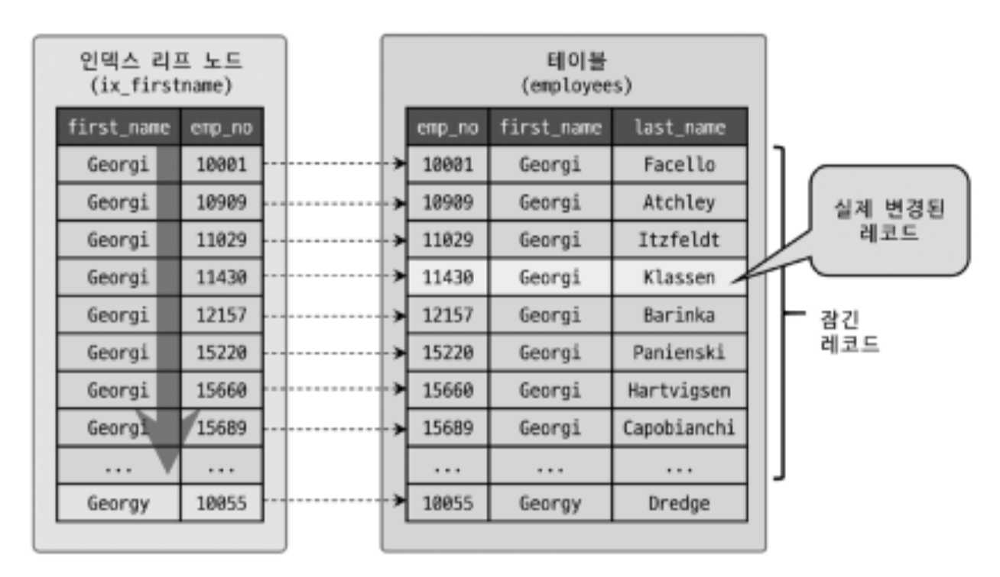

5장에서는 MySQL의 동시성에 영향을 미치는 잠금(Lock)과 트랜잭션, 트랜잭션 격리 수준(Isolation Level)을 살펴보겠다.

트랜잭션은 작업의 완전성을 보장해 줌.  
즉 논리적인 작업 셋을 모두 완변하게 처리하거나, 처리하지 못할 경우에는 원 상태로 복구해서 작업의 일부만 적용되는 현상(Patial update)를 막는다.  
잠금 : 동시성을 제어하기 위한 기능  
트랜잭션 : 데이터의 정합성을 보장하기 위한 기능  
격리 수준 : 하나의 트랜잭션 내에서 또는 여러 트랜잭션 간의 작업 내용을 어떻게 공유하고 차단할 것인지를 결정하는 레벨.  
트랜잭션과 잠금은 비슷한 것 같지만 다르다.

ex)  
하나의 회원정보 레코드를 여러 커넥션에서 동시에 변경 시도

잠금이 없는 경우 :

- 여러 커넥션에서 동시에 변경 가능.
- 결과적으로 해당 레코드의 값은 예측할 수 없게 됨.

잠금이 있는 경우 :

- 잠금이 여러 커넥션에서 동시에 동일한 자원을 요청할 경우 순서대로 한 시점에는 하나의 커넥션만 변경하게 해줌

# 5.1 트랜잭션

트랜잭션을 지원하지 않는 MyISAM과 트랜잭션을 지원하는 InnoDB의 처리 방식의 차이를 살펴보고, 트랜잭션을 사용할 경우 주의할 사항도 함께 살펴보자.

## 5.1.1 MySQL에서의 트랜잭션

트랜잭션은 하나의 논리적인 작업 셋에 하나의 쿼리가 있든 두 개의 쿼리가 있든 관계없이 논리적인 작업 셋 자체가 100% 적용되거나(COMMIT) 아무것도 적용되지 말아야 함(ROLLBACK)을 보장해주는 것이다.

트랜잭션 관점에서 InnoDB와 MyISAM의 차이를 예제로 살펴보자.
테이블MYISAM, 테이블INNODB라는 테이블은 id라는 INT 타입의 레코드를 각각 갖는다고 해보자.
그래서 아래와 같은 쿼리를 수행한다.

> mysql > insert into 테이블MYISAM (id) values (3);  
> mysql > insert into 테이블INNODB (id) values (3);

위의 결과는 당연하게도 id 값이 3인 레코드들이 잘 들어갈 것이다.

그런데 아래와 같은 sql을 실행한다고 해보자.

> mysql > insert into 테이블MYISAM (id) values (1), (2), (3);  
> ERROR 1062 (23000): Duplicate entry "3' for key 'PRIMARY'
>
> mysql > insert into 테이블INNODB (id) values (1), (2), (3);  
> ERROR 1062 (23000): Duplicate entry "3' for key 'PRIMARY'

위 쿼리의 결과는 당연히 pk값인 3이 이전에 insert한 데이터와 중복되었기 때문에 에러가 발생할 것이다.

하지만 테이블을 조회해보면 아래와 같다.

> mysql > select \* from 테이블MYISAM;  
> +----+  
> | id |  
> +----+  
> | 1 |  
> +----+  
> | 2 |  
> +----+  
> | 3 |  
> +----+

> mysql > select \* from 테이블INNODB;  
> +----+  
> | id |  
> +----+  
> | 1 |  
> +----+

결과를 보면 MYISAM 테이블은 오류가 발생했음에도 1과 2가 insert되었다.  
이는 insert문이 실행되면서 1과 2는 차례대로 저장하고, 3을 저장하려는 순간 에러가 발생하게 된 것이다.  
하지만 MyISAM은 트랜잭션의 개념이 없기 때문에 1과 2는 그대로 저장된다.

하지만 InnoDB는 쿼리 중 일부라도 오류가 발생하면 전체를 원 상태로 만드는 트랜잭션의 원칙대로 insert문을 실행하기 전 상태로 복구했다.

MyISAM의 이러한 현상을 부분 업데이트(Partial update)라고 하며 이는 테이블 데이터의 정합성을 맞추는 것을 어렵게 한다.  
부분 업데이트 현상이 발생하면 실패한 쿼리로 인해 남은 레코드를 다시 삭제해야 하는 대처리 작업이 필요할 수 있다. 실행한 쿼리가 하나뿐이라면 재처리 작업이 간단하겠지만 2개 이상의 쿼리가 실행되는 경우라면 실패에 대한 재처리 작업이 복잡해질 것이다.

## 5.1.2 주의사항

트랜잭션 또한 DBMS의 커넥션과 동일하게 꼭 필요한 최소의 코드에만 적용하는 것이 좋다. <== 프로그램의 코드에서 트랜잭션의 범위를 최소화하라는 의미

아래 예시는 사용자가 게시판에 게시물을 작성한 후 저장 버튼을 클릭했을 때 서버에서 처리하는 내용을 순서대로 간략하게 정리한 것이다.

> 1. 처리 시작  
>    ==> 데이터베이스 커넥션 생성  
>    ==> 트랜잭션 시작
> 2. 사용자의 로그인 여부 확인
> 3. 사용자의 글쓰기 내용 오류 여부 확인
> 4. 첨부로 업로드된 파일 확인 및 저장
> 5. 사용자의 입력 내용을 DBMS에 저장
> 6. 첨부 파일 정보를 DBMS에 저장
> 7. 저장된 내용 또는 기타 정보를 DBMS에서 조회
> 8. 게시물 등록에 대한 알림 매일 발송
> 9. 알림 메일 발송 이력을 DBMS에 저장  
>    <== 트랜잭션 종료(COMMIT)  
>    <== 데이터베이스 커넥션 반납
> 10. 처리 완료

위 처리 절차에서 DBMS의 트랜잭션 처리에 좋지 않은 영향을 미치는 부분을 살펴보자.

- 현재 트랜잭션은 1,2번 사이에서 시작하고 9,10번 사이에서 트랜잭션을 종료하고 있다. 그런데 실제로 트랜잭션을 사용하여 5번부터이다. 2,3,4번의 로직이 아무리 빨리 실행된다고 하여도 굳이 DBMS를 사용하지 않는 부분을 트랜잭션에 포함시킬 필요는 없다.  
  일반적으로 데이터 베이스 커넥션은 개수가 제한적이라 각 단위 프로그램이 커넥션을 소유하는 시간이 길어질수록 사용 가능한 여우 커넥션의 수는 줄어들 것이다.

- 더 위험한 것은 8번 작업이다. 외부와 네트워크 통신을 하는 작업은 무조건 DBMS의 트랜잭션 내에서 제거하는 것이 좋다. 프로그램이 실행되는 동안 메일 서버와 통신할 수 없는 상황이 발생하면 웹 서버뿐만 아니라 DBMS 서버까지 위험해질 수 있다.

- 또한 이 처리 절차에는 DBMS의 작업이 크게 4개가 있다. 사용자가 입력한 정보를 저장하는 5,6번은 반드시 하나의 트랜잭션으로 묶어야 하고, 7번은 단순 조회이므로 트랜잭션으로 묶지 않아도 된다(또한 7번은 단순 조회이기 때문에 굳이 다른 트랜잭션을 사용하지 않아도 될 것같다.) 9번은 작업의 성격이 다르기에 5,6번과 함께 묶지 않아도 된다.

문제가 되는 3가지 부분을 수정한 것을 보자.

> 1. 처리 시작
> 2. 사용자의 로그인 여부 확인
> 3. 사용자의 글쓰기 내용 오류 여부 확인
> 4. 첨부로 업로드된 파일 확인 및 저장  
>    ==> 데이터베이스 커넥션 생성  
>    ==> 트랜잭션 시작
> 5. 사용자의 입력 내용을 DBMS에 저장
> 6. 첨부 파일 정보를 DBMS에 저장  
>    <== 트랜잭션 종료(COMMIT)
> 7. 저장된 내용 또는 기타 정보를 DBMS에서 조회
> 8. 게시물 등록에 대한 알림 매일 발송  
>    ==> 트랜잭션 시작
> 9. 알림 메일 발송 이력을 DBMS에 저장  
>    <== 트랜잭션 종료(COMMIT)  
>    <== 데이터베이스 커넥션 반납
> 10. 처리 완료

- 프로그램의 코드가 데이터베이스 커넥션을 가지고 있는 범위와 트랜잭션이 활성화돼 있는 프로그램의 범위를 최소화해야 한다.
- 프로그램의 코드에서 라인 수는 한두 줄이라고 하더라도 네트워크 작업이 있는 경우에는 반드시 트랜잭션에서 배제해야 한다.
- 위와 같은 실수로 인해 DBMS 서버가 높은 부하 상태로 빠지거나 위험한 상태에 빠지는 경우가 발생할 수 있다.

# 5.2 MySQL 엔진의 잠금

MySQL의 잠금은 크게 스토리지 엔진 레벨과 MySQL 엔진 레벨로 나눌 수 있다.  
MySQL 엔진은 서버에서 스토리지 엔진을 제외한 모든 부분을 의믜한다. MySQL 엔진 레벨의 잠금은 모든 스토리지 엔진에 영향을 미치지만, 스토리지 엔진 레벨의 잠금은 스토리지 엔진 간 상호 영향을 미치지 않음.  
MySQL은 대표적으로 아래와 같은 4개의 락을 제공한다.

1. 글로벌 락 : MySQL 서버 전체를 잠금
2. 테이블 락 : 테이블 데이터를 동기화하기 위함
3. 메타데이터 락 : 테이블의 구조를 잠금
4. 네임드 락 : 사용자의 필요에 맞게 사용가능한 잠금

## 5.2.1 글로벌 락

글로벌 락(GLOBAL LOCK)은 FLUSH WITH READ LOCK 명령으로 획득할 수 있으며, MySQL에서 제공하는 잠금 중 가장 범위가 크다.  
일단 한 세션에서 글로벌 락을 획득하면 다른 세션에서 SELECT를 제외한 DDL, DML 문장을 실행하는 경우 글로벌 락이 해제될 때까지 해당 명령들은 대기 상태로 남는다.
글로벌 락의 범위는 MySQL 서버 전체이며, 작업 대상 테이블이나 데이터 베이스가 다르더라도 동일하게 영향을 미친다.

FLUSH WITH READ LOCK 명령으로 이용한 글로벌 락은 MySQL 서버의 모든 변경 작업을 멈춘다.

- 다만 최근에는 InnoDB 스토리지 엔진이 일반화됨
- InnoDB 스토리지 엔진은 트랜잭션을 지원하기 때문에 일관된 데이터 상태를 유지하기 위해 모든 데이터 변경 작업을 멈출 필요는 없다.
- 또한 MySQL 8.0 버전부터는 InnoDB가 기본 스토리지 엔진으로 채택되면서 더 가벼운 글로벌 락의 필요성이 생김
- 하여 MySQL 8.0부터 Xtrabackup이나 Enterprise Backup과 같은 툴들의 안정적인 실행을 위해 **백업 락**이 도입됨

> mysql > LOCK INSTANCE FOR BACKUP;  
> -- // 백업 실행 --  
> mysql > UNLOCK INSTANCE;

- 특정 세션에서 백업 락을 획득하면 모든 세션에서 테이블의 스키마나 사용자의 인증 관련 정보를 변경할 수 없음. 즉 아래의 3가지 경우는 백업 락 중 변경이 불가능하다.

  - 데이터베이스 및 테이블 등 모든 객체 생성 및 변경, 삭제
  - REPAIR TABLE과 OPTIMIZE TABLE 명령
  - 사용자 관리 및 비밀번호 변경

- 하지만 백업 락은 일반적인 데이터 변경은 허용한다.
- 일반적인 MySQL 서버의 구성은 소스 서버(sorce server)와 레플리카 서버(replica server)로 구성되는데, 주로 백업은 레플리카 서버에서 실행된다.
- 이때 백업이 FLUSH TABLES WITH READ LOCK 명령으로 글로벌 락을 획득하면 복제는 백업 시간만큼 지연될 수 밖에 없다.
- 또한 레플리카 서버에서 백업을 실행하는 도중에 소스 서버에 문제가 생기면 레플리카 서버의 데이터가 최신 상태가 될때까지 서비스를 멈춰야할 수도 있다.
- MySQL의 백업 락은 이런 문제를 해결하기 위해 도입되었으며, 정상적으로 복제는 실행되지만 백업의 실패를 막기 위해 DDL 명령이 실행되면 복제를 일시 중지하는 역할을 한다.

## 5.2.2 테이블 락

테이블 락(Table Lock)은 개별 테이블 단위로 설정되는 잠금이며, 명시적 또는 묵시적으로 특정 테이블의 락을 획득할 수 있다.

명시적 : "LOCK TABLES table_name [ READ | WRITE]" 명령  
명시적으로 획득한 잠금은 "UNLOCK TABLES" 명령으로 잠금을 반납(해제)할 수 있다. (명시적 락은 특별한 일 아니면 어플리케이션에서 거의 사용할 일 X - 이는 글로벌 락처럼 온라인 작업에 상당한 영향을 미치기 때문)

묵시적 : MyISAM이나 MEMORY 테이블에서 데이터를 변경하는 쿼리를 실행하면 발생한다.  
하지만 InnoDB 테이블의 경우 스토리지 엔진 차원에서 레코드 기반의 잠금을 제공하기 때문에 단순 데이터 변경 쿼리로 인해 묵시적 테이블 락이 설정되지 않는다. 더 정확히는 InnoDB 테이블에서도 테이블 락이 설정되지만 대부분의 데이터 변경 DML 쿼리에서는 무시되고 스키마를 변경하는 DDL의 경우에만 영향을 미친다.

## 5.2.3 네임드 락

네임드 락(Named Lock)은 GET_LOCK() 함수를 이용해 임의의 문자열에 대해 잠금을 설정할 수 있다.

- 이 잠금은 테이블, 레코드, AUTO_INCREMENT와 같은 데이터베이스 객체가 아니다.
- 네임드 락은 단순히 사용자가 지정한 문자열(String)에 대해 획득하고 반납(해제)하는 잠금이다.
- 네임드 락은 자주 사용되지는 않음
- 예를 들어 DB서버 1대에 5대의 웹서버가 접근하는 접속해서 서비스하는 상황에서 5대의 웹 서버가 어떤 정보를 동기화해야 하는 상황처럼 여러 클라이언트가 상호 동기화를 처리해야 할 때 네임드 락을 사용하면 쉽게 해결할 수 있다.

> -- // "mylock"이라는 문자열에 대해 잠금을 획득  
> -- // 이미 잠금을 사용하는 중이면 2초 동안 대기.(2초후 자동으로 잠금 해제됨)  
> mysql > SELECT GET_LOCK ('mylock', 2);
>
> -- // "mylock"이라는 문자열에 대해 잠금이 설정돼 있는지 확인  
> mysql > SELECT IS_FREE_LOCK("mylock");
>
> -- // "mylock"이라는 문자열에 대해 획득했던 잠금을 반납(해제)한다.  
> mysql > SELECT RELEASE_LOCK("mylock");
>
> -- // 3개 함수 모두 정상적으로 락을 획득하거나 해제한 경우에는 1을, 아니면 NULL이나 0을 반환한다.

- 또한 네임드 락의 경우, 많은 레코드에 대해서 복잡한 요건으로 레코드를 변경하는 트랜잭션에 유용하게 사용할 수 있다.
- 배치 프로그램처럼 한꺼번에 많은 레코드를 변경하는 쿼리는 자주 데드락이 원인이 되곤 한다.
- 이런 경우 동일 데이터를 변경하거나 참조하는 프로그램끼리 분류해서 네임드 락을 걸고 쿼리를 실행하면 간단히 해결할 수 있다.
- MySQL 8.0부터는 아래와 같이 네임드 락을 중첩해서 사용할 수 있으며, 현재 세션에서 획득한 네임드 락을 한 번에 모두 해제하는 기능도 추가됐다.

> mysql > SELECT GET_LOCK("mylock_1", 10);  
> -- // mylock_1에 대한 작업 실행  
> mysql > SELECT GET_LOCK("mylock_2", 10);  
> -- // mylock_1과 mylock_2에 대한 작업 실행
>
> mysql > SELECT RELEASE_LOCK("mylock_2);  
> mysql > SELECT RELEASE_LOCK("mylock_1);
>
> -- // mylock_1과 mylock_2를 동시에 모두 락 해제하고 싶다면 아래 함수 사용  
> mysql > SELECT RELEASE_ALL_LOCKS();

## 5.2.4 메타데이터 락

메타데이터 락(Metadata Lock)은 데이터베이스 객체(대표적으로 테이블이나 뷰 등)의 이름이나 구조를 변경하는 경우에 획득하는 잠금이다.

- 메타데이터 락은 명시적으로 획득하거나 해제할 수 있는 것이 아니고 "RENAME TABLE tab_a TO tab_b" 같이 테이블의 이름을 변경하는 경우 자동으로 획득하는 잠금이다.
- 또한 실시간으로 테이블을 바꿔야 하는 요건이 배치 프로그램에서 자주 발생하는데, 다음 예제를 잠깐 살려보자.

> -- // 배치 프로그램에서 별도의 임시 테이블(rank_new)에 서비스용 랭킹 데이터를 생성
>
> -- // 랭킹 배치가 완료되면 현재 서비스용 랭킹 테이블(rank)을 rank_backup으로 백업하고  
> -- // 새로 만들어진 랭킹 테이블(rank_new)을 서비스용으로 대체하고자 하는 경우  
> mysql > RENAME TABLE rank TO rank_backup, rank_new TO rank;

- 위와 같이 한번에 두 개의 RENAME 작업을 실행하면 에러가 발생하지 않고 적용된다.
- 하지만 아래와 같이 2개로 나누면 "Table not found rank" 오류를 발생시킨다.

  > mysql > RENAME TABLE rank TO rank_backup;  
  > mysql > RENAME TABLE rank_new TO rank;

- 이때는 아주 잠깐이지만 rank 테이블이 존재하지 않는 시간이 생기며 이때 "Table not found rank" 오류가 발생하는 것이다.

- 때로는 메타데이터 잠금과 InnoDB의 트랜잭션을 동시에 사용해야 하는 경우도 있다. 예를 들어, 아래와 같이 INSERT만 실행되는 로그 테이블이 있다고 가정해보자. 해다 테이블은 웹 서버의 액세스(접근) 로그를 저장만 하기 때문에 UPDATE, DELETE가 없다.

> CREATE TABLE access_log(  
>  id BIGINT NOT NULL,  
>  AUTO_INCREMENT,  
>  client_ip INT UNSIGNED,  
>  access_dttm TIMESTAMP,  
>  ...  
>  PRIMARY KEY(id)  
> );

- 그런데 어느날 테이블의 구조를 변경해야 하는 요구사항이 있다고 해보자.
- 문제는 MySQL 서버의 DDL은 단일 스레드로 작동하기 때문에 많은 시간이 소요될 것 이라는 점이다.
- 이때는 먼저 새로운 테이블을 생성하고, 먼저 최근 (1시간 직전 또는 하루 직전)의 데이터까지 프라이머리 키 id 값을 밤위별로 나눠서 여러 개의 스레드로 빠르게 복사하면 된다.

  > //테이블의 압축을 위해 KEY_BLOCK_SIZE=4 옵션을 추가해 신규 테이블 생성  
  > CREATE TABLE access_log_new(  
  >  id BIGINT NOT NULL,  
  >  AUTO_INCREMENT,  
  >  client_ip INT UNSIGNED,  
  >  access_dttm TIMESTAMP,  
  >  ...  
  >  PRIMARY KEY(id)  
  > ) KEY_BLOCK_SIZE=4;
  >
  > // 4개의 스레드를 이용해 id 범위별로 신규 테이블로 복사  
  > mysql_thread1 > INSERT INTO access_log_new SELECT * FROM access*log WHERE id >= 0 AND id < 10000;  
  > mysql_thread2 > INSERT INTO access_log_new SELECT * FROM access*log WHERE id >= 10000 AND id < 20000;  
  > mysql_thread3 > INSERT INTO access_log_new SELECT * FROM access*log WHERE id >= 20000 AND id < 30000;  
  > mysql_thread4 > INSERT INTO access_log_new SELECT \* FROM access_log WHERE id >= 30000 AND id < 40000;

- 그리고 이제 나머지 데이터는 아래와 같이 트랜잭션과 테이블 잠금, RENAME TABLE 명령으로 응용 프로그램의 중단 없이 실행할 수 있다.
- 이때 "남은 데이터를 복사"하는 시간 동안은 테이블의 잠금으로 인해 INSERT를 할 수 없게 된다.
- 그래서 가능하면 미리 아주 최근 데이터까지 복사해 둬야 잠금 시간을 최소화해서 서비스에 미치는 영향을 줄일 수 있다.

> // 트랜잭션을 autocommit으로 실행(BEGIN이나 START TRANSACTION으로 시작하면 안됨)  
> mysql > SET autocommit=0;
>
> // 작업 대상 테이블 2개에 대해 테이블 쓰기 락을 획득  
> mysql > LOCK TABLES access_log WRITE, access_log_new WRITE;
>
> // 남은 데이터를 복사  
> mysql > SELECT MAX(id) as @MAX_ID FROM access_log;  
> mysql > INSERT INTO access_log_new SELECT \* FROM access_log WHERE pk > @MAX_ID;  
> mysql > commit;
>
> // 새로운 테이블로 데이터 복사가 완료되면 RENAME 명령으로 새로운 테이블을 서비스로 투입  
> mysql > RENAME TABLE access_log TO access_log_old, access_log_new TO access_log;  
> mysql > UNLOCK TABLES;
>
> //불필요한 데이터 삭제  
> mysql > DROP TABLE access_log_old;

# 5.3 InnoDB 스토리지 엔진 잠금

InnoDB 스토리지 엔진은 MySQL에서 제공하는 잠금과 별개로 스토리지 엔진 내부에서 레코드 기반의 잠금 방식을 탑재하고 있음.

- 레코드 기반 잠금 때문에 뛰어난 동시성 처리를 제공할 수 있다.
- 하지만 이원화된 잠금 처리탓에 InnoDB 스토리지 엔진에서 사용되는 잠금에 대한 정보는 MySQL 명령을 이용해 접근하기 어렵다.
- 최근 버전에서는 MySQL 서버의 information_schema 데이터베이스에 존재하는 INNODB_TRX, INNODB_LOCKS, INNODB_LOCK_WAITS라는 테이블을 조인해서 조회하면:
  - 어떤 트랜잭션이 어떤 잠금을 대기하는지
  - 해당 잠금을 어느 트랜잭션이 가지고 있는지
  - 장시간 잠금을 가지고 있는 클라이언트를 찾아서 종료시킬 수도 있음
- 또한 InnoDB의 잠금에 대한 모니터링이 강화되면서 Performance Schema를 이용하여 InnoDB 스토리지 엔진의 내부 잠금(세마포어)에 대한 모니터링 방법도 추가됨.

## 5.3.1 InnoDB 스토리지 엔진의 잠금

InnoDB의 레코드 기반 잠금은 잠금 정보가 상당히 작은 공간으로 관리됨.

- 하여 레코드 락이 페이지 락으로, 또는 테이블 락으로 레벨업 되는 경우(락 에스컬레이터)는 없다.

- 사용 DBMS와는 다르게 InnoDB 스토리지 엔진에는 레코드 락 뿐 아니라 레코드와 레코드 사이의 간격을 잠그는 갭(GAP)락이라는 것이 존재하는데, 아래 그림은 InnoDB 스토리지 엔진의 레코드 락과 갭락을 보여준다.  
  </img>

### 5.3.1.1 레코드 락

레코드 자체만 잠그는 것을 레코드 락.

- 다른 상용 DBMS의 레코드 락과 동일한 역할을 함.
- 중요한 차이는 InnoDB 스토리지 엔진은 레코드 자체가 아닌, 인덱스의 레코드를 잠근다.
- 인덱스가 하나도 없는 테이블이더라도 내부적으로 자동 생성된 클러스터 인덱스를 이용해 잠금을 설정한다.
- 레코드 자체를 잠그느냐, 인덱스를 잠그느냐는 상당한 차이가 있음
- InnoDB에서는 대부분 보조(secondary) 인덱스를 이용한 변경 작업은 이어서 설명할 넥스트 키 락(Next key lock) 또는 갭 락(Gap lock)을 사용하지만 프라이머리 키 또는 유니크 인덱스에 의한 변경 작업에서는 갭이 아닌 레코드 자체에 대해서만 락을 건다. (보조 인덱스 => 넥스트 키락, 갭락 | 프라이머리 키, 유니크 인덱스 => 레코드 자체)

### 5.3.1.2 갭 락

다른 DBMS와의 또 다른 차이가 갭 락임.

- 갭 락은 레코드 자체가 아니라 레코드와 바로 인접한 레코드 사이의 간격만을 잠그는 것을 의미.
- 갭 락의 역할은 레코드와 레코드 사이의 간격에 새로운 레코드가 생성(insert)되는 것을 제어.
- 갭 락은 자체로 보다 넥스크 키 락의 일부로 자주 사용된다.

### 5.3.1.3 넥스트 키 락

레코드 락 + 갭 락 = 넥스크 키 락(Next Key Lock)

- STATMENT 포맷의 바이너리 로그를 사용하는 MySQL 서버라면 REPEATABLE READ 격리 수준을 사용해야 함.
- 또한 innodb_locks_unsafe_gor_binlog 시스템 변수가 비활성화되면(0으로 설정) 변경을 위해 검색하는 레코드에는 넥스트 키 락 방식으로 잠금이 걸림.
- 갭 락이나 넥스크 키 락은 바이너리 로그에 기록되는 쿼리가 레플리카 서버에서 실행될 때 소스 서버에서 만들어 낸 결과와 동일한 결과를 만들어내도록 보장하는 것이 목적.
- 그런데 넥스크 키 락과 갭 락으로 인해 데드락이 발생하거나 다른 트랜잭션을 기다리게 만드는 일이 자주 발생함
- 해서 가능하다면 바이너리 로그 포맷을 ROW 형태로 바꿔서 넥스트 키 락이나 갭락을 줄이는게 좋음

### 5.3.1.4 자동 증가 락

MySQL에서는 자동 증가하는 숫자 값을 추출하기 위해 AUTO_INCREMENT라는 칼럼 속성을 제공.  
AUTO_INCREMENT 칼럼이 사용된 테이블에 동시에 여러 레코드가 insert되는 경우, 저장되는 각 레코드는 중복되지 않고 저장된 순서대로 증가하는 일련번호 값을 가져야함.  
InnoDB 스토리지 엔진에서는 이를 내부적으로 AUTO_INCREMENT 락 이라고 하는 테이블 수준의 잠금을 사용한다.

- AUTO_INCREMENT 락은 INSERT와 REPLACE 쿼리 문장과 같은 새로운 레코드를 저장하는 쿼리에서만 필요.(UPDATE, DELETE 등의 쿼리에서는 걸리지 않음)
- InnoDB의 다른 잠금과 달리 트랜잭션과 관계없이 INSERT나 REPLACE에서 AUTO_INCREMENT 값을 가져오는 순간만 락이 걸렸다가 즉시 해제됨.
- MySQL 5.1 이상부터는 innodb_autoinc_lock_mode라는 시스템 변수를 이용해 자동 증가 락의 작동 방식을 변경할 수 있다.

## 5.3.2 인덱스와 잠금

InnoDB의 잠금과 인덱스는 상당히 중요한 연관관계가 있다.  
InnoDB의 잠금은 레코드가 아닌 인덱스를 잠그는 방식으로 처리된다.  
즉 변경해야 할 레코드를 찾기 위해 검색한 인덱스의 레코드를 모두 락을 걸어야 한다.  
이해를 위해 아래 UPDATE 문장을 한 번 보자.

> // 예제 데이터베이스의 employees 테이블에는 아래와 같이 first_name 칼럼만 멤버로 담긴 ix_firstname이라는 인덱스가 준비되어 있다.  
> // KEY ix_firstname(first_name)  
> // employees 테이블에서 first_name="Kingchan"인 사원은 전체 235명이 있으며,  
> // first_name = "Kingchan"이고 last_name="Lee"인 사원은 딱 1명만 있는 것을 아래 쿼리로 확인할 수 있다.
> mysql > SELECT COUNT(\*) FROM employees where first_name="Kingchan";  
> +-------+  
> | 235 |  
> +-------+
>
> mysql > SELECT COUNT(\*) FROM employees where first_name="Kingchan" AND last_name = "Lee";  
> +-------+  
> | 1 |  
> +-------+  
> // employees 테이블에서 first_name = "Kingchan"이고 last_name="Lee"인 사원의 입사 일자를 오늘로 변경하는 쿼리를 실행해보자.  
> mysql > UPDATE employees SET hire_date=NOW() where first_name="Kingchan" AND last_name = "Lee";

- UPDATE 문장이 실행되면 1건의 레코드가 업데이트될 것이다.
- 하지만 이 1건의 업데이트를 위해 많은 레코드에 락을 걸어야 한다.
  - UPDATE 문장의 조건에서 인덱스를 이용할 수 있는 조건은 first_name = "Kingchan"이며, last_name 컬럼은 인덱스가 없다.
  - 해서 first_name = "Kingchan"인 레코드 235건이 모두 잠긴다.
- 아래 그림은 UPDATE 문장이 어떻게 변경 대상 레코드를 검색하고, 실제 변경이 수행되는지 보여준다.
- 이 예제에서는 몇 건 안되는 레코드만 잠그지만 UPDATE 문장을 위해 적절히 인덱스가 준비돼 있지 않다면 각 클라이언트 간의 동시성이 상당히 떨어져서 한 세션에서 UPDATE 작업을 하는 중에는 다른 클라이언트는 그 테이블을 업데이트하지 못하고 기다려야 하는 상황이 발생할 것이다.  
  </img>
- 만약 위 테이블에서 인덱스가 하나도 없다면 테이블을 풀 스캔하면서 UPDATE 작업을 하는데, 이 과정에서 테이블에 있는 30여만 건의 모든 레코드를 잠그게 된다.
- 해서 MySQL의 InnoDB에서는 인덱스 설계가 매우 중요하다.
