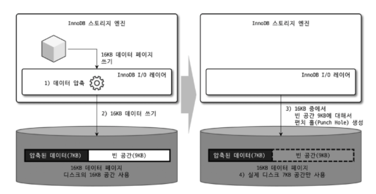
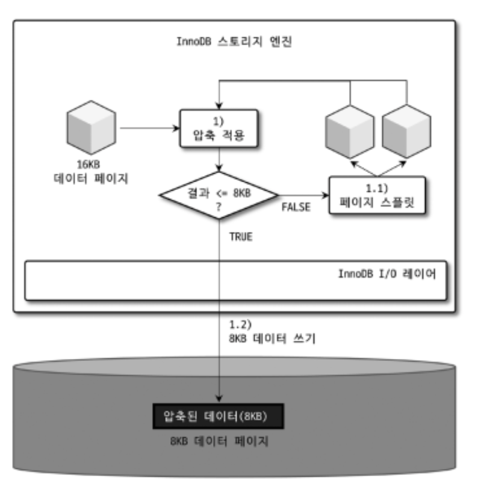
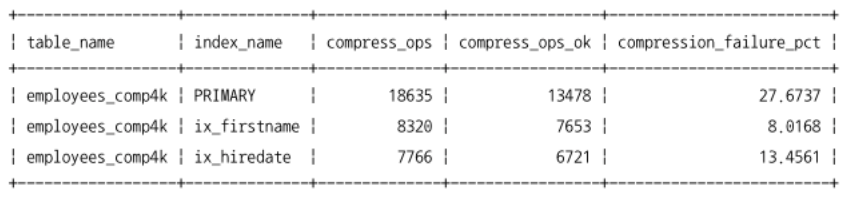
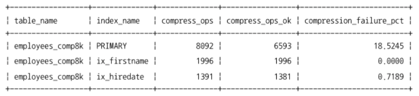
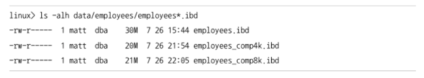

# 6 데이터 압축

MySQL 서버에서 디스크에 저장된 데이터 파일의 크기는 일반적으로 쿼리의 성능과도 연결되지만 백업 및 복구 시간과도 밀접하게 연관된다.

- 디스크의 데이터 파일이 크면 클수록 ->
- 쿼리를 처리하기 위해서 더 많은 데이터 페이지를 InnoDB 버퍼 풀로 읽어야 할 수도 있고 ->
- 새로운 페이지가 버퍼 풀로 적재 ->
- 그만큼 더티 페이지가 더 자주 디스크로 기록되어야 함.

또한

- 데이터 파일이 크면 클수록 백업 시간이 오래걸림 + 복구도 오래 걸림

이러한 문제점들을 해결하기 위해 많은 DBMS가 데이터 압축 기능을 제공한다.
MySQL에서 사용 가능한 압축 방식은 크게 테이블 압축과 페이지 압축의 두 가지 종류가 있다. 하나씩 구분하여 알아보자.

## 6.1 페이지 압축

페이지 압축은 "Transparent Page Compression"이라고도 불리는데, MySQL 서버가 디스크에 저장하는 시점에 데이터 페이지가 압축되어 저장하고, 반대로 MySQL 서버가 디스크에서 데이터 페이지를 읽어올 때 압축이 해제되기 때문이다.

- 즉 버퍼 풀에 데이터 페이지가 한 번 적재되면 InnoDB 스토리지 엔진은 압축이 해제된 상태로만 데이터 페이지를 관리한다.
- 그래서 MySQL 서버의 내부 코드에서는 압축 여부와 상관없이 "투명(Transparent)"하게 작동한다.
- 여기서의 문제점은 16KB 데이터 페이지를 압축한 결과가 용량이 얼마나 될지 예측이 불가능한데, 적어도 하나의 테이블은 동일한 크기의 페이지로 통일돼야 한다는 것이다.
- 해서 페이지 압축 기능은 운영체제 별로 특정 버전의 파일 시스템에서만 지원되는 펀치 홀(Punch hole)이라는 기능을 사용한다.
- 운영체제(파일 시스템)의 블록 사이즈가 512바이트인 경우, 페이지 압축이 작동하는 방식을 간단히 살펴보면 다음과 같다.
- MySQL 서버는 특정 테이블에 대해 16KB 크기의 페이지를 유지하면서도 압축된 다양한 크기의 데이터 페이지를 디스크에 저장하고 압축된 만큼의 공간을 절약할 수 있다.
  > 1. 16KB 페이지를 압축(압축 결과를 7KB로 가정)
  > 2. MySQL 서버는 디스크에 압축된 결과 7KB를 기록
  >    (이때 MySQL 서버는 압축 데이터 7KB에 9KB의 빈 데이터를 기록)
  > 3. 디스크에 데이터를 기록한 후, 7KB 이후의 공간 9KB에 대해 펀치 홀을 생성
  > 4. 파일 시스템은 7KB만 남기고 나머지 디스크의 9KB 공간은 다시 운영체제로 반납
- 아래 그림은 위의 과정을 그림으로 표현한 것이다. 그림의 오른쪽 그림은 16KB 페이지에 대해 9KB만큼 펀치 홀이 생성된 것을 의미한다. 이 상태에서는 실제 디스크의 공간은 7KB만 차지한다.
- 하지만 운영체제에서 16KB를 읽으면 압축된 데이터 7KB와 펀치 홀 공간인 9KB를 합쳐서 16KB를 읽는다.  
  </img>
- 그런데 MySQL 서버의 페이지 압축이 가진 문제는 펀치 홀 기능은 운영체제뿐만 아니라 하드웨어 자체에서도 해당 기능을 지원해야 사용가능하다는 것이다.
- 또 다른 문제점은 아직 파일 시스템 관련 명령어가 펀치 홀을 지원하지 못한다는 것이다.
- MySQL 서버의 데이터 파일은 해당 서버에만 머무는 것이 아니라 백업했다가 복구하는 과정에서 데이터 파일의 복사 과정이 실행되고, 그 외에도 많은 파일 관련 유틸리티들을 사용한다.
- 예로 펀치 홀이 적용되어 실제 데이터 파일의 크기가 1GB라고 하더라도 "cp"같은 파일 복사 명령어 또는 "XtraBackup"같은 툴이 파일을 복사하면 펀치 홀이 다시 채워져서 데이터 파일의 크기는 원본 크기인 10GB가 될 수 있다.
- 이런 이유로 실제 페이지 압축은 많이 사용되지 않는 상태다.

## 6.2 테이블 압축

테이블 압축은 운영체제나 하드웨어에 대한 제약 없이 사용가능하여 활용도가 더 높음.
테이블 압축은 우선 디스크의 데이터 파일 크기를 줄일 수 있기 때문에 이득이 있지만 역시 몇가지 단점이 있다.

- 버퍼 풀 공간 활용률이 낮음
- 쿼리 처리 성능이 낮음
- 빈번한 데이터 변경 시 압축률이 떨어짐

이러한 단점들이 발생하는 이유를 이해하기 위해 내부적으로 어떻게 압축이 실행되어 디스크에 저장되는지, 그리고 압축된 데이터 페이지들이 버퍼 풀에 어떻게 적재되어 사용되는지를 이해해보자.

### 6.2.1 압축 테이블 생성

테이블 압축을 사용하기 위한 전제조건 : 압축을 사용하려는 테이블이 별도의 테이블 스페이스를 사용해야 한다.

- 이를 위해서는 innodb_file_per_table 시스템 변수가 ON으로 설정된 상태에서 테이블이 생성되어야 함.
- 이제 테이블 압축을 사용하는 테이블은 다음과 같이 테이블을 생성할 때 ROW_FORMAT=COMPRESSED 옵션을 명시해야 한다.
- 추가로 KEY_BLOCK_SIZE 옵션을 이용해 압축된 페이지의 타깃 크기(목표 크기)를 명시하는데, 2n으로만 설정할 수 있다.(n >= 2)
- Ex) InnoDB 스토리지 엔진의 페이지 크기가 16KB라면 KEY_BLOCK_SIZE는 4KB, 8KB만 설정할 수 있다.
- 그리고 페이지 크기가 32KB 또는 64KB인 경우에는 테이블 압축을 적용할 수 없다.
  > mysql > SET GLOBAL innodb_file_per_table = ON;
  >
  > // ROW_FORMAT 옵션과 KEY_BLOCK_SIZE 옵션을 모두 명시  
  > mysql > CREATE TABLE compressed_table (  
  >  c1 INT PRIMARY KEY  
  > )  
  > ROW_FORMAT=COMPRESSED  
  > KEY_BLOCK_SIZE=8;
  >
  > // KEY_BLOCK_SIZE 옵션만 명시  
  > mysql > CREATE TABLE compressed_table (  
  >  c1 INT PRIMARY KEY  
  > )  
  > KEY_BLOCK_SIZE=8;
- 두번째 테이블 생성 구문처럼 ROW_FORMAT옵션을 생략하면 자동으로 ROW_FORMAT=COMPRESSED 옵션이 추가되어 생성됨
- KEY_BLOCK_SIZE에 명시된 옵션값은 KB단위를 설정한다. 그래서 앞의 테이블의 KEY_BLOCK_SIZE는 8KB를 의미한다.
- 압축 적용에 사용되는 KEY_BLOCK_SIZE 옵션은 압축된 페이지가 저장될 페이지의 크기를 지정한다.
- 예로, 현재 InnoDB 스토리지 엔진의 데이터 페이지(블록) 크기가 16KB, 그리고 KEY_BLOCK_SIZE가 8로 설정됐다고 해보자. 이때 데이터 페이지를 압축한 용량이 얼마가 될지 알 수 없는데, 어떻게 KEY_BLOCK_SIZE를 테이블을 생성할 때 설정할 수 있을까? 먼저 InnoDB 스토리지 엔진이 압축을 적용하는 방법을 알아보자.
  > 1. 16KB의 데이터 페이지를 압축  
  >    1.1 압축된 결과가 8KB이하면 그대로 디스크에 저장(압축 완료)  
  >    1.2 압축된 결과가 8KB를 초과하면 원본 페이지를 스플릿(split)해서 2개의 페이지에 8KB씩 저장
  > 2. 나뉜 페이지 각각에 대해 1번 단계를 반복 실행

아래 그림은 위에서 살펴본 테이블 압축의 작동 방식을 보여준다.  
목표 크기(KEY_BLOCK_SIZE)로 8KB를 가정했고, 테이블 압축에서는 InnoDB 스토리지 엔진의 "InnoDB I/O 레이어"에서는 아무런 역할을 하지 않는다는 것을 알 수 있다.  
</img>

- 테이블 압축에서 중요한 것은 원본 데이터 페이지의 압축 결과가 목표 크기(KEY_BLOCK_SIZE)보다 작거나 같을 때까지 반복해서 페이지를 스플릿하는 것이다. 해서 목표 크기 설정이 잘못되면 MySQL의 처리 성능이 급격히 느려질 수 있으니 주의해야 한다.

### 6.2.2 KEY_BLOCK_SIZE 결정

- 테이블 압축에서 중요한 것은 압축된 결과가 어느 정도될지를 예측하여 KEY_BLOCK_SIZE를 결정하는 것이다.
- 해서 테이블 압축 적용 전에 KEY_BLOCK_SIZE를 4KB, 8KB로 테이블을 생성하여 샘플 데이터를 저장해보는 테스트를 하는 것이 좋다.
- 이때 샘플 데이터는 많을 수록 좋다(테이블의 데이터 페이지가 최소 10개 이상되도록 데이터 INSERT)
- 예제 데이터베이스의 employees 테이블을 이용해 간단히 KEY_BLOCK_SIZE를 선택하는 예시를 살펴보자.

  > mysql > USE employees;  
  > // 테이블 압축을 사용하는 예제 테이블을 생성  
  > mysql > CREATE TABLE employees_comp4k (  
  >  emp_no int NOT NULL,  
  > birth_date date NOT NULL,  
  > first_name varchar(14) NOT NULL,  
  > last_name varchar(16) NOT NULL,  
  > gender enum('M', 'F') NOT NULL,  
  > hire_date date NOT NULL,  
  > PRIMARY KEY (emp_no),  
  > KEY ix_firstname(first_name),  
  > KEY ix_hiredate(hire_date),  
  > ) ROW_FORMAT=COMPRESSED KEY_BLOCK_SIZE=4;
  >
  > // 테스트를 실행하기 전에 innodb_cmp_per_index_enabled 시스템 변수를 ON으로 변경해야 한다.  
  > // 그래야 인덱스별로 압축 실행 횟수와 성공 횟수가 기록된다.  
  > mysql > SET GLOBAL innodb_cmp_per_index_enabled=ON;
  >
  > // employees 테이블의 데이터를 그대로 압축 테스트 테이블로 저장.  
  > mysql > INSERT INTO employees_comp4k SELECT \* from employees;
  >
  > // 인덱스 별로 입력 횟수와 성공 횟수, 압축 실패율을 조회  
  > mysql > SELECT table_name, index_name, compress_ops, compress_ops_ok,  
  > (compress_ops-compress_ops_ok)/compress_ops \* 100 as compression_failure_pct  
  > FROM information_schema.INNODB_CMP_PER_INDEX;
  > </img>

- 위 예제의 결과를 보면 압축된 테이블의 PRIMARY 키는 전체 18635번의 압축을 실행했는데, 그 중에서 13478번 성공했다.
- 즉 5175(18635-13478)번 압축했는데, 압축의 결과가 4KB를 초과해서 데이터 페이지를 스플릿해서 다시 압축을 실행했다는 의미이다.
- 여기서 PK의 압축 실패율은 27프로, 인덱스들도 각각 8, 13프로로 상대적으로 높은 실패율이다.
- 압축 실패율은 3~5프로 정도가 적당하다.
- 그렇다면 이번에는 KEY_BLOCK_SIZE를 8KB로 설정하고 동일한 테스트를 한 결과를 보자.  
  </img>
- 8KB로 설정했음에도 PK는 괘 높은 실패율이 나오는 것을 볼 수 있다.
- 이 결과를 바탕으로, 압축을 적용하면 압축 실패율이 높아 InnoDB 버퍼 풀에서 디스크로 기록되기 전에 압축하는 과정에 꽤 오랜 시간이 걸릴 것이라고 예측할 수 있다.
- 성능에 민감한 서비스라면 employees 테이블은 압축을 적용하지 않느 것이 좋을 것 같다.
- 물론 압축 실패율이 높다고 해서 실제 디스크의 데이터 파일 크기가 줄어들지 않는다는 것은 아니다.

  </img>

- 위의 결과는 실제 데이터 디렉터리에 생성된 각 테이블의 크기다.
- 압축되지 않은 employees 테이블의 크기는 30MB인 반면, 4KB 압축을 적용한 테이블은 20MB, 8KB 설정 테이블은 21MB인 것을 볼 수 있다.
- 흥미로운 것은 4KB나 8KB나 압축의 결과가 차이가 크지 않다는 것이다.
- 이러한 경우 결과는 비슷하지만 압축 실패율은 더 낫은 8KB를 선택하는 것이 좋다.
- 주의할 것은 "압축 실패울이 높다 -> 압축 사용하면 안된다"는 아니라는 것이다.
- 예로 INSERT만 되는 로그 테이블의 경우에는 한 번 INSERT되면 이후 다시는 변경되지 않을 것이다. 그렇다면 한번 정도는 압축 시도가 실패해서 페이지 스플릿 후 재압축을 한다고 하더라도 데이터 파일의 크기가 크게 준다면 큰 손해는 아닐 것이다.

- 하지만 반대로 테이블의 데이터가 빈번하게 조회되고 변경된다면 압축은 고려하지 않는 것이 좋다.
- 테이블 압축은 zlib를 이용해 압축을 하는데, 이 압축 알고리즘은 많은 CPU 자원을 소모한다.

### 6.2.3 압축된 페이지의 버퍼 풀 적재 및 사용

InnoDB 스토리지 엔진은 압축된 테이블의 데이터 페이지를 버퍼 풀에 적재하면 압축된 상태와 압축이 해제된 상태 2개의 버전을 관리한다.  
그래서 InnoDB 스토리지 엔진은 디스크에서 읽은 상태 그대로의 데이터 페이지 목록을 관리하는 LRU 리스트와 압축된 페이지들의 압축 해제 버전인 Unzip_LRU 리스트를 별도로 관리한다.  
MySQL 서버에는 압축된 테이블과 압축되지 않은 테이블이 공존하므로 결국 LRU 리스트는 다음과 같이 압축된 페이지와 압축되지 않은 페이지 모두를 가질 수 있다.

- 압축이 적용되지 않은 테이블의 데이터 페이지
- 압축이 적용된 테이블의 압축된 데이터 페이지

그리고 Unzip_LRU 리스트는 압축이 적용되지 않은 테이블의 데이터 페이자는 가지지 않으며, 압축이 적용된 테이블에서 읽은 데이터 페이지만 관리한다. 물론 Unzip_LRU 리스트에는 압축을 해제한 상태의 데이터 페이지 목록이 관리된다.  
결국 InnoDB 스토리지 엔진은 압축된 테이블에 대해서는 버퍼 풀의 공간을 이중으로 사용함으로써 메모리를 낭비하는 효과를 가진다. 또 다른 문제는 압축된 페이지에서 데이터를 읽거나 변경하기 위해서는 압축을 해제해야 한다는 것인데, 이는 CPU를 소모하게 한다. 이러한 두가지 문제를 보완하기 위해 Unzip_LRU 리스트를 별도로 관리하고 있다가 MySQL 서버로 유입되는 요청 패턴에 따라서 적절히(Adaptive) 다음과 같은 처리를 수행한다.

1. InnoDB 버퍼 풀의 공간이 필요한 경우에는 LRU 리스트에서 원본 데이터 페이지(압축된 형태)는 유지하고, Unzip_LRU 리스트에서 압축 해제된 버전은 제거해서 버퍼 풀의 공간을 확보한다.
2. 압축된 데이터 페이지가 자주 사용되는 경우에는 Unzip_LRU 리스트에 압축 해제된 페이지를 계속 유지하면서 압축 및 압축 해제 작업을 최소화한다.
3. 압축된 데이터 페이지가 사용되지 않아서 LRU 리스트에서 제거되는 경우에는 Unzip_LRU 리스트에서도 함께 제거된다.

InnoDB 스토리지 엔진은 버퍼 풀에서 압축 해제된 버전의 데이터 페이지를 적절한 수준으로 유지하기 위해 다음과 같은 어댑티브 알고리즘을 사용한다.

- CPU 사용량이 높은 서버에서는 가능하면 압축 해제를 피하기 위해 Unzip_LRU의 비율을 높여서 유지하고
- Disk IO 사용량이 높은 서버에서는 가능하면 Unzip_LRU 리스트의 비율을 낮춰서 InnoDB 버퍼 풀의 공간을 더 확보하도록 작동한다.

### 6.2.4 테이블 압축 관련 설정

테이블 압축을 사용할 때 연관된 시스템 변수가 몇 가지 있는데, 모두 페이지의 압축 실패율을 낮추기 위해 필요한 튜닝 포인트를 제공한다.

- innodb_cmp_per_index_enabled: 테이블 압축이 사용된 테이블의 모든 인덱스별로 압축 성공 및 압축 실행 횟수를 수집하도록 설정한다.
- innodb_compression_level: 0-9까지 압축률 설정 가능. 값이 작을수록 압축 속도는 빠르지만 저장 공간은 커지고, 값이 클수록 속도는 느려지지만 압축률은 높아짐(압축 속도가 빨라진다는 것은 CPU 자원을 그만큼 적게 사용한다는 것임)
- innodb_compression_failure_threshold_pct와 innodb_compression_pad_pct_max: 테이블 단위로 압축 실패율이 innodb_compression_failure_threshold_pct보다 커지면 압축을 실행하기 전 원본 데이터 페이지의 끝에 의도적으로 일정 크기의 빈 공간을 추가한다. 추가된 빈 공간은 압축률을 높여서 압축 결과가 KEY_BLOCK_SIZE보다 작아지게 만드는 효과를 낸다.
- innodb_log_compressed_pages: MySQL 서버가 비정상적으로 종료됐다가 다시 시작되는 경우 압축 알고리즘 버전 차이가 있더라도 복구 과정이 실패하지 않도록 InnoDB 스토리지 엔진은 압축된 데이터 페이지를 그대로 리두 로그에 기록한다.
