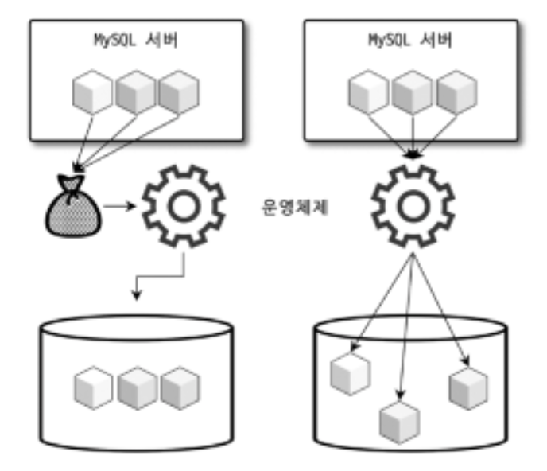

# 8 인덱스

인덱스는 데이터베이스의 쿼리 성능에 매우 중요한 부분.  
8장에서는 MySQL에서 사용 가능한 인덱스의 종류 및 특성을 간단히 살펴보자.  
각 인덱스의 특성과 차이는 매우 중요하며, 물리 수준의 모델링을 할 때도 중요한 요소가 된다.  
MySQL 8.0버전까지 오면서 기존의 MyISAM 스토리지 엔진에만 있던 전문 검색이나 위치 기반 검색 기능도 모두 InnoDB 스토리지 엔진에서 사용할 수 있게 되었다. 하지만 아무리 MySQL 서버의 옵티마이저가 발전하고 성능이 개선됐다고 해도 여전히 관리자의 역할이 매우 중요하다. 해서 인덱스에 대한 기본 지식은 매우 중요하며, 쿼리 튜닝의 기본이 될 것이다.

## 8.1 디스크 읽기 방식

먼저 랜덤 I/O(Random), 순차 I/O(Sequential)와 같은 디스크 읽기 방식을 먼저 간단히 살펴보자.  
CPU나 메모리같은 전기적 특성을 띤 장치는 매우 빠르게 발전했지만 디스크같은 기계식 장치의 성능은 상당히 제한적으로 발전했다. 데이터 저장 매체(SSD/HDD)는 컴퓨터에서 가장 느린 부분이다. 하여 데이터베이스의 성능 튜닝은 어떻게 디스크I/O를 줄이냐가 관건이다.

### 8.1.1 하드 디스크 드라이브(HDD)와 솔리드 스테이트 드라이브(SSD)

- 컴퓨터에서 CPU나 메모리는 전자식 장치지만 하드 디스크 드라이브는 기계식 장치이다.
- 하여 데이터베이스 서버에서는 항상 디스크 장치가 병목이 된다.
- 기계식 하드 디스크 드라이브를 대체하기 위해 전자식 저장 매체인 SSD가 많이 출시되고 있다.
  > SSD(Solid State Drive)
  >
  > - SSD도 기존 하드 디스크 드라이브와 같은 인터페이스를 지원하므로 DAS, SAN에 그대로 사용할 수 있다.
  > - SSD는 기존 HDD에서 데이터 저장용 플레터(원판)을 제거하고 그 대신 플래시 메모리를 장착하고 있다. 해서 디스크 원판을 기계적으로 회전시킬 필요가 없으므로 아주 빨리 데이터를 읽고 쓸 수 있다.
  > - 플레시 메모리는 전원이 공급되지 않아도 데이터가 삭제되지 않으며, 컴퓨터 메모리(d-ram)보다는 느리지만 HDD보단 훨 빠르다.
  > - 디스크의 헤더를 움직이지 않고 한 번에 많은 데이터를 읽는 순차I/O에서는 SSD가 HDD보다 조금 빠르거나 거의 비슷하다.
  > - SSD의 장점은 HDD보다 랜덤 I/O보다 훨씬 빠르다는 것이다.
  > - 데이터베이스 서버에서 순차 I/O 작업은 그다지 많지 않고 랜덤 I/O를 하는 것이 대부분이므로 SSD는 데이터베이스의 작업에 최적이라고 할 수 있다.

### 8.1.2 랜덤 I/O와 순차 I/O

랜덤 I/O라는 표현은 HDD의 플래터를 돌려서 읽어야 할 데이터가 저장된 위치로 디스크 헤더를 이동시킨 다음 데이터를 읽는 것을 의미한다. 사실 순차 I/O도 이 작업 과정은 같다. 그렇다면 순차 I/O와 대체 어떤 차이가 있는지 알아보자.  
 </img>  
 (왼)순차I/O (오)랜덤I/O

순차 I/O는 3개의 페이지(3x16KB)를 디스크에 기록하기 위해 1번 시스템 콜을 요청하지만, 랜덤 I/O는 3개의 페이지를 디스크에 기록하기 위해 3번의 시스템콜을 요청한다.

- 즉 디스크에 기록해야할 위치를 찾기 위해 순차 I/O는 디스크의 헤더를 1번 움직였고, 랜덤 I/O는 3번 움직였다.
- 디스크에 데이터를 읽고 쓰는데 걸리는 시간 == 디스크 헤더를 움직여서 읽고 쓸 위치로 옮기는 시간
- 즉 위 그림에서 순차 I/O가 랜덤 I/O보다 거의 3배 빠름
- 디스크의 성능은 디스크 헤더의 위치 이동 없이 얼마나 많은 데이터를 한 번에 기록하느냐 의해 결정
- 여러 번 읽고 쓰기를 요청하는 랜덤 I/O 작업이 작업 부하가 훨씬 더 크다.
- 데이터베이스 대부분의 작업은 이러한 작은 데이터를 빈번히 읽고 쓰기 때문에 MySQL 서버에는 그룹 커밋이나 로그 버퍼 또는 InnoDB 로그 버퍼 등의 기능이 내장돼 있다.
- 디스크 원판을 가지지 않는 SSD는 랜덤 I/O와 순차 I/O의 차이가 없을 것으로 예측하지만, 실제로 그렇지 않음
- SSD 드라이브에서도 랜덤 I/O는 여전히 순차 I/O보다 전체 스루풋(Throughput)이 떨어진다. 해서 SSD에서도 항상 랜덤 I/O와 순차 I/O의 성능 비교를 구분해서 명시한다.
- 사실 쿼리를 튜닝하여 랜덤 I/O를 순차 I/O로 바꿔서 실행할 방법은 많지 않음.
- 일반적으로 쿼리를 튜닝하는 것은 랜덤 I/O를 줄이는 것이 목적이다. 여기서 랜덤 I/O를 줄인다는 것은 쿼리를 처리하는데 꼭 필요한 데이터만 읽도록 쿼리를 개선하는 것을 의미한다.
  > 인덱스 레인지 스캔은 주로 랜덤 I/O를 사용하며, 풀 데이터 스캔은 순차 I/O를 사용한다. 그래서 큰 테이블의 레코드 대부분을 읽는 작업에서는 인덱스를 사용하지 않고 풀 테이블 스캔을 사용하도록 유도할 때도 있다. 이런 형태는 OLTP(On-Line Transaction Processing) 성격의 웹 서비스보다는 데이터 웨어하우스나 통계 작업에서 자주 사용된다.
