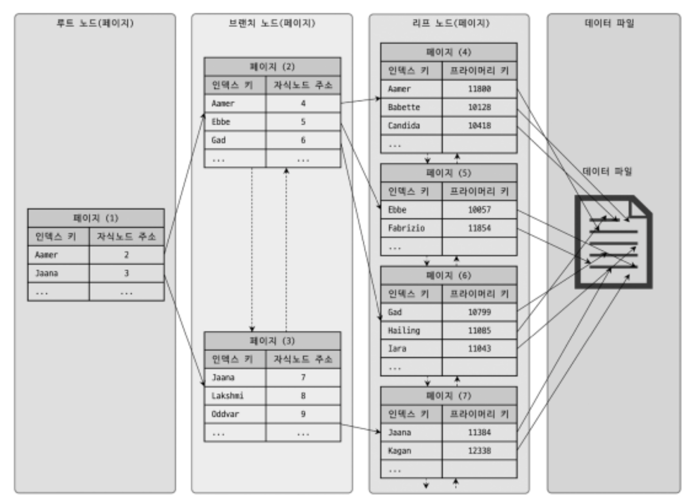

# 8 인덱스

인덱스는 데이터베이스의 쿼리 성능에 매우 중요한 부분.  
8장에서는 MySQL에서 사용 가능한 인덱스의 종류 및 특성을 간단히 살펴보자.  
각 인덱스의 특성과 차이는 매우 중요하며, 물리 수준의 모델링을 할 때도 중요한 요소가 된다.  
MySQL 8.0버전까지 오면서 기존의 MyISAM 스토리지 엔진에만 있던 전문 검색이나 위치 기반 검색 기능도 모두 InnoDB 스토리지 엔진에서 사용할 수 있게 되었다. 하지만 아무리 MySQL 서버의 옵티마이저가 발전하고 성능이 개선됐다고 해도 여전히 관리자의 역할이 매우 중요하다. 해서 인덱스에 대한 기본 지식은 매우 중요하며, 쿼리 튜닝의 기본이 될 것이다.

## 8.1 디스크 읽기 방식

먼저 랜덤 I/O(Random), 순차 I/O(Sequential)와 같은 디스크 읽기 방식을 먼저 간단히 살펴보자.  
CPU나 메모리같은 전기적 특성을 띤 장치는 매우 빠르게 발전했지만 디스크같은 기계식 장치의 성능은 상당히 제한적으로 발전했다. 데이터 저장 매체(SSD/HDD)는 컴퓨터에서 가장 느린 부분이다. 하여 데이터베이스의 성능 튜닝은 어떻게 디스크I/O를 줄이냐가 관건이다.

### 8.1.1 하드 디스크 드라이브(HDD)와 솔리드 스테이트 드라이브(SSD)

- 컴퓨터에서 CPU나 메모리는 전자식 장치지만 하드 디스크 드라이브는 기계식 장치이다.
- 하여 데이터베이스 서버에서는 항상 디스크 장치가 병목이 된다.
- 기계식 하드 디스크 드라이브를 대체하기 위해 전자식 저장 매체인 SSD가 많이 출시되고 있다.
  > SSD(Solid State Drive)
  >
  > - SSD도 기존 하드 디스크 드라이브와 같은 인터페이스를 지원하므로 DAS, SAN에 그대로 사용할 수 있다.
  > - SSD는 기존 HDD에서 데이터 저장용 플레터(원판)을 제거하고 그 대신 플래시 메모리를 장착하고 있다. 해서 디스크 원판을 기계적으로 회전시킬 필요가 없으므로 아주 빨리 데이터를 읽고 쓸 수 있다.
  > - 플레시 메모리는 전원이 공급되지 않아도 데이터가 삭제되지 않으며, 컴퓨터 메모리(d-ram)보다는 느리지만 HDD보단 훨 빠르다.
  > - 디스크의 헤더를 움직이지 않고 한 번에 많은 데이터를 읽는 순차I/O에서는 SSD가 HDD보다 조금 빠르거나 거의 비슷하다. (HDD의 성능 저하 요인이 헤더를 움직여야 하는 것이므로 헤더를 움직이지 않는다면 SSD와 속도가 비슷함)
  > - SSD의 장점은 HDD보다 랜덤 I/O가 훨씬 빠르다는 것이다.
  > - 데이터베이스 서버에서 순차 I/O 작업은 그다지 많지 않고 랜덤 I/O를 하는 것이 대부분이므로 SSD는 데이터베이스의 작업에 최적이라고 할 수 있다.

### 8.1.2 랜덤 I/O와 순차 I/O

랜덤 I/O라는 표현은 HDD의 플래터를 돌려서 읽어야 할 데이터가 저장된 위치로 디스크 헤더를 이동시킨 다음 데이터를 읽는 것을 의미한다. 사실 순차 I/O도 이 작업 과정은 같다. 그렇다면 순차 I/O와 대체 어떤 차이가 있는지 알아보자.  
 </img>  
 (왼)순차I/O (오)랜덤I/O

순차 I/O는 3개의 페이지(3x16KB)를 디스크에 기록하기 위해 1번 시스템 콜을 요청하지만, 랜덤 I/O는 3개의 페이지를 디스크에 기록하기 위해 3번의 시스템콜을 요청한다.

- 즉 디스크에 기록해야할 위치를 찾기 위해 순차 I/O는 디스크의 헤더를 1번 움직였고, 랜덤 I/O는 3번 움직였다.
- 디스크에 데이터를 읽고 쓰는데 걸리는 시간 == 디스크 헤더를 움직여서 읽고 쓸 위치로 옮기는 시간
- 즉 위 그림에서 순차 I/O가 랜덤 I/O보다 거의 3배 빠름
- 디스크의 성능은 디스크 헤더의 위치 이동 없이 얼마나 많은 데이터를 한 번에 기록하느냐에 의해 결정
- 여러 번 읽고 쓰기를 요청하는 랜덤 I/O 작업이 작업 부하가 훨씬 더 크다.
- 데이터베이스 대부분의 작업은 이러한 작은 데이터를 빈번히 읽고 쓰기 때문에 MySQL 서버에는 그룹 커밋이나 로그 버퍼 또는 InnoDB 로그 버퍼 등의 기능이 내장돼 있다.
- 디스크 원판을 가지지 않는 SSD는 랜덤 I/O와 순차 I/O의 차이가 없을 것으로 예측하지만, 실제로 그렇지 않음
- SSD 드라이브에서도 랜덤 I/O는 여전히 순차 I/O보다 전체 처리량(Throughput)이 떨어진다. 해서 SSD에서도 항상 랜덤 I/O와 순차 I/O의 성능 비교를 구분해서 명시한다.
- 사실 쿼리를 튜닝하여 랜덤 I/O를 순차 I/O로 바꿔서 실행할 방법은 많지 않음.
- 일반적으로 쿼리를 튜닝하는 것은 랜덤 I/O를 줄이는 것이 목적이다. 여기서 랜덤 I/O를 줄인다는 것은 쿼리를 처리하는데 꼭 필요한 데이터만 읽도록 쿼리를 개선하는 것을 의미한다.

  > 인덱스 레인지 스캔은 주로 랜덤 I/O를 사용하며, 풀 데이터 스캔은 순차 I/O를 사용한다. 그래서 큰 테이블의 레코드 대부분을 읽는 작업에서는 인덱스를 사용하지 않고 풀 테이블 스캔을 사용하도록 유도할 때도 있다. 이런 형태는 OLTP(On-Line Transaction Processing) 성격의 웹 서비스보다는 데이터 웨어하우스나 통계 작업에서 자주 사용된다.

## 8.2 인덱스란?

인덱스 - 책의 맨 마지막의 색인  
데이터 파일 - 책의 내용  
데이터 파일에 저장된 레코드의 주소 - 책의 찾아보기를 통해 알아낼 수 있는 페이지  
DBMS도 데이터베이스 테이블의 모든 데이터를 검색해서 원하는 결과를 가져오려면 시간이 오래 걸린다. 그래서 칼럼(또는 칼럼들)의 값과 해당 레코드가 저장된 주소를 키와 값의 쌍(key-value pair)으로 삼아 인덱스를 만들어 두는 것이다.  
또한 책의 "찾아보기"와 DBMS 인덱스의 공통점 가운데 중요한 것이 바로 정렬이다. 책의 찾아보기도 내용이 많아지면 우리가 원하는 검색어를 찾아내는데 시간이 걸릴것이다. 해서 최대한 빠르게 찾아갈 수 있도록 가나다 순으로 정렬되어 있는데, 인덱스도 칼럼의 값을 주어진 순서대로 미리 정렬해서 보관한다.

프로그래밍 언어의 자료 구조로 인덱스와 데이터 파일을 비교해가며 살펴보자. 자료구조에 SortedList와 ArrayList라는 자료구조가 있는데 DBMS 인덱스는 Sortedlist, 데이터 파일은 Arraylist와 같은 자료 구조이다.

- Sortedlist : 저장되는 값을 항상 정렬된 상태로 유지.
- Arraylist : 값을 저장되는 순서 그대로 저장.

그렇다면 이제 sortedlist의 장단점을 통해 인덱스의 장단점을 살펴보자.

- 자료구조가 항상 저장될 때 마다 값을 정렬해야하므로 저장하는 과정이 복잡하고 느리다.
- 하지만 이미 정렬되어 있기 때문에 원하는 값을 빠르게 찾을 수 있다.
- 즉 INSERT, UPDATE, DELETE 문장의 처리가 느리지만
- SELECT는 매우 빠르다.

결론적으로 DBMS의 인덱스는 INSERT, UPDATE, DELETE 성능을 희생시키고 SELECT(읽기) 속도를 높이는 기능이다.  
테이블의 인덱스를 하나 더 추가할지 말지는 데이터의 저장 속도를 어디까지 희생할 수 있고, 읽기 속도를 얼마나 더 빠르게 만들어야 하느냐에 따라 결정된다.  
SELECT 쿼리 문장의 WHERE 조건절에 사용되는 컬럼이라고 해서 전부 인덱스로 생성하면 데이터 저장 성능이 떨어지고 인덱스의 크기가 비대해져 오히려 역효과만 불러올 수 있다.

인덱스는 데이터를 관리하는 방식(알고리즘)과 중복 값의 허용 여부에 따라 여러 가지로 나눠볼 수 있다. (해당 분류는 책에서 저자가 임의로 분류한 것. 추가적으로 해당 책에서는 Key라는 말과 인덱스를 같은 의미로 사용한다.)  
인덱스를 역할별로 구분하면 프라이머리 키(Primary key)와 보조 키(세컨더리 인덱스, Secondary key)로 구분할 수 있다.

- 프라이머리 키 : 레코드를 대표하는 칼럼의 값으로 만들어진 인덱스. 이 칼럼은 테이블에서 해당 레코드를 식별할 수 있는 기준값이 된다. 해서 이를 식별자라고도 부른다. 프라이머리키는 NULL값을 허용하지 않으며 중복을 허용하지 않는 것이 특징.
- 세컨더리 인덱스 : 프라이머리 키를 제외한 나머지 모든 인덱스. 유니크 인덱스는 프라이머리 키와 성격이 비슷하고 프라이머리 키를 대체해서 사용할 수도 있다고 해서 대체 키라고도 하는데, 별도로 분류하기도, 세컨더리 인덱스로 분류하기도 한다.

데이터 저장 방식(알고리즘)별로 구분할 경우 더 많은 분류가 가능하지만 대표적으로 B-Tree 인덱스와 Hash 인덱스로 구분할 수 있음. (최근에는 Fractal-Tree 인덱스나 Merge-Tree 알고리즘을 사용하는 DBMS도 개발되고 있음)

- B-Tree : 가장 일반적으로 사용되는 인덱스 알고리즘. B-Tree 인덱스는 칼럼의 값을 변형하지 않고 원래의 값을 이용해 인덱싱하는 알고리즘. MySQL 서버에서는 위치 기반 검색을 지원하기 위한 R-Tree 인덱스 알고리즘도 있지만, 결국 R-Tree 인덱스는 B-Tree의 응용 알고리즘으로 볼 수 있다.
- Hash : 칼럼의 값으로 해시값을 계산해서 인덱싱하는 알고리즘으로, 매우 빠른 검색을 지원함. 하지만 값을 변형해서 인덱싱하므로 전방(Prefix)일치와 같이 값의 일부만 검색하거나 범위를 검색할 때는 해시 인덱스를 사용할 수 없다. Hash 인덱스는 주로 메모리 기반의 데이터베이스에서 많이 사용한다.

데이터 중복 허용 여부로 분류하면 유니크 인덱스(Unique)와 유니크하지 않은 인덱스(Non-Unique)로 구분할 수 있다. 인덱스가 유니크한지 유니크하지 않은지는 단순히 값이 1개만 존재하는지 1개 이상 존재할 수 있는지를 의미하지만, 실제 DBMS의 쿼리를 실행해야 하는 옵티마이저에게는 상당히 중요한 문제다.  
유니크 인덱스에 대해 동등 조건(Equal, =)으로 검색한다는 것은 항상 1건의 레코드만 찾으면 더 찾지 않아도 된다는 것을 옵티마이저에게 알려주는 효과를 낸다. 뿐만 아니라 유니크 인덱스로 인한 MySQL의 처리 방식의 변화나 차이점이 많다. 이러한 부분은 인덱스와 쿼리의 실행계획을 살펴보면서 배울 것이다.  
인덱스의 기능별로 분류해보면 전문 검색용 인덱스나 공간 검색용 인덱스등을 예로 들 수 있다. 이들은 더 뒤에서 살펴본다.

## 8.3 B-Tree 인덱스

- B-Tree는 데이터베이스의 인덱싱 알고리즘 가운데 가장 일반적으로 사용되고, 가장 먼저 도입된 알고리즘.
- B-Tree에는 여러가지 변형된 형태의 알고리즘이 있는데, 주로 B+-Tree 또는 B\*-Tree가 사용된다.
- 추가적으로 B-Tree의 B는 'binary'가 아닌 'balanced'이다.
- B-Tree는 칼럼의 원래의 값을 변형하지 않고(일부분만 잘라서 관리하긴 하지만) 인덱스 구조체 내에서는 항상 정렬된 상태로 유지한다.
- 전문 검색과 같은 특수한 요건이 아닌 경우, 대부분 인덱스는 거의 B-Tree를 사용할 정도로 일반적인 용도에 적합한 알고리즘이다.

## 8.3.1 B-Tree의 구조 및 특성

- B-Tree는 트리 구조의 최상위에 하나의 루트 노드(Root node)가 존재하고 그 하위에 자식 노드가 붙어있는 형태이다.
- 트리의 가장 하위 노드는 리프 노드(Leaf node), 루트도 리프도 아닌 노드를 브랜치 노드(Branch node)라고 한다.
- 데이터베이스에서 인덱스와 실제 데이터는 항상 따로 관리되는데, 인덱스의 리프 노드는 항상 실제 데이터 레코드를 찾아가기 위한 주솟값을 가지고 있다.
- 아래 그림은 B-Tree 인덱스의 각 노드와 데이터 파일의 관계를 표현한 것이다.

</img>

- 위 그림에서 보이는 것처럼 인덱스 키 값은 모두 정렬돼 있지만, 데이터 파일의 레코드는 임의의 순서로 저장돼 있다.
- 추가로 데이터 파일은 반드시 INSERT된 순으로 데이터를 저장하지 않는다. INSERT만 수행하면 모르겠지만 DBMS는 어떤 레코드가 삭제되면 최대한 삭제된 레코드의 빈 공간에 INSERT를 하여 공간을 재활용한다.

  > 참고  
  > 대부분 DBMS의 데이터파일에서 레코드는 특정 기준으로 정렬되지 않고 임의의 순서로 저장된다. 하지만 InnoDB 테이블에서 레코드는 클러스터되어 디스크에 저장되므로 기본적으로 프라이머리 키 순서로 정렬되어 저장된다. 다른 DBMS에서는 클러스터링 기능이 선택사항이지만, InnoDB애서는 사용자가 별도의 명령이나 옵션을 선택하지 않아도 디폴트로 클러스터링 테이블이 생성된다. 클러스터링이란 비슷한 값을 최대한 모아서 저장하는 방식을 말한다. 더 뒤에서 자세히 다룬다.

- 인덱스는 테이블의 키 칼럼만 가지고 있으므로 나머지 칼럼을 읽으려면 데이터 파일에서 해당 레코드를 찾아야 한다. 이를 위해 인덱스의 리프 노드는 데이터 파일에 저장된 레코드의 주소를 가진다. 그림 8.5와 8.6은 인덱스의 리프 노드와 데이터 파일의 이러한 관계를 보여준다.

</img> 그림8.5
</img>그림8.6

- 그림 8.5는 MyISAM 테이블의 인덱스와 데이터 파일의 관계를 보여주는데, "레코드 주소"는 MyISAM 테이블의 생성 옵션에 따라 레코드가 테이블에 INSERT된 순번이거나 데이터 파일 내의 위치(Offset)다.
- MyISAM 스토리지 엔진에서 인덱스의 구조는 4.3.3절 '데이터 파일과 프라이머리 키(인덱스) 구조'의 ROWID 설명을 참고하자.

- 그림 8.6은 InnoDB 테이블의 인덱스의 데이터 파일의 관계를 보여준다.
- InnoDB 스토리지 엔진을 사용하는 테이블에서는 프라이머리 키가 ROWID 역할을 한다.
  > "ROWID"는 데이터베이스 테이블의 각 레코드(행)를 식별하는 고유한 식별자. 이는 각 행이 데이터베이스 내에서 물리적으로 저장될 때 사용되는 고유한 주소 또는 위치를 가리킨다.
- 두 스토리지 엔진의 인덱스에서 가장 큰 차이점은 세컨더리 인덱스를 통해 데이터 파일에 데이터 파일의 레코드를 찾아가는 방법에 있음.
  - MyISAM 테이블은 세컨더리 인덱스가 물리적인 주소를 가지는 반면
  - InnoDB 테이블은 프라이머리 키를 주소처럼 사용하기 때문에 논리적인 주소를 가진다고 할 수 있음.
- 위와 같은 이유로 InnoDB 테이블에서 인덱스를 통해 레코드를 읽을 때는 그림 8.5처럼 데이터 파일을 바로 찾아가지 못한다.
- 그림 8.6처럼 인덱스에 저장되어 있는 프러이머리 키 값을 이용해 프라이머리 키 인덱스를 한번 더 검색한 후, 프라이머리 키 인덱스의 리프 페이지에 저장돼 있는 레코드를 읽는다.
- 즉, InnoDB 스토리지 엔진에서는 모든 세컨더리 인덱스 검색에서 데이터 레코드를 읽기 위해서는 반드시 프라이머리 키를 저장하고 있는 B-Tree를 다시 한번 검색해야 한다.
- 이것만 보면 InnoDB를 사용한 테이블이 성능이 떨어질 것 같지만, MyISAM과 InnoDB는 각각 장단점이 있다. 이는 8.8에서 살펴본다.

### 8.3.2 B-Tree 인덱스 키 추가 및 삭제

테이블의 레코드를 저장하거나 변경하는 경우 인덱스 키 추가나 삭제 작업이 발생함.  
인덱스 키 추가, 삭제가 어떻게 처리되는지 알아보자.

### 8.3.2.1 인덱스 키 추가

- 새로운 키 값이 B-Tree에 저장될 때 테이블의 스토리지 엔진에 따라 새로운 키 값이 즉시 인덱스에 저장될 수고 있고 그렇지 않을 수도 있다.
- B-Tree에 저장될 때는 저장될 키 값을 이용해 B-Tree상의 적절한 위치를 검색해야 한다.
  - 저장될 위치가 결정되면 키 값과 대상 레코드의 주소 정보를 B-Tree의 리프 노드에 저장.
  - 리프 노드가 꽉 차서 더는 저장할 공간이 없다면 리프 노드를 분리
  - 이는 상위 브랜치 노드까지 처리의 범위가 넓어진다.
  - 이러한 작업 탓에 B-Tree는 상대적으로 쓰기 작업에 비용이 많이 든다.
- 인덱스 추가로 인해 INSERT나 UPDATE 문장이 어떤 영향을 받을지는 테이블의 칼럼 수, 칼럼의 크기, 인덱스 칼럼의 특성등을 명확히 알야아한다.
  - 대략으로 계산하는 방법:
  - 1. 테이블에 레코드를 추가하는 비용이 1이라고 가정
  - 2. 해당 테이블의 인덱스에키를 추가하는 작업 비용은 1.5로 예측
  - 3. 일반적으로 테이블에 인덱스가 3개 있다면 테이블에 인덱스가 하나도 없는 경우는 작업 비용이 1이고, 3개인 경우에는 5.5(1 + 1.5\*3)정도로 예측한다.
  - 중요한 것은 이 비용의 대부분이 메모리,CPU의 처리 시간이 아닌, 디스크로부터 인덱스 페이지를 읽고 쓰기를 해야 해서 걸리는 시간이라는 것.
  - MyISAM이나 MEMORY 스토리지 엔진을 사용하는 테이블에서는 INSERT 문장이 실행되면 즉시 새로운 키 값을 B-Tree 인덱스에 변경한다.
  - 하지만 InnoDB는 필요하다면 인덱스 키 추가 작업을 지연시켜 나중에 처리가 가능.
  - 하지만 프라이머리 키나 유니크 인덱스의 경우에는 중복 체크가 필요해서 즉시 B-Tree에 추가하거나 삭제한다.
  - (InnoDB 스토리지 엔진의 체인지 버퍼에 대해서는 4.2.10절 '체인지 버퍼' 참고)

### 8.3.2.2 인덱스 키 삭제

- B-Tree의 키 값이 삭제되는 경우에는 해당 키 값이 저장된 B-Tree의 리프 노드를 찾아 삭제 마크만 하면 작업이 완료됨
- 이렇게 삭제 마킹된 인덱스 키 공간은 방치하거나 재활용할 수 있음.
- 인덱스 키 삭제 역시 디스크 I/O 작업임.
- MySQL 5.5 이상은 해당 작업 역시 버퍼링 처리가 가능함
- MyISAM이나 MEMORY 스토리지 엔진은 체인지 버퍼와 같은 기능이 없으니 키 삭제가 완료된 후에야 DELETE 쿼리 실행이 완료된다.

### 8.3.2.3 인덱스 키 변경

- 인덱스의 키 값에 따라 저장될 리프 노드의 위치가 결정되므로, 단순히 인덱스 상의 키 값만 변경하는 것은 불가능.
- 하여 먼저 기존의 키 값을 삭제한 후, 다시 새로운 키 값을 추가하는 형태로 처리된다.
- 즉 기존 키 값을 삭제하고 새로운 인덱스 키 값을 추가하는 것이므로, InnoDB 스토리지 엔진을 사용한다면 이 작업을 모두 체인지 버퍼를 통해 지연 처리할 수
  있다.

### 8.3.2.4 인덱스 키 검색

- INSERT, UPDATE, DELETE 작업을 할 때 인덱스 관리에 따르는 추가 비용을 감당하는 것은 빠른 검색을 위해서임
- B-Tree의 루트 노드부터 브랜치 노드를 거쳐 최종 리프 노드까지 이동하면서 비교작업을 수행하는데, 이를 '트리 탐색'이라고 한다.
- 인덱스 트리 탐색은 SELECT에서만 사용하는 것이 아니라, UPDATE, DELETE를 처리하기 위해서도 사용한다.
- B-Tree를 이용한 검색은 100% 일치 또는 값의 앞부분(left-most part)만 일치하는 경우에 사용할 수 있다.
- 부등호( > , < ) 비교 조건에서도 인덱스를 사용할 수 있지만, 인덱스를 구성하는 키 값의 뒷부분만 검색하는 용도로는 인덱스를 사용할 수 없다.
- 인덱스의 키 값에 변형이 가해진 후 비교되는 경우에는 절대 B-Tree의 빠른 검색 기능을 사용할 수 없다. 이미 변형된 값은 B-Tree 인덱스에 존재하는 값이 아니다. 따라서 함수나 연산을 수행한 결과로 정렬한다거나 검색하는 작업은 B-Tree의 장점을 이용할 수 없으므로 주의한다.
- InnoDB 스토리지 엔진에서 인덱스는 더 특별한 의미를 가진다.
  - InnoDB 테이블에서 지원하는 레코드 잠금이나 넥스크 키락이 검색을 수행한 인덱스를 잠근 후 테이블의 레코드를 잠그는 방식으로 구현되어 있다.
  - 따라서 UPDATE, DELETE 문장이 실행될 때 테이블에 적절히 사용할 수 있는 인덱스가 없으면 불필요하게 많은 레코드를 잠근다.(심지어 테이블의 모든 레코드를 잠글 수도 있다.)
  - InnoDB 스토리지 엔진에서는 그만큼 인덱스의 설계가 중요하다.

### 8.3.3.1 인덱스 키 값의 크기

InnoDB 스토리지 엔진은 디스크에 데이터를 저장하는 가장 기본 단위를 페이지(Page) 또는 블록(Block)이라고 하며, 디스크의 모든 읽기 및 쓰기 작업의 최소 작업 단위가 된다. 또한 페이지는 InnoDB 스토리지 엔진의 버퍼 풀에서 데이터를 버퍼링하는 기본 단위이기도 하다. 인덱스도 결국은 페이지 단위로 관리된다.

- 일반적으로 DBMS의 B-Tree는 자식 노드의 개수가 가변적인 구조다.
- MySQL의 B-Tree의 자식 노드 개수는 인덱스 페이지 크기와 키 값의 크기에 따라 결정된다. (MySQL 5.7버전부터 InnoDB 스토리지 엔진의 페이지 크기는 기본값이 16KB이다.)
- 인덱스의 키가 16바이트라고 가정하면 아래 그림과 같이 페이지가 구성될 것이다.
- 아래 그림에서 자식 노드 주소라는 것은 여러 가지 복합적인 정보가 담긴 영역이며, 페이지의 종류별로 대략 6바이트에서 12바이트까지 다양한 크기의 값을 가질 수 있다.(여기서는 편의상 12바이트로 가정)  
  </img> 그림 8.7

- 위 그림의 경우 계산을 해보면 하나의 인덱스 페이지(16KB)에 약 585(16\*1024/(16+12))개의 키를 저장할 수 있다.
- 만약 인덱스의 키값이 2배인 32바이트로 증가했다면 한 페이지에 인덱스 키를 16\*1024/(32+12)=372개 저장할 수 있다.
- 어떤 SELECT 쿼리가 레코드를 500개 읽어야 한다면 전자는 인덱스 페이지 한번으로 해결될 수도 있지만, 후자는 최소 2번 이상을 디스크로부터 읽어야 한다.
- 결국 인덱스를 구성하는 키 값의 크기가 커지면 디스크로부터 읽어야 하는 횟수가 늘어나고, 그만큼 느려진다.
- 또한 인덱스의 키값의 길이가 길어진다는 것은 전체적인 인덱스의 크기가 커지는 것이고 인덱스를 캐시해두는 InnoDB 버퍼 풀이나 MyISAM의 키 캐시 영역은 크기가 제한적이기 때문에 하나의 레코드를 위한 인덱스 크기가 커지면 커질수록 메모리에 캐시해둘 수 있는 레코드 수는 줄어들 것이다. 이는 메모리 효율을 떨어트린다.

### 8.3.3.2 B-Tree 깊이

B-Tree 인덱스의 깊이는 매우 중요하지만 직접 제어할 방법은 없음. 인덱스 키 값의 평균 크기가 늘어나면 어떤 현상이 추가로 더 발생하는지 알아보자.
그림 8.7의 예제를 살펴보자.

- 인덱스의 B-Tree 깊이가 3인 경우 최대 몇 개의 키 값을 가질 수 있는지 한 번 비교해보자.
- 키 값이 16바이트인 경우에는 최대 2억(585\*585 \*585)개 정도의 키값을 담을 수 있다.
- 키 값이 32바이트로 늘어나면 5천만(372\*372\*372)개로 줄어든다.
- B-Tree의 깊이는 MySQL에서 값을 검색할 때 몇번이나 랜덤하게 디스크를 읽어야 하는지와 직결되는 문제다.
  - 인덱스 키 값의 크기가 커짐 ->
  - 하나의 인덱스 페이지가 담을 수 있는 인덱스 키 값의 개수가 적어짐 ->
  - 같은 레코드 건수라 하더라도 B-Tree의 깊이가 깊어짐 ->
  - 디스크의 읽기가 더 많이 필요함
- 즉 인덱스의 키 값의 크기는 가능하면 작게 만드는 것이 좋다.

### 8.3.3.3 읽어야 하는 레코드의 건수

- 인덱스를 거쳐 테이블의 레코드를 읽는 것은 인덱스를 거치지 않고 레코드를 읽는 것보다 높은 비용이 든다.
- 테이블에 레코드가 100만 건이 있을 때, 그 중 50만 건을 읽어야 하는 쿼리가 있다고 가정해보자.
  - 이 작업은 '전체 테이블을 읽어서 필요없는 50만건 버리기' VS '인덱스를 통해 필요한 50만 건만 읽기' 중 더 효율적인 것을 판단해야함
  - 일반적인 DBMS의 옵티마이저에서는 인덱스를 통해 레코드 1건을 읽는 것이 테이블에서 직접 레코드 1건을 읽는 것보다 4~5배 정도 비용이 많이 든다.
  - 즉 인덱스를 통해 읽어야 할 레코드 건수가 전체 테이블 레코드의 20~25프로를 넘어서면 인덱스를 사용하지 않고 테이블의 레코드를 모두 읽은 뒤 필요한 데이터만 필터링하는 것이 효율적이다.
  - 즉 인덱스의 손익 분기점은 20~25프로이다.

## 8.3.4 B-Tree 인덱스를 통한 데이터 읽기

어떤 경우에 인덱스를 사용하게 유도할지, 또는 사용하지 못하게 할지 판단하려면 MySQL이 어떻게 인덱스를 이용(경우)해서 실제 레코드를 읽어 내는지 알아야 한다. MySQL이 인덱스를 이용하는 대표적인 3가지 방법을 알아보자.

### 8.3.4.1 인덱스 레인지 스캔

- 인덱스 레인지 스캔은 인덱스의 접근 방법 중 가장 대표적인 방법.
- 세가지 방법 중 가장 빠르다.

아래 쿼리를 예로 보자.

> mysql > SELECT \* FROM employees WHERE first_name BETWEEN 'Ebbe' AND 'Gad';

</img>

- 인덱스 레인지 스캔은 검색해야 할 인덱스의 범위가 결정됐을 때 사용하는 방식이다. 검색하려는 값의 수나 검색 결과 레코드 건수와 관계없이 레인지 스캔이라고 표현한다.
- 위 그림의 화살표에서 알 수 있듯이 루트 노드에서부터 비교를 시작해 브랜치 노드를 거쳐 리프 노드까지 찾아들어가야만 필요한 레코드의 시작점을 알 수 있다.
- 시작해야할 레코드를 찾으면 그때부터는 리프 노드의 레코드만 순서대로 읽으면 된다. (이처럼 쭉 읽는 것을 스캔이라함)
- 스캔을 하다가 리프 노드의 끝까지 읽으면 리프 노드 간의 링크를 이용해 다음 리프 노드를 찾아서 다시 스캔한다.
- 최종적인 위치에 도달하면 지금까지 읽은 레코드를 사용자에게 반환하고 쿼리를 끝낸다.
- 위 그림은 실제 인덱스만을 읽는 경우만 보여주는데, B-Tree 인덱스의 리프 노드를 스캔하면서 실제 데이터 파일의 레코드를 읽어 와야 하는 경우도 많은데, 이 과정을 자세히 살펴보자.

</img>

- B-Tree 인덱스에서 루트와 브랜치 노드를 이용해 스캔 시작 위치를 검색하고, 그 지점부터 필요한 방향(오름/내림 차순)으로 인덱스를 읽어 나가는 괴정이 위의 그림이다.
- 중요한 것은 어떤 방식으로 스캔을 하든 해당 인덱스를 구성하는 칼럼의 정순 또는 역순으로 정렬된 상태로 레코드를 가져온다는 것이다.
- 이는 별도의 정렬 과정이 수반되는 것이 아니라 인덱스 자체의 정렬 특성 때문이다.
- 또 중요한 것은 인덱스의 리프 노드에서 검색 조건에 일치하는 건들은 데이터 파일에서 레코드를 읽어오는 과정이 필요하는 것임.
- 이때 레코드 한 건 단위로 랜덤I/O가 한 번씩 일어난다.
- 위 그림에서 3건의 레코드가 검색 조건에 일치했다면 데이터 레코드를 읽기 위해 랜덤I/O가 최대 3번 필요한 것이다.
- 그래서 인덱스를 통해 데이터 레코드를 읽는 작업은 비용이 많이 드는 작업이다.
- 인덱스를 통해 읽어야 할 데이터 레코드가 20~25%를 넘으면 인덱스를 통한 읽기보다 테이블의 데이터를 직접 읽는 것이 더 효율적인 처리 방식이 된다.
- 정리하면 인덱스 레인지 스캔은 아래와 같이 크게 3단계를 거친다.
  - 1. 인덱스에서 조건을 만족하는 값이 저장된 위치를 찾는다. 이 과정을 인덱스 탐색(index seek)이라고 한다.
  - 2. 1번에서 탐색된 위치부터 필요한 만큼 인덱스를 차례대로 쭉 읽는다. 이 과정을 인덱스 스캔(index scan)이라고 한다.
  - 3. 2번에서 읽어 들인 인덱스 키와 레코드 주소를 이용해 레코드가 저장된 페이지를 가져오고, 최종 레코드를 읽어온다.
- 마지막 3번 과정은 쿼리가 필요로 하는 데이터에 따라 필요하지 않을 수도 있는데 이를 커버링 인덱스라고 한다.
- 커버링 인덱스로 처리되는 쿼리는 디스크의 레코드를 읽지 않아도 되기 때문에 랜덤 읽기가 상당히 줄어들고 성능은 빨라진다.
- MySQL 서버에서는 1번과 2번 단계의 작업이 얼마나 수행됐는지를 확인할 수 있게 다음과 같은 상태 값을 제공한다.

</img>

- Handler_read_key : 1번 단계가 실행된 횟수
- Handler_read_next : 2번 단계로 읽은 레코드 건수(인덱스 정순)
- Handler_read_prev : 2번 단계로 읽은 레코드 건수(인덱스 역순)
- Handler_read_first : 인덱스의 첫 번째 레코드를 읽은 횟수
- Handler_read_last : 인덱스의 마지막 번째 레코드를 읽은 횟수

### 8.3.4.2 인덱스 풀 스캔

- 인덱스의 처음부터 끝까지 모두 읽는 방식
- 쿼리의 조건절에 사용된 칼럼이 인덱스의 첫 번째 칼럼이 아닌 경우 인덱스 풀 스캔이 사용됨.
- 예로 인덱스는 (A,B,C)칼럼의 순으로 만들어져 있지만 쿼리의 조건절은 B칼럼이나 C칼럼으로 검색하는 경우다.
- 일반적으로 인덱스의 크기는 테이블이 크기보다 작으므로 직접 테이블을 처음부터 끝까지 읽는 것보다는 안덱스만 읽는 것이 효율적이다.
- 쿼리가 인덱스에 명시된 컬럼만으로 조건을 처리할 수 있는 경우 주로 이 방식을 사용한다.
- 인덱스 뿐 아니라 데이터 레코드까지 모두 읽어야 한다면 절대 이 방식으로 처리되지 않는다.

</img>

- 위 그림을 보면, 먼저 인덱스 리프 노드의 제일 앞 또는 제일 귀로 이동한 후, 인덱스의 리프 노드를 연결하는 링크드 리스트를 따라서 처음부터 끝까지 스캔하는 방식을 인덱스 풀 스캔이라고 한다.
- 이 방식은 인덱스 레인지 스캔보다 빠르지는 않지만 테이블 풀 스캔보다는 효율적이다. (인덱스에 포함된 칼럼만으로 쿼리를 처리하면 테이블의 레코드를 읽을 필요가 없으므로)
- 인덱스의 전체 크기는 테이블 자체의 크기보다 훨씬 작으므로 인덱스 풀 스캔은 테이블 전체를 읽는 것보다 적은 디스크I/O로 쿼리 처리가 가능하다.

### 8.3.4.3 루스(Loose) 인덱스 스캔

- MySQL 8.0 버전 부터는 루스 인덱스 스캔에 다른 상용 DBMS에서 지원하는 인덱스 스킵과 같은 최적화를 조금씩 지원하기 시작함
- 앞서 언급한 인덱스 레인지 스캔과 인덱스 풀 스캔은 루스 인덱스 스캔과는 상반된 의미에서 타이트(Tight) 인덱스 스캔으로 분류한다.
- 루스 인덱스 스캔은 말그대로 느슨하게 또는 듬성듬성하게 인덱스를 읽는 것을 의미한다.
  </img>

- 루스 인덱스 스캔은 인덱스 레인지 스캔과 비슷하게 작동하지만 중간에 필요치 않은 인덱스 키 값은 무시하고 다음으로 넘어가는 형태로 처리한다.
- 일반적으로 GROUP BY 또는 집합 함수 가운데 MAX() 또는 MIN() 함수에 대해 최적화를 하는 경우에 사용된다.

  > mysql > SELECT dept_no, MIN(emp_no)  
  > FROM dept emp  
  > WHERE dep_no BETWEEN 'd002' AND 'd004'  
  > GROUP BY dept_no;

- 위 쿼리에 사용된 dept_emp 테이블은 dept_no와 emp_no라는 두 개의 칼럼으로 인덱스가 생성돼 있다.
- 또한 이 인덱스는 (dept_no, emp_no) 조합으로 정렬까지 되어 있어서 위 그림에서와 같이 dept_no 그룹 별로 첫 번째 레코드의 emp_no 값만 읽으면 된다.
- 즉 인덱스에서 WHERE 조건을 만족하는 범위 전체를 다 스캔할 필요가 없다는 것을 옵티마이저는 알고 있기에 조건에 만족하지 않는 레코드는 무시하고 다음 레코드로 넘어간다.
- 위 그림을 보면 인덱스 리프 노드를 스캔하면서 불필요한 부분은 무시하고 필요한 부분(회색)만 읽었음을 알 수 있다.
- 루스 인덱스 스캔을 사용하려면 여러가지 조건을 만족해야 하는데 이는 10장 '실행 계획'에서 알아본다.

### 8.3.4.4 인덱스 스킵 스캔

데이터베이스 서버에서 인덱스의 핵심은 값이 정렬되어 있다는 것이며, 이로 인해 인덱스를 구성하는 칼럼의 순서가 매우 중요하다. 예를 들어, employees 테이블에 아래와 같은 인덱스를 생성해보자.

> mysql > ALTER TABLE employees  
> ADD INDEX ix_gender_birthdate (gender, birth_date);

- 이 인덱스를 사용하려면 WHERE 조건절에 gender 칼럼에 대한 비교 조건이 필수다.
  > //인덱스를 사용하지 못하는 쿼리  
  > mysql > SELECT \* FROM employees where birth_date>='1980-02-01';
  >
  > // 인덱스를 사용할 수 있는 쿼리  
  > mysql > SELECT \* FROM employees where gender = 'M' and birth_date>='1980-02-01';
- 하여 첫번째 쿼리에서 인덱스를 사용하기 위해서는 birth_date 칼럼부터 시작하는 인덱스를 새로 생성해야 했다.
- MySQL 8.0부터는 옵티마이저가 gender 칼럼을 건너뛰어서 birth_date 칼럼만으로도 인덱스 검색이 가능하게 해주는 인덱스 스킵 스캔 최적화 기능이 도입되었다.
- 물론 이전에도 위에서 언급한 루스 인덱스 스캔이 있었지만 이는 GROUP BY 작업에만 적용되었다.
- 하지만 인덱스 스킵 스캔은 WHERE 조건절의 검색을 위해 사용 가능하도록 용도가 훨씬 넓어졌다.
- 먼저 인덱스 스킵 스캔을 비활성화하고 쿼리의 실행계획을 보자.

</img>

- 위 쿼리는 WHERE 조건절에 gender칼럼에 대한 조건 없이 birth_date에 대한 조건만을 명시했기에 ix_gender_birthdate 인덱스를 효율적으로 사용할 수 없다.
- 위의 실행계획에서 type 칼럼이 "index"라고 표시된 것은 인덱스를 처음부터 끝까지 모두 읽었다(풀 인덱스 스캔)는 의미이므로 인덱스를 비효울적으로 사용한 것이다.
- 만약 예제 쿼리가 employees 테이블의 모든 칼럼을 가져와야 했다면 테이블 풀 스캔을 실행했을 것이다.
- 이번에는 인덱스 스킵 스캔을 활성화하고 동일 쿼리의 실행계획을 다시 확인해보자.

</img>

- 이번에는 쿼리의 실행계획에서 type 칼럼의 값이 "range"로 표시됐는데, 이는 인덱스에서 꼭 필요한 부분만 읽었다는 것을 의미한다.
- 그리고 Extra 칼럼에 "Using index for skip scan"이라는 문구가 표시됐는데, 이는 ix_gender_birthdate 인덱스에 대해 인덱스 스킵 스캔을 활용해 데이터를 조회했다는 의미이다.
- MySQL 옵티마이저는 우선 gender 칼럼에서 유니크한 값을 모두 조회하여 주어진 쿼리에 gender 칼럼의 조건을 추가해서 쿼리를 다시 실행하는 형태로 처리한다.
- 아래의 그림은 인덱스 스킵 스캔이 어떻게 처리되는지 보여준다.

</img>

- gender 칼럼은 성별을 구분하는 칼럼으로 'M'과 'F'값만을 가지는 ENUM타입의 칼럼이다.
- 하여 gender칼럼에 대하여 가능한 값 2개(M,F)를 구한 다음
- 옵티마이저는 내부적으로 아래 2개의 쿼리를 실행하는 것과 비슷한 형태의 최적화를 실행하게 된다.
  > mysql > SELECT gender, birth_date from employees WHERE gender = 'M' AND birth_date>='1965-02-01';  
  > mysql > SELECT gender, birth_date from employees WHERE gender = 'F' AND birth_date>='1965-02-01';

> 추가사항
> 여기서 gender 칼럼이 ENUM 타입이기 때문에 이런 처리가 가능한 것은 아님. 다른 타입이더라도 MySQL 서버는 인덱스를 루스 인덱스 스캔과 동일한 방식으로 읽으면서 인덱스에 존재하는 모든 값을 먼저 추출하고 그 결과를 이용해 인덱스 스킵 스캔을 실행한다.

- 하지만 인덱스 스킵 스캔은 아직 다음과 같은 단점이 있다.
  - WHERE 조건절에 조건이 없는 인덱스의 선행 칼럼의 유니크한 값의 개수가 적어야함
  - 쿼리가 인덱스에 존재하는 칼럼만으로 처리 가능해야함(커버링 인덱스)
- 첫번째 조건은 만약 유니크한 값의 개수가 매우 많다면 MySQL 옵티마이저는 인덱스에서 스캔해야할 시작 지점을 검색하는 작업이 많이 필요해져 쿼리 성능이 오히려 느려질 수 있다.
- 두번째 제약 조건은 아래 예제 쿼리를 통해 살펴보자.

</img>

- 위의 쿼리는 WHERE 조건절을 동일하지만 "SELECT \*"인 것을 볼 수 있다.
- 이 쿼리는 ix_gender_birthdate 인덱스에 포함된 gender 칼럼과 birth_date 칼럼 이외의 나머지 칼럼도 필요로하기 때문에 인덱스 스킵 스캔을 사용하지 못하고 풀 테이블 스캔으로 실행계획을 수립한 것을 볼 수 있다.
