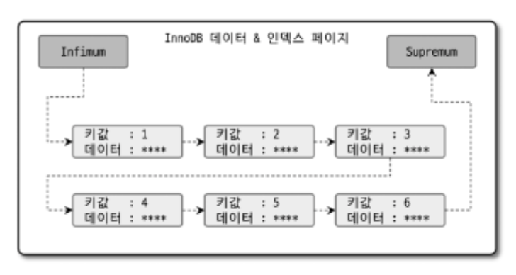

# 8 인덱스

인덱스는 데이터베이스의 쿼리 성능에 매우 중요한 부분.  
8장에서는 MySQL에서 사용 가능한 인덱스의 종류 및 특성을 간단히 살펴보자.  
각 인덱스의 특성과 차이는 매우 중요하며, 물리 수준의 모델링을 할 때도 중요한 요소가 된다.  
MySQL 8.0버전까지 오면서 기존의 MyISAM 스토리지 엔진에만 있던 전문 검색이나 위치 기반 검색 기능도 모두 InnoDB 스토리지 엔진에서 사용할 수 있게 되었다. 하지만 아무리 MySQL 서버의 옵티마이저가 발전하고 성능이 개선됐다고 해도 여전히 관리자의 역할이 매우 중요하다. 해서 인덱스에 대한 기본 지식은 매우 중요하며, 쿼리 튜닝의 기본이 될 것이다.

## 8.1 디스크 읽기 방식

먼저 랜덤 I/O(Random), 순차 I/O(Sequential)와 같은 디스크 읽기 방식을 먼저 간단히 살펴보자.  
CPU나 메모리같은 전기적 특성을 띤 장치는 매우 빠르게 발전했지만 디스크같은 기계식 장치의 성능은 상당히 제한적으로 발전했다. 데이터 저장 매체(SSD/HDD)는 컴퓨터에서 가장 느린 부분이다. 하여 데이터베이스의 성능 튜닝은 어떻게 디스크I/O를 줄이냐가 관건이다.

### 8.1.1 하드 디스크 드라이브(HDD)와 솔리드 스테이트 드라이브(SSD)

- 컴퓨터에서 CPU나 메모리는 전자식 장치지만 하드 디스크 드라이브는 기계식 장치이다.
- 하여 데이터베이스 서버에서는 항상 디스크 장치가 병목이 된다.
- 기계식 하드 디스크 드라이브를 대체하기 위해 전자식 저장 매체인 SSD가 많이 출시되고 있다.
  > SSD(Solid State Drive)
  >
  > - SSD도 기존 하드 디스크 드라이브와 같은 인터페이스를 지원하므로 DAS, SAN에 그대로 사용할 수 있다.
  > - SSD는 기존 HDD에서 데이터 저장용 플레터(원판)을 제거하고 그 대신 플래시 메모리를 장착하고 있다. 해서 디스크 원판을 기계적으로 회전시킬 필요가 없으므로 아주 빨리 데이터를 읽고 쓸 수 있다.
  > - 플레시 메모리는 전원이 공급되지 않아도 데이터가 삭제되지 않으며, 컴퓨터 메모리(d-ram)보다는 느리지만 HDD보단 훨 빠르다.
  > - 디스크의 헤더를 움직이지 않고 한 번에 많은 데이터를 읽는 순차I/O에서는 SSD가 HDD보다 조금 빠르거나 거의 비슷하다. (HDD의 성능 저하 요인이 헤더를 움직여야 하는 것이므로 헤더를 움직이지 않는다면 SSD와 속도가 비슷함)
  > - SSD의 장점은 HDD보다 랜덤 I/O가 훨씬 빠르다는 것이다.
  > - 데이터베이스 서버에서 순차 I/O 작업은 그다지 많지 않고 랜덤 I/O를 하는 것이 대부분이므로 SSD는 데이터베이스의 작업에 최적이라고 할 수 있다.

### 8.1.2 랜덤 I/O와 순차 I/O

랜덤 I/O라는 표현은 HDD의 플래터를 돌려서 읽어야 할 데이터가 저장된 위치로 디스크 헤더를 이동시킨 다음 데이터를 읽는 것을 의미한다. 사실 순차 I/O도 이 작업 과정은 같다. 그렇다면 순차 I/O와 대체 어떤 차이가 있는지 알아보자.  
 </img>  
 (왼)순차I/O (오)랜덤I/O

순차 I/O는 3개의 페이지(3x16KB)를 디스크에 기록하기 위해 1번 시스템 콜을 요청하지만, 랜덤 I/O는 3개의 페이지를 디스크에 기록하기 위해 3번의 시스템콜을 요청한다.

- 즉 디스크에 기록해야할 위치를 찾기 위해 순차 I/O는 디스크의 헤더를 1번 움직였고, 랜덤 I/O는 3번 움직였다.
- 디스크에 데이터를 읽고 쓰는데 걸리는 시간 == 디스크 헤더를 움직여서 읽고 쓸 위치로 옮기는 시간
- 즉 위 그림에서 순차 I/O가 랜덤 I/O보다 거의 3배 빠름
- 디스크의 성능은 디스크 헤더의 위치 이동 없이 얼마나 많은 데이터를 한 번에 기록하느냐에 의해 결정
- 여러 번 읽고 쓰기를 요청하는 랜덤 I/O 작업이 작업 부하가 훨씬 더 크다.
- 데이터베이스 대부분의 작업은 이러한 작은 데이터를 빈번히 읽고 쓰기 때문에 MySQL 서버에는 그룹 커밋이나 로그 버퍼 또는 InnoDB 로그 버퍼 등의 기능이 내장돼 있다.
- 디스크 원판을 가지지 않는 SSD는 랜덤 I/O와 순차 I/O의 차이가 없을 것으로 예측하지만, 실제로 그렇지 않음
- SSD 드라이브에서도 랜덤 I/O는 여전히 순차 I/O보다 전체 처리량(Throughput)이 떨어진다. 해서 SSD에서도 항상 랜덤 I/O와 순차 I/O의 성능 비교를 구분해서 명시한다.
- 사실 쿼리를 튜닝하여 랜덤 I/O를 순차 I/O로 바꿔서 실행할 방법은 많지 않음.
- 일반적으로 쿼리를 튜닝하는 것은 랜덤 I/O를 줄이는 것이 목적이다. 여기서 랜덤 I/O를 줄인다는 것은 쿼리를 처리하는데 꼭 필요한 데이터만 읽도록 쿼리를 개선하는 것을 의미한다.

  > 인덱스 레인지 스캔은 주로 랜덤 I/O를 사용하며, 풀 데이터 스캔은 순차 I/O를 사용한다. 그래서 큰 테이블의 레코드 대부분을 읽는 작업에서는 인덱스를 사용하지 않고 풀 테이블 스캔을 사용하도록 유도할 때도 있다. 이런 형태는 OLTP(On-Line Transaction Processing) 성격의 웹 서비스보다는 데이터 웨어하우스나 통계 작업에서 자주 사용된다.

## 8.2 인덱스란?

인덱스 - 책의 맨 마지막의 색인  
데이터 파일 - 책의 내용  
데이터 파일에 저장된 레코드의 주소 - 책의 찾아보기를 통해 알아낼 수 있는 페이지  
DBMS도 데이터베이스 테이블의 모든 데이터를 검색해서 원하는 결과를 가져오려면 시간이 오래 걸린다. 그래서 칼럼(또는 칼럼들)의 값과 해당 레코드가 저장된 주소를 키와 값의 쌍(key-value pair)으로 삼아 인덱스를 만들어 두는 것이다.  
또한 책의 "찾아보기"와 DBMS 인덱스의 공통점 가운데 중요한 것이 바로 정렬이다. 책의 찾아보기도 내용이 많아지면 우리가 원하는 검색어를 찾아내는데 시간이 걸릴것이다. 해서 최대한 빠르게 찾아갈 수 있도록 가나다 순으로 정렬되어 있는데, 인덱스도 칼럼의 값을 주어진 순서대로 미리 정렬해서 보관한다.

프로그래밍 언어의 자료 구조로 인덱스와 데이터 파일을 비교해가며 살펴보자. 자료구조에 SortedList와 ArrayList라는 자료구조가 있는데 DBMS 인덱스는 Sortedlist, 데이터 파일은 Arraylist와 같은 자료 구조이다.

- Sortedlist : 저장되는 값을 항상 정렬된 상태로 유지.
- Arraylist : 값을 저장되는 순서 그대로 저장.

그렇다면 이제 sortedlist의 장단점을 통해 인덱스의 장단점을 살펴보자.

- 자료구조가 항상 저장될 때 마다 값을 정렬해야하므로 저장하는 과정이 복잡하고 느리다.
- 하지만 이미 정렬되어 있기 때문에 원하는 값을 빠르게 찾을 수 있다.
- 즉 INSERT, UPDATE, DELETE 문장의 처리가 느리지만
- SELECT는 매우 빠르다.

결론적으로 DBMS의 인덱스는 INSERT, UPDATE, DELETE 성능을 희생시키고 SELECT(읽기) 속도를 높이는 기능이다.  
테이블의 인덱스를 하나 더 추가할지 말지는 데이터의 저장 속도를 어디까지 희생할 수 있고, 읽기 속도를 얼마나 더 빠르게 만들어야 하느냐에 따라 결정된다.  
SELECT 쿼리 문장의 WHERE 조건절에 사용되는 컬럼이라고 해서 전부 인덱스로 생성하면 데이터 저장 성능이 떨어지고 인덱스의 크기가 비대해져 오히려 역효과만 불러올 수 있다.

인덱스는 데이터를 관리하는 방식(알고리즘)과 중복 값의 허용 여부에 따라 여러 가지로 나눠볼 수 있다. (해당 분류는 책에서 저자가 임의로 분류한 것. 추가적으로 해당 책에서는 Key라는 말과 인덱스를 같은 의미로 사용한다.)  
인덱스를 역할별로 구분하면 프라이머리 키(Primary key)와 보조 키(세컨더리 인덱스, Secondary key)로 구분할 수 있다.

- 프라이머리 키 : 레코드를 대표하는 칼럼의 값으로 만들어진 인덱스. 이 칼럼은 테이블에서 해당 레코드를 식별할 수 있는 기준값이 된다. 해서 이를 식별자라고도 부른다. 프라이머리키는 NULL값을 허용하지 않으며 중복을 허용하지 않는 것이 특징.
- 세컨더리 인덱스 : 프라이머리 키를 제외한 나머지 모든 인덱스. 유니크 인덱스는 프라이머리 키와 성격이 비슷하고 프라이머리 키를 대체해서 사용할 수도 있다고 해서 대체 키라고도 하는데, 별도로 분류하기도, 세컨더리 인덱스로 분류하기도 한다.

데이터 저장 방식(알고리즘)별로 구분할 경우 더 많은 분류가 가능하지만 대표적으로 B-Tree 인덱스와 Hash 인덱스로 구분할 수 있음. (최근에는 Fractal-Tree 인덱스나 Merge-Tree 알고리즘을 사용하는 DBMS도 개발되고 있음)

- B-Tree : 가장 일반적으로 사용되는 인덱스 알고리즘. B-Tree 인덱스는 칼럼의 값을 변형하지 않고 원래의 값을 이용해 인덱싱하는 알고리즘. MySQL 서버에서는 위치 기반 검색을 지원하기 위한 R-Tree 인덱스 알고리즘도 있지만, 결국 R-Tree 인덱스는 B-Tree의 응용 알고리즘으로 볼 수 있다.
- Hash : 칼럼의 값으로 해시값을 계산해서 인덱싱하는 알고리즘으로, 매우 빠른 검색을 지원함. 하지만 값을 변형해서 인덱싱하므로 전방(Prefix)일치와 같이 값의 일부만 검색하거나 범위를 검색할 때는 해시 인덱스를 사용할 수 없다. Hash 인덱스는 주로 메모리 기반의 데이터베이스에서 많이 사용한다.

데이터 중복 허용 여부로 분류하면 유니크 인덱스(Unique)와 유니크하지 않은 인덱스(Non-Unique)로 구분할 수 있다. 인덱스가 유니크한지 유니크하지 않은지는 단순히 값이 1개만 존재하는지 1개 이상 존재할 수 있는지를 의미하지만, 실제 DBMS의 쿼리를 실행해야 하는 옵티마이저에게는 상당히 중요한 문제다.  
유니크 인덱스에 대해 동등 조건(Equal, =)으로 검색한다는 것은 항상 1건의 레코드만 찾으면 더 찾지 않아도 된다는 것을 옵티마이저에게 알려주는 효과를 낸다. 뿐만 아니라 유니크 인덱스로 인한 MySQL의 처리 방식의 변화나 차이점이 많다. 이러한 부분은 인덱스와 쿼리의 실행계획을 살펴보면서 배울 것이다.  
인덱스의 기능별로 분류해보면 전문 검색용 인덱스나 공간 검색용 인덱스등을 예로 들 수 있다. 이들은 더 뒤에서 살펴본다.

## 8.3 B-Tree 인덱스

- B-Tree는 데이터베이스의 인덱싱 알고리즘 가운데 가장 일반적으로 사용되고, 가장 먼저 도입된 알고리즘.
- B-Tree에는 여러가지 변형된 형태의 알고리즘이 있는데, 주로 B+-Tree 또는 B\*-Tree가 사용된다.
- 추가적으로 B-Tree의 B는 'binary'가 아닌 'balanced'이다.
- B-Tree는 칼럼의 원래의 값을 변형하지 않고(일부분만 잘라서 관리하긴 하지만) 인덱스 구조체 내에서는 항상 정렬된 상태로 유지한다.
- 전문 검색과 같은 특수한 요건이 아닌 경우, 대부분 인덱스는 거의 B-Tree를 사용할 정도로 일반적인 용도에 적합한 알고리즘이다.

## 8.3.1 B-Tree의 구조 및 특성

- B-Tree는 트리 구조의 최상위에 하나의 루트 노드(Root node)가 존재하고 그 하위에 자식 노드가 붙어있는 형태이다.
- 트리의 가장 하위 노드는 리프 노드(Leaf node), 루트도 리프도 아닌 노드를 브랜치 노드(Branch node)라고 한다.
- 데이터베이스에서 인덱스와 실제 데이터는 항상 따로 관리되는데, 인덱스의 리프 노드는 항상 실제 데이터 레코드를 찾아가기 위한 주솟값을 가지고 있다.
- 아래 그림은 B-Tree 인덱스의 각 노드와 데이터 파일의 관계를 표현한 것이다.

</img>

- 위 그림에서 보이는 것처럼 인덱스 키 값은 모두 정렬돼 있지만, 데이터 파일의 레코드는 임의의 순서로 저장돼 있다.
- 추가로 데이터 파일은 반드시 INSERT된 순으로 데이터를 저장하지 않는다. INSERT만 수행하면 모르겠지만 DBMS는 어떤 레코드가 삭제되면 최대한 삭제된 레코드의 빈 공간에 INSERT를 하여 공간을 재활용한다.

  > 참고  
  > 대부분 DBMS의 데이터파일에서 레코드는 특정 기준으로 정렬되지 않고 임의의 순서로 저장된다. 하지만 InnoDB 테이블에서 레코드는 클러스터되어 디스크에 저장되므로 기본적으로 프라이머리 키 순서로 정렬되어 저장된다. 다른 DBMS에서는 클러스터링 기능이 선택사항이지만, InnoDB애서는 사용자가 별도의 명령이나 옵션을 선택하지 않아도 디폴트로 클러스터링 테이블이 생성된다. 클러스터링이란 비슷한 값을 최대한 모아서 저장하는 방식을 말한다. 더 뒤에서 자세히 다룬다.

- 인덱스는 테이블의 키 칼럼만 가지고 있으므로 나머지 칼럼을 읽으려면 데이터 파일에서 해당 레코드를 찾아야 한다. 이를 위해 인덱스의 리프 노드는 데이터 파일에 저장된 레코드의 주소를 가진다. 그림 8.5와 8.6은 인덱스의 리프 노드와 데이터 파일의 이러한 관계를 보여준다.

</img> 그림8.5
</img>그림8.6

- 그림 8.5는 MyISAM 테이블의 인덱스와 데이터 파일의 관계를 보여주는데, "레코드 주소"는 MyISAM 테이블의 생성 옵션에 따라 레코드가 테이블에 INSERT된 순번이거나 데이터 파일 내의 위치(Offset)다.
- MyISAM 스토리지 엔진에서 인덱스의 구조는 4.3.3절 '데이터 파일과 프라이머리 키(인덱스) 구조'의 ROWID 설명을 참고하자.

- 그림 8.6은 InnoDB 테이블의 인덱스의 데이터 파일의 관계를 보여준다.
- InnoDB 스토리지 엔진을 사용하는 테이블에서는 프라이머리 키가 ROWID 역할을 한다.
  > "ROWID"는 데이터베이스 테이블의 각 레코드(행)를 식별하는 고유한 식별자. 이는 각 행이 데이터베이스 내에서 물리적으로 저장될 때 사용되는 고유한 주소 또는 위치를 가리킨다.
- 두 스토리지 엔진의 인덱스에서 가장 큰 차이점은 세컨더리 인덱스를 통해 데이터 파일에 데이터 파일의 레코드를 찾아가는 방법에 있음.
  - MyISAM 테이블은 세컨더리 인덱스가 물리적인 주소를 가지는 반면
  - InnoDB 테이블은 프라이머리 키를 주소처럼 사용하기 때문에 논리적인 주소를 가진다고 할 수 있음.
- 위와 같은 이유로 InnoDB 테이블에서 인덱스를 통해 레코드를 읽을 때는 그림 8.5처럼 데이터 파일을 바로 찾아가지 못한다.
- 그림 8.6처럼 인덱스에 저장되어 있는 프러이머리 키 값을 이용해 프라이머리 키 인덱스를 한번 더 검색한 후, 프라이머리 키 인덱스의 리프 페이지에 저장돼 있는 레코드를 읽는다.
- 즉, InnoDB 스토리지 엔진에서는 모든 세컨더리 인덱스 검색에서 데이터 레코드를 읽기 위해서는 반드시 프라이머리 키를 저장하고 있는 B-Tree를 다시 한번 검색해야 한다.
- 이것만 보면 InnoDB를 사용한 테이블이 성능이 떨어질 것 같지만, MyISAM과 InnoDB는 각각 장단점이 있다. 이는 8.8에서 살펴본다.

### 8.3.2 B-Tree 인덱스 키 추가 및 삭제

테이블의 레코드를 저장하거나 변경하는 경우 인덱스 키 추가나 삭제 작업이 발생함.  
인덱스 키 추가, 삭제가 어떻게 처리되는지 알아보자.

### 8.3.2.1 인덱스 키 추가

- 새로운 키 값이 B-Tree에 저장될 때 테이블의 스토리지 엔진에 따라 새로운 키 값이 즉시 인덱스에 저장될 수고 있고 그렇지 않을 수도 있다.
- B-Tree에 저장될 때는 저장될 키 값을 이용해 B-Tree상의 적절한 위치를 검색해야 한다.
  - 저장될 위치가 결정되면 키 값과 대상 레코드의 주소 정보를 B-Tree의 리프 노드에 저장.
  - 리프 노드가 꽉 차서 더는 저장할 공간이 없다면 리프 노드를 분리
  - 이는 상위 브랜치 노드까지 처리의 범위가 넓어진다.
  - 이러한 작업 탓에 B-Tree는 상대적으로 쓰기 작업에 비용이 많이 든다.
- 인덱스 추가로 인해 INSERT나 UPDATE 문장이 어떤 영향을 받을지는 테이블의 칼럼 수, 칼럼의 크기, 인덱스 칼럼의 특성등을 명확히 알야아한다.
  - 대략으로 계산하는 방법:
  - 1. 테이블에 레코드를 추가하는 비용이 1이라고 가정
  - 2. 해당 테이블의 인덱스에 키를 추가하는 작업 비용은 1.5로 예측
  - 3. 일반적으로 테이블에 인덱스가 3개 있다면 테이블에 인덱스가 하나도 없는 경우는 작업 비용이 1이고, 3개인 경우에는 5.5(1 + 1.5\*3)정도로 예측한다.
  - 중요한 것은 이 비용의 대부분이 메모리,CPU의 처리 시간이 아닌, 디스크로부터 인덱스 페이지를 읽고 쓰기를 해야 해서 걸리는 시간이라는 것.
  - MyISAM이나 MEMORY 스토리지 엔진을 사용하는 테이블에서는 INSERT 문장이 실행되면 즉시 새로운 키 값을 B-Tree 인덱스에 변경한다.
  - 하지만 InnoDB는 필요하다면 인덱스 키 추가 작업을 지연시켜 나중에 처리가 가능.
  - 하지만 프라이머리 키나 유니크 인덱스의 경우에는 중복 체크가 필요해서 즉시 B-Tree에 추가하거나 삭제한다.
  - (InnoDB 스토리지 엔진의 체인지 버퍼에 대해서는 4.2.10절 '체인지 버퍼' 참고)

### 8.3.2.2 인덱스 키 삭제

- B-Tree의 키 값이 삭제되는 경우에는 해당 키 값이 저장된 B-Tree의 리프 노드를 찾아 삭제 마크만 하면 작업이 완료됨
- 이렇게 삭제 마킹된 인덱스 키 공간은 방치하거나 재활용할 수 있음.
- 인덱스 키 삭제 역시 디스크 I/O 작업임.
- MySQL 5.5 이상은 해당 작업 역시 버퍼링 처리가 가능함
- MyISAM이나 MEMORY 스토리지 엔진은 체인지 버퍼와 같은 기능이 없으니 키 삭제가 완료된 후에야 DELETE 쿼리 실행이 완료된다.

### 8.3.2.3 인덱스 키 변경

- 인덱스의 키 값에 따라 저장될 리프 노드의 위치가 결정되므로, 단순히 인덱스 상의 키 값만 변경하는 것은 불가능.
- 하여 먼저 기존의 키 값을 삭제한 후, 다시 새로운 키 값을 추가하는 형태로 처리된다.
- 즉 기존 키 값을 삭제하고 새로운 인덱스 키 값을 추가하는 것이므로, InnoDB 스토리지 엔진을 사용한다면 이 작업을 모두 체인지 버퍼를 통해 지연 처리할 수
  있다.

### 8.3.2.4 인덱스 키 검색

- INSERT, UPDATE, DELETE 작업을 할 때 인덱스 관리에 따르는 추가 비용을 감당하는 것은 빠른 검색을 위해서임
- B-Tree의 루트 노드부터 브랜치 노드를 거쳐 최종 리프 노드까지 이동하면서 비교작업을 수행하는데, 이를 '트리 탐색'이라고 한다.
- 인덱스 트리 탐색은 SELECT에서만 사용하는 것이 아니라, UPDATE, DELETE를 처리하기 위해서도 사용한다.
- B-Tree를 이용한 검색은 100% 일치 또는 값의 앞부분(left-most part)만 일치하는 경우에 사용할 수 있다.
- 부등호( > , < ) 비교 조건에서도 인덱스를 사용할 수 있지만, 인덱스를 구성하는 키 값의 뒷부분만 검색하는 용도로는 인덱스를 사용할 수 없다.
- 인덱스의 키 값에 변형이 가해진 후 비교되는 경우에는 절대 B-Tree의 빠른 검색 기능을 사용할 수 없다. 이미 변형된 값은 B-Tree 인덱스에 존재하는 값이 아니다. 따라서 함수나 연산을 수행한 결과로 정렬한다거나 검색하는 작업은 B-Tree의 장점을 이용할 수 없으므로 주의한다.

  > 우리가 학생 데이터를 담은 데이터베이스 테이블을 가지고 있다고 가정해 봅시다. 이 테이블에는 학생의 이름과 나이가 포함되어 있습니다.  
  > mysql > CREATE TABLE students ( id INT PRIMARY KEY, name VARCHA (50), age INT);
  >
  > 이제 B-Tree 인덱스를 학생의 이름에 대해 생성했다고 가정합니다.  
  > mysql > CREATE INDEX idx_name ON students (name);
  >
  > 여기서 주의해야 할 점은 만약 우리가 검색을 수행할 때 학생 이름에 어떤 변형이 가해진다면, 즉 이름에 함수나 연산을 적용해서 검색한다면, B-Tree 인덱스의 이점을 활용하기 어려워집니다.  
  > 예를 들어, 만약 우리가 학생 이름을 모두 대문자로 바꾼 후 검색한다면, 이는 원래 B-Tree 인덱스에 저장된 값과 일치하지 않을 것입니다. B-Tree는 키 값의 순서를 기반으로 검색을 수행하기 때문에 변형된 값은 인덱스에서 찾을 수 없게 됩니다.
  >
  > mysql > SELECT \* FROM students WHERE UPPER(name) = 'ALICE';  
  > 이 쿼리는 이름을 대문자로 변환한 후에 'ALICE'와 비교하는 형태입니다. 이때 B-Tree 인덱스를 활용할 수 없습니다. 왜냐하면 B-Tree 인덱스는 원본 데이터의 순서를 기반으로 동작하는데, 대문자 변환된 값은 원본 데이터의 순서와 일치하지 않기 때문입니다.

- InnoDB 스토리지 엔진에서 인덱스는 더 특별한 의미를 가진다.
  - InnoDB 테이블에서 지원하는 레코드 잠금이나 넥스크 키락이 검색을 수행한 인덱스를 잠근 후 테이블의 레코드를 잠그는 방식으로 구현되어 있다.
  - 따라서 UPDATE, DELETE 문장이 실행될 때 테이블에 적절히 사용할 수 있는 인덱스가 없으면 불필요하게 많은 레코드를 잠근다.(심지어 테이블의 모든 레코드를 잠글 수도 있다.)
  - InnoDB 스토리지 엔진에서는 그만큼 인덱스의 설계가 중요하다.

### 8.3.3.1 인덱스 키 값의 크기

InnoDB 스토리지 엔진은 디스크에 데이터를 저장하는 가장 기본 단위를 페이지(Page) 또는 블록(Block)이라고 하며, 디스크의 모든 읽기 및 쓰기 작업의 최소 작업 단위가 된다. 또한 페이지는 InnoDB 스토리지 엔진의 버퍼 풀에서 데이터를 버퍼링하는 기본 단위이기도 하다. 인덱스도 결국은 페이지 단위로 관리된다.

- 일반적으로 DBMS의 B-Tree는 자식 노드의 개수가 가변적인 구조다.
- MySQL의 B-Tree의 자식 노드 개수는 인덱스 페이지 크기와 키 값의 크기에 따라 결정된다. (MySQL 5.7버전부터 InnoDB 스토리지 엔진의 페이지 크기는 기본값이 16KB이다.)
- 인덱스의 키가 16바이트라고 가정하면 아래 그림과 같이 페이지가 구성될 것이다.
- 아래 그림에서 자식 노드 주소라는 것은 여러 가지 복합적인 정보가 담긴 영역이며, 페이지의 종류별로 대략 6바이트에서 12바이트까지 다양한 크기의 값을 가질 수 있다.(여기서는 편의상 12바이트로 가정)  
  </img> 그림 8.7

- 위 그림의 경우 계산을 해보면 하나의 인덱스 페이지(16KB)에 약 585(16\*1024/(16+12))개의 키를 저장할 수 있다.
- 만약 인덱스의 키값이 2배인 32바이트로 증가했다면 한 페이지에 인덱스 키를 16\*1024/(32+12)=372개 저장할 수 있다.
- 어떤 SELECT 쿼리가 레코드를 500개 읽어야 한다면 전자는 인덱스 페이지 한번으로 해결될 수도 있지만, 후자는 최소 2번 이상을 디스크로부터 읽어야 한다.
- 결국 인덱스를 구성하는 키 값의 크기가 커지면 디스크로부터 읽어야 하는 횟수가 늘어나고, 그만큼 느려진다.
- 또한 인덱스의 키값의 길이가 길어진다는 것은 전체적인 인덱스의 크기가 커지는 것이고 인덱스를 캐시해두는 InnoDB 버퍼 풀이나 MyISAM의 키 캐시 영역은 크기가 제한적이기 때문에 하나의 레코드를 위한 인덱스 크기가 커지면 커질수록 메모리에 캐시해둘 수 있는 레코드 수는 줄어들 것이다. 이는 메모리 효율을 떨어트린다.

### 8.3.3.2 B-Tree 깊이

B-Tree 인덱스의 깊이는 매우 중요하지만 직접 제어할 방법은 없음. 인덱스 키 값의 평균 크기가 늘어나면 어떤 현상이 추가로 더 발생하는지 알아보자.
그림 8.7의 예제를 살펴보자.

- 인덱스의 B-Tree 깊이가 3인 경우 최대 몇 개의 키 값을 가질 수 있는지 한 번 비교해보자.
- 키 값이 16바이트인 경우에는 최대 2억(585\*585 \*585)개 정도의 키값을 담을 수 있다.
- 키 값이 32바이트로 늘어나면 5천만(372\*372\*372)개로 줄어든다.
- B-Tree의 깊이는 MySQL에서 값을 검색할 때 몇번이나 랜덤하게 디스크를 읽어야 하는지와 직결되는 문제다.
  - 인덱스 키 값의 크기가 커짐 ->
  - 하나의 인덱스 페이지가 담을 수 있는 인덱스 키 값의 개수가 적어짐 ->
  - 같은 레코드 건수라 하더라도 B-Tree의 깊이가 깊어짐 ->
  - 디스크의 읽기가 더 많이 필요함
- 즉 인덱스의 키 값의 크기는 가능하면 작게 만드는 것이 좋다.

### 8.3.3.3 읽어야 하는 레코드의 건수

- 인덱스를 거쳐 테이블의 레코드를 읽는 것은 인덱스를 거치지 않고 레코드를 읽는 것보다 높은 비용이 든다.
- 테이블에 레코드가 100만 건이 있을 때, 그 중 50만 건을 읽어야 하는 쿼리가 있다고 가정해보자.
  - 이 작업은 '전체 테이블을 읽어서 필요없는 50만건 버리기' VS '인덱스를 통해 필요한 50만 건만 읽기' 중 더 효율적인 것을 판단해야함
  - 일반적인 DBMS의 옵티마이저에서는 인덱스를 통해 레코드 1건을 읽는 것이 테이블에서 직접 레코드 1건을 읽는 것보다 4~5배 정도 비용이 많이 든다.
  - 즉 인덱스를 통해 읽어야 할 레코드 건수가 전체 테이블 레코드의 20~25프로를 넘어서면 인덱스를 사용하지 않고 테이블의 레코드를 모두 읽은 뒤 필요한 데이터만 필터링하는 것이 효율적이다.
  - 즉 인덱스의 손익 분기점은 20~25프로이다.

## 8.3.4 B-Tree 인덱스를 통한 데이터 읽기

어떤 경우에 인덱스를 사용하게 유도할지, 또는 사용하지 못하게 할지 판단하려면 MySQL이 어떻게 인덱스를 이용(경우)해서 실제 레코드를 읽어 내는지 알아야 한다. MySQL이 인덱스를 이용하는 대표적인 3가지 방법을 알아보자.

### 8.3.4.1 인덱스 레인지 스캔

- 인덱스 레인지 스캔은 인덱스의 접근 방법 중 가장 대표적인 방법.
- 세가지 방법 중 가장 빠르다.

아래 쿼리를 예로 보자.

> mysql > SELECT \* FROM employees WHERE first_name BETWEEN 'Ebbe' AND 'Gad';

</img>

- 인덱스 레인지 스캔은 검색해야 할 인덱스의 범위가 결정됐을 때 사용하는 방식이다. 검색하려는 값의 수나 검색 결과 레코드 건수와 관계없이 레인지 스캔이라고 표현한다.
- 위 그림의 화살표에서 알 수 있듯이 루트 노드에서부터 비교를 시작해 브랜치 노드를 거쳐 리프 노드까지 찾아들어가야만 필요한 레코드의 시작점을 알 수 있다.
- 시작해야할 레코드를 찾으면 그때부터는 리프 노드의 레코드만 순서대로 읽으면 된다. (이처럼 쭉 읽는 것을 스캔이라함)
- 스캔을 하다가 리프 노드의 끝까지 읽으면 리프 노드 간의 링크를 이용해 다음 리프 노드를 찾아서 다시 스캔한다.
- 최종적인 위치에 도달하면 지금까지 읽은 레코드를 사용자에게 반환하고 쿼리를 끝낸다.
- 위 그림은 실제 인덱스만을 읽는 경우만 보여주는데, B-Tree 인덱스의 리프 노드를 스캔하면서 실제 데이터 파일의 레코드를 읽어 와야 하는 경우도 많은데, 이 과정을 자세히 살펴보자.

</img>

- B-Tree 인덱스에서 루트와 브랜치 노드를 이용해 스캔 시작 위치를 검색하고, 그 지점부터 필요한 방향(오름/내림 차순)으로 인덱스를 읽어 나가는 괴정이 위의 그림이다.
- 중요한 것은 어떤 방식으로 스캔을 하든 해당 인덱스를 구성하는 칼럼의 정순 또는 역순으로 정렬된 상태로 레코드를 가져온다는 것이다.
- 이는 별도의 정렬 과정이 수반되는 것이 아니라 인덱스 자체의 정렬 특성 때문이다.
- 또 중요한 것은 인덱스의 리프 노드에서 검색 조건에 일치하는 건들은 데이터 파일에서 레코드를 읽어오는 과정이 필요하는 것임.
- 이때 레코드 한 건 단위로 랜덤I/O가 한 번씩 일어난다.
- 위 그림에서 3건의 레코드가 검색 조건에 일치했다면 데이터 레코드를 읽기 위해 랜덤I/O가 최대 3번 필요한 것이다.
- 그래서 인덱스를 통해 데이터 레코드를 읽는 작업은 비용이 많이 드는 작업이다.
- 인덱스를 통해 읽어야 할 데이터 레코드가 20~25%를 넘으면 인덱스를 통한 읽기보다 테이블의 데이터를 직접 읽는 것이 더 효율적인 처리 방식이 된다.
- 정리하면 인덱스 레인지 스캔은 아래와 같이 크게 3단계를 거친다.
  - 1. 인덱스에서 조건을 만족하는 값이 저장된 위치를 찾는다. 이 과정을 인덱스 탐색(index seek)이라고 한다.
  - 2. a번에서 탐색된 위치부터 필요한 만큼 인덱스를 차례대로 쭉 읽는다. 이 과정을 인덱스 스캔(index scan)이라고 한다.
  - 3. b번에서 읽어 들인 인덱스 키와 레코드 주소를 이용해 레코드가 저장된 페이지를 가져오고, 최종 레코드를 읽어온다.
- 마지막 c번 과정은 쿼리가 필요로 하는 데이터에 따라 필요하지 않을 수도 있는데 이를 커버링 인덱스라고 한다.
- 커버링 인덱스로 처리되는 쿼리는 디스크의 레코드를 읽지 않아도 되기 때문에 랜덤 읽기가 상당히 줄어들고 성능은 빨라진다.
- MySQL 서버에서는 a번과 b번 단계의 작업이 얼마나 수행됐는지를 확인할 수 있게 다음과 같은 상태 값을 제공한다.

</img>

- Handler_read_key : a번 단계가 실행된 횟수
- Handler_read_next : b번 단계로 읽은 레코드 건수(인덱스 정순)
- Handler_read_prev : b번 단계로 읽은 레코드 건수(인덱스 역순)
- Handler_read_first : 인덱스의 첫 번째 레코드를 읽은 횟수
- Handler_read_last : 인덱스의 마지막 번째 레코드를 읽은 횟수

### 8.3.4.2 인덱스 풀 스캔

- 인덱스의 처음부터 끝까지 모두 읽는 방식
- 쿼리의 조건절에 사용된 칼럼이 인덱스의 첫 번째 칼럼이 아닌 경우 인덱스 풀 스캔이 사용됨.
- 예로 인덱스는 (A,B,C)칼럼의 순으로 만들어져 있지만 쿼리의 조건절은 B칼럼이나 C칼럼으로 검색하는 경우다.
- 일반적으로 인덱스의 크기는 테이블의 크기보다 작으므로 직접 테이블을 처음부터 끝까지 읽는 것보다는 인덱스만 읽는 것이 효율적이다.
- 쿼리가 인덱스에 명시된 컬럼만으로 조건을 처리할 수 있는 경우 주로 이 방식을 사용한다.
- 인덱스 뿐 아니라 데이터 레코드까지 모두 읽어야 한다면 절대 이 방식으로 처리되지 않는다.

</img>

- 위 그림을 보면, 먼저 인덱스 리프 노드의 제일 앞 또는 제일 귀로 이동한 후, 인덱스의 리프 노드를 연결하는 링크드 리스트를 따라서 처음부터 끝까지 스캔하는 방식을 인덱스 풀 스캔이라고 한다.
- 이 방식은 인덱스 레인지 스캔보다 빠르지는 않지만 테이블 풀 스캔보다는 효율적이다. (인덱스에 포함된 칼럼만으로 쿼리를 처리하면 테이블의 레코드를 읽을 필요가 없으므로)
- 인덱스의 전체 크기는 테이블 자체의 크기보다 훨씬 작으므로 인덱스 풀 스캔은 테이블 전체를 읽는 것보다 적은 디스크I/O로 쿼리 처리가 가능하다.

### 8.3.4.3 루스(Loose) 인덱스 스캔

- MySQL 8.0 버전 부터는 루스 인덱스 스캔에 다른 상용 DBMS에서 지원하는 인덱스 스킵과 같은 최적화를 조금씩 지원하기 시작함
- 앞서 언급한 인덱스 레인지 스캔과 인덱스 풀 스캔은 루스 인덱스 스캔과는 상반된 의미에서 타이트(Tight) 인덱스 스캔으로 분류한다.
- 루스 인덱스 스캔은 말그대로 느슨하게 또는 듬성듬성하게 인덱스를 읽는 것을 의미한다.
  </img>

- 루스 인덱스 스캔은 인덱스 레인지 스캔과 비슷하게 작동하지만 중간에 필요치 않은 인덱스 키 값은 무시하고 다음으로 넘어가는 형태로 처리한다.
- 일반적으로 GROUP BY 또는 집합 함수 가운데 MAX() 또는 MIN() 함수에 대해 최적화를 하는 경우에 사용된다.

  > mysql > SELECT dept_no, MIN(emp_no)  
  > FROM dept emp  
  > WHERE dep_no BETWEEN 'd002' AND 'd004'  
  > GROUP BY dept_no;

- 위 쿼리에 사용된 dept_emp 테이블은 dept_no와 emp_no라는 두 개의 칼럼으로 인덱스가 생성돼 있다.
- 또한 이 인덱스는 (dept_no, emp_no) 조합으로 정렬까지 되어 있어서 위 그림에서와 같이 dept_no 그룹 별로 첫 번째 레코드의 emp_no 값만 읽으면 된다.
- 즉 인덱스에서 WHERE 조건을 만족하는 범위 전체를 다 스캔할 필요가 없다는 것을 옵티마이저는 알고 있기에 조건에 만족하지 않는 레코드는 무시하고 다음 레코드로 넘어간다.
- 위 그림을 보면 인덱스 리프 노드를 스캔하면서 불필요한 부분은 무시하고 필요한 부분(회색)만 읽었음을 알 수 있다.
- 루스 인덱스 스캔을 사용하려면 여러가지 조건을 만족해야 하는데 이는 10장 '실행 계획'에서 알아본다.

### 8.3.4.4 인덱스 스킵 스캔

데이터베이스 서버에서 인덱스의 핵심은 값이 정렬되어 있다는 것이며, 이로 인해 인덱스를 구성하는 칼럼의 순서가 매우 중요하다. 예를 들어, employees 테이블에 아래와 같은 인덱스를 생성해보자.

> mysql > ALTER TABLE employees  
> ADD INDEX ix_gender_birthdate (gender, birth_date);

- 이 인덱스를 사용하려면 WHERE 조건절에 gender 칼럼에 대한 비교 조건이 필수다.
  > //인덱스를 사용하지 못하는 쿼리  
  > mysql > SELECT \* FROM employees where birth_date>='1980-02-01';
  >
  > // 인덱스를 사용할 수 있는 쿼리  
  > mysql > SELECT \* FROM employees where gender = 'M' and birth_date>='1980-02-01';
- 하여 첫번째 쿼리에서 인덱스를 사용하기 위해서는 birth_date 칼럼부터 시작하는 인덱스를 새로 생성해야 했다.
- MySQL 8.0부터는 옵티마이저가 gender 칼럼을 건너뛰어서 birth_date 칼럼만으로도 인덱스 검색이 가능하게 해주는 인덱스 스킵 스캔 최적화 기능이 도입되었다.
- 물론 이전에도 위에서 언급한 루스 인덱스 스캔이 있었지만 이는 GROUP BY 작업에만 적용되었다.
- 하지만 인덱스 스킵 스캔은 WHERE 조건절의 검색을 위해 사용 가능하도록 용도가 훨씬 넓어졌다.
- 먼저 인덱스 스킵 스캔을 비활성화하고 쿼리의 실행계획을 보자.

</img>

- 위 쿼리는 WHERE 조건절에 gender칼럼에 대한 조건 없이 birth_date에 대한 조건만을 명시했기에 ix_gender_birthdate 인덱스를 효율적으로 사용할 수 없다.
- 위의 실행계획에서 type 칼럼이 "index"라고 표시된 것은 인덱스를 처음부터 끝까지 모두 읽었다(풀 인덱스 스캔)는 의미이므로 인덱스를 비효울적으로 사용한 것이다.
- 만약 예제 쿼리가 employees 테이블의 모든 칼럼을 가져와야 했다면 테이블 풀 스캔을 실행했을 것이다.
- 이번에는 인덱스 스킵 스캔을 활성화하고 동일 쿼리의 실행계획을 다시 확인해보자.

</img>

- 이번에는 쿼리의 실행계획에서 type 칼럼의 값이 "range"로 표시됐는데, 이는 인덱스에서 꼭 필요한 부분만 읽었다는 것을 의미한다.
- 그리고 Extra 칼럼에 "Using index for skip scan"이라는 문구가 표시됐는데, 이는 ix_gender_birthdate 인덱스에 대해 인덱스 스킵 스캔을 활용해 데이터를 조회했다는 의미이다.
- MySQL 옵티마이저는 우선 gender 칼럼에서 유니크한 값을 모두 조회하여 주어진 쿼리에 gender 칼럼의 조건을 추가해서 쿼리를 다시 실행하는 형태로 처리한다.
- 아래의 그림은 인덱스 스킵 스캔이 어떻게 처리되는지 보여준다.

</img>

- gender 칼럼은 성별을 구분하는 칼럼으로 'M'과 'F'값만을 가지는 ENUM타입의 칼럼이다.
- 하여 gender칼럼에 대하여 가능한 값 2개(M,F)를 구한 다음
- 옵티마이저는 내부적으로 아래 2개의 쿼리를 실행하는 것과 비슷한 형태의 최적화를 실행하게 된다.
  > mysql > SELECT gender, birth_date from employees WHERE gender = 'M' AND birth_date>='1965-02-01';  
  > mysql > SELECT gender, birth_date from employees WHERE gender = 'F' AND birth_date>='1965-02-01';

> 추가사항
> 여기서 gender 칼럼이 ENUM 타입이기 때문에 이런 처리가 가능한 것은 아님. 다른 타입이더라도 MySQL 서버는 인덱스를 루스 인덱스 스캔과 동일한 방식으로 읽으면서 인덱스에 존재하는 모든 값을 먼저 추출하고 그 결과를 이용해 인덱스 스킵 스캔을 실행한다.

- 하지만 인덱스 스킵 스캔은 아직 다음과 같은 단점이 있다.
  - WHERE 조건절에 조건이 없는 인덱스의 선행 칼럼의 유니크한 값의 개수가 적어야함
  - 쿼리가 인덱스에 존재하는 칼럼만으로 처리 가능해야함(커버링 인덱스)
- 첫번째 조건은 만약 유니크한 값의 개수가 매우 많다면 MySQL 옵티마이저는 인덱스에서 스캔해야할 시작 지점을 검색하는 작업이 많이 필요해져 쿼리 성능이 오히려 느려질 수 있다.
- 두번째 제약 조건은 아래 예제 쿼리를 통해 살펴보자.

</img>

- 위의 쿼리는 WHERE 조건절은 동일하지만 "SELECT \*"인 것을 볼 수 있다.
- 이 쿼리는 ix_gender_birthdate 인덱스에 포함된 gender 칼럼과 birth_date 칼럼 이외의 나머지 칼럼도 필요로하기 때문에 인덱스 스킵 스캔을 사용하지 못하고 풀 테이블 스캔으로 실행계획을 수립한 것을 볼 수 있다.

### 8.3.5 다중 칼럼(Multi-column) 인덱스

지금까지 살펴본 인덱스들은 모두 1개의 칼럼만 포함된 인덱스였다. 하지만 실제 서비스용 데이터베이스에서는 2개 이상의 칼럼을 포함하는 인덱스가 더 많이 사용된다.

- 두 개 이상의 칼럼으로 구성된 인덱스를 다중 칼럼 인덱스(또는 복합 칼럼 인덱스)라고 하며, 또한 2개 이상의 칼럼이 연결됐다고 해서 "Concatenated Index"라고도 한다.
- 아래 그림은 2개 이상의 칼럼을 포함하는 다중 칼럼 인덱스의 구조를 보여준다.

</img>

- 위 그림에서 루트 노드는 편의상 생략. 실제로 데이터 레코드 건수가 작은 경우에는 브랜치 노드가 없는 경우도 있다.
- 하지만 루트 노드와 리프 노드는 항상 존재함.
- 위 그림은 다중 칼럼 인덱스일 때 각 인덱스를 구성하는 칼럼의 값이 어떻게 정렬되어 저장되는지 설명해준다.
- 이 그림에서 중요한 것은 인덱스의 두번째 칼럼은 첫번째 칼럼에 의존해서 정렬돼 있다는 것.
- 즉 두번째 칼럼의 정렬은 첫 번째 칼럼이 똑같은 레코드에서만 의미가 있다는 것이다.
- 만약 칼럼이 4개인 인덱스를 생성한다면 세 번째 칼럼은 두번째 칼럼에 의존하여 정렬되고 네 번째 칼럼은 다시 세 번째 칼럼에 의존해서 정렬된다.
- 위의 예제에서 emp_no 값의 정렬 순서가 빠르더라도 dept_no 칼럼의 정렬 순서가 늦다면 인덱스의 뒤쪽에 위치한다.
- 그래서 위의 그림에서 emp_no 값이 "1003"인 레코드가 인덱스 리프 노드의 제일 마지막에 위치하는 것이다.
- 다중 칼럼 인덱스에서는 인덱스 내에서 각 칼럼의 위치(순서)가 상당히 중요하며, 그것을 아주 신중하게 결정해야 한다.

## 8.3.6 B-Tree 인덱스의 정렬 및 스캔 방향

인덱스를 생성할 때 설정한 정렬 규칙에 따라서 인덱스의 키 값은 오름차순이나 내림차순으로 정렬되어 저장된다.  
물론 오름차순으로 정렬되어 있는 것을 거꾸로 읽어 내림차순으로 정렬된 인덱스로도 사용할 수 있다.  
인덱스를 어느 방향으로 읽을지는 쿼리에 따라 옵티마이저가 실시간으로 만들어 내는 실행 계획에 따라 결정된다.

### 8.3.6.1 인덱스의 정렬

- 일반적인 상용 DBMS에서는 인덱스를 생성하는 시점에 인덱스를 구성하는 각 칼럼의 정렬을 오름차순 또는 내림차순으로 설정할 수 있다.
- MySQL 8.0부터 아래와 같은 형태의 정렬 순서를 혼합한 인덱스도 생성할 수 있게 해준다.
  > mysql > CREATE INDEX ix_teamname_userscore ON employees (team_name ASC, user_score DESC);

#### 8.3.6.1.1 인덱스 스캔 방향

first_name 칼럼에 대한 인덱스가 포함된 employees 테이블에 대해 다음 쿼리를 실행하는 과정을 한 번 살펴보자.  
MySQL은 이 쿼리를 실행하기 위해 인덱스를 처음부터 오름차순으로 끝까지 읽어 first_name이 가장 큰 값 하나를 가져오는 것일까?

> mysql > SELECT \* FROM employees ORDER BY first_name DESC LIMIT;

- 그렇지 않다. 인덱스는 항상 오름차순으로 정렬되어 있지만 인덱스를 최솟값부터 읽으면 오름차순으로 값을 가져올 수 있고, 최댓값부터 거꾸로 읽으면 내림차순으로 값을 가져올 수 있다는 것을 MySQL 옵티마이저는 알고있다.
- 그래서 위의 쿼리는 인덱스를 역순으로 접근해 첫 번째 레코드만 읽으면 된다.
- 아래 그림은 인덱스를 정순으로 읽는 경우와 역순으로 읽는 경우를 보여준다.
  </img>
- 즉 인덱스 생성 시점에 오름차순 또는 내림차순으로 정렬이 결정되지만 쿼리가 그 인덱스를 사용하는 시점에 인덱스를 읽는 방향에 따라 오름차순 또는 내림차순 정렬 효과를 얻을 수 있다.
- 오름차순으로 생성된 인덱스를 정순으로 읽으면 출력되는 결과 레코드는 자동으로 자동으로 오름차순으로 정렬된 결과가 되고, 역순으로 읽으면 그 결과는 내림차순으로 정렬된 상태가 되는 것이다.

  > mysql > SELECT \* FROM employees WHERE first_name>='Anneke' ORDER BY first_name ASC LIMIT 4;  
  > mysql > SELECT \* FROM employees ORDER BY first_name DESC LIMIT 5;

- 위의 첫 번째 쿼리는 first_name 칼럼에 정의된 인덱스를 이용해 "Anneke"라는 레코드를 찾은 후, 정순으로 해당 인덱스를 읽으면서 4개의 레코드만 가져오면 원하는 정렬 효과를 얻을 수 있다.
- 두 번째 쿼리는 이와 반대로 employees 테이블의 first_name 칼럼에 정의된 인덱스를 역순으로 읽으면서 처음 다섯 개의 레코드만 가져오면 된다.
- 쿼리의 ORDER BY처리나 MIN(), MAX() 함수 등의 최적화가 필요한 경우에도 MySQL 옵티마이저는 인덱스의 읽기 방향을 전환해서 사용하도록 실행 계획을 만든다.

#### 8.3.6.1.2 내림차순 인덱스

MySQL 서버에서 다음 두 쿼리는 실제 내림차순인지 오름차순인지와 관계없이 인덱스를 읽는 순서만 변경해서 해결할 수 있음을 살펴봤다.

> mysql > SELECT \* FROM employees ORDER BY first_name ASC LIMIT 10;  
> mysql > SELECT \* FROM employees ORDER BY first_name DESC LIMIT 10;

- 물론 다음과 같이 2개 이상의 칼럼으로 구성된 복합 인덱스에서 각각의 칼럼이 내림차순과 오름차순이 혼합된 경우에는 MySQL 8.0의 내림차순 인덱스로만 해결할 수 있다.

  > mysql > CREATE INDEX ix_teamname_userscore ON employees (team_name ASC, user_score DESC);

- 그렇다면 first_name 컬럼을 역순으로 정렬하는 요건만 있다면 다음 2개의 인덱스 중에서 어떤 것을 선택하는 것이 좋을까?
  > mysql > CREATE INDEX ix_firstname_asc ON employees (first_name ASC);  
  > mysql > CREATE INDEX ix_firstname_desc ON employees (first_name DESC);

이에 대한 답을 위해 MySQL 8.0부터 지원되는 내림차순 인덱스에 대해 조금 더 알아보자.  
용어는 아래 그림과 같이 정리했다.  
 </img>

- 오름차순 인덱스(Ascending index) : 작은 값의 인덱스 키가 B-Tree의 왼쪽으로 정렬된 인덱스
- 내림차순 인덱스(Descending index) : 큰 값의 인덱스 키가 B-Tree의 왼쪽으로 정렬된 인덱스
- 인덱스 정순 스캔(Forward index scan) : 인덱스 키의 크고 작음에 관계없이 인덱스 리프 노드의 왼쪽 페이지부터 오른쪽으로 스캔
- 인덱스 역순 스캔(Backward index scan) : 인덱스 키의 크고 작음에 관계없이 인덱스 리프 노드의 오른쪽 페이지부터 왼쪽으로 스캔

이제 간단한 테스트를 해보자. 아래와 같이 테이블을 생성하고 1천만 정도의 레코드를 insert했다고 가정한다.

> mysql > CREATE TABLE t1(  
>  tid INT NOT NULL AUTO_INCREMENT  
>  TABLE_NAME VARCHAR(64),  
>  COLUMN_NAME VARCHAR(64),  
>  ORDINAL_POSTITION INT,  
>  PRIMARY KEY(tid)  
> ) ENGINE=InnoDB;
>
> mysql SELECT count(\*) FROM t1;  
> +----------+  
> | count |  
> +----------+  
> | 12619776 |  
> +----------+

- 이제 위 테이블을 풀 스캔하면서 정렬만 수행하는 쿼리를 다음과 같이 한번 실행해보자.
- 다음 두 쿼리는 테이블의 프라이머리 키를 정순 또는 역순으로 스캔하면서 마지막 레코드 1건만 반환한다.
- 첫 번째 쿼리는 tid 칼럼의 값이 가장 큰 레코드 1건을,
- 두 번째 쿼리는 tid 칼럼의 값이 가장 작은 레코드 1건을 반환한다. 하지만 LIMIT...OFFSET... 부분의 쿼리로 인해 실제 MySQL 서버는 테이블의 모든 레코드를 스캔해야한다.

  > mysql > SELECT \* FROM t1 ORDER BY tid ASC LIMIT 12619775, 1;  
  > 1 row in set (4.15 sec)
  >
  > mysql > SELECT \* FROM t1 ORDER BY tid DESC LIMIT 12619775, 1;  
  > 1 row in set (5.35 sec)

- 위 결과를 보면 역순 정렬 쿼리가 정순 정렬 쿼리보다 28.9% 더 시간이 걸리는 것을 알 수 있다.
- 하나의 인덱스를 정순으로 읽느냐 또는 역순으로 읽느냐에 따라 이런 차이가 발생한다.
- MySQL 서버의 InnoDB 스토리지 엔진에서 정순 스캔과 역순 스캔은 페이지(블록) 간의 양방향 연결 고리(Double linked list)를 통해 전진(Forward)하느냐 후진(Backward)하느냐의 차이만 있지만, 실제 내부적으로 InnoDB에서 인덱스 역순 스캔이 정순 스캔에 비해 느릴 수밖에 없는 두가지 이유가 있다.

  - 페이지 잠금이 인덱스 정순 스캔(Forward index scan)에 적합한 구조
  - 페이지 내에서 인덱스 레코드가 단방향으로만 연결된 구조(아래 그림을 보면 InnoDB 페이지 내부에서 레코드들이 단방향으로만 링크를 가진다.)
    </img>
    > 참고  
    > 위 그림에서 InnoDB 페이지 내부에서 레코드들이 정렬 순서대로 저장돼 있는 것처럼 보이지만 실제로 innoDB 페이지는 힙(Heap)처럼 사용되기 때문에 물리적으로 저장이 순서대로 배치되지 않음.  
    > 그리고 각 데이터 페이지나 인덱스 페이지의 엔트리(인덱스 키)는 키값과 데이터를 가지는데, 인덱스의 루트 노드 또는 브랜치 노드라면 자식 노드의 주소를 가진다. 프라이머리 키에서 리프 노드의 "데이터"는 실제 레코드의 칼럼 값들이며, 세컨더리 인덱스 페이지에서는 프라이머리 키값을 가진다.

- 이제 서비스의 요건에 맞게 어떤 정렬 순서의 인덱스를 선택해야할지 살펴보자.
- 일반적으로 인덱스를 ORDER BY... DESC하는 쿼리가 소량의 레코드에 드물게 실행되는 경우라면 내림차순 인덱스를 굳이 고려할 필요는 없다.

- 예로 아래 쿼리를 보자.
  > mysql > SELECT \* FROM tab  
  > WHERE userid=?  
  > ORDER BY score DESC  
  > LIMIT 10;
- 위 쿼리의 경우 다음 두가지 인덱스 모두 적절한 선택이 될 수 있다.
  > 오름차순 인덱스 : INDEX (userid ASC, score ASC)  
  > 내림차순 인덱스 : INDEX (userid DESC, socre DESC)
- 하지만 위 쿼리가 많은 레코드를 조회화면서 빈번하게 실행된다면 오름차순 인덱스보다는 내림차순 인덱스가 더 효율적일 수 있다.
- 또한 많은 쿼리가 인덱스의 앞쪽과 뒤쪽만 많이 읽어 인덱스의 특정 페이지 잠금이 병목이 될것 같다면 쿼리에서 자주 사용되는 정렬 순서대로 인덱스를 생성하는 것이 잠금 병목 현상을 완하하는데 도움이 된다.

### 8.3.7 B-Tree 인덱스의 가용성과 효율성

쿼리의 WHERE 조건, GROUP BY, ORDER BY 절이 어떤 경우에 인덱스를 사용할 수 있고 어떤 방식으로 사용할 수 있는지 식별할 수 있어야 쿼리의 조건을 최적화하거나 역으로 쿼리에 맞게 인덱스를 최적으로 생성할 수 있다.

- 어떤 조건에서 인덱스를 사용할 수 있고 어떨 때 사용할 수 없는지 알아보자.
- 추가로 인덱스를 100%사용하는지, 일부만 사용하는지도 알아보자.

#### 8.3.7.1 비교 조건의 종류와 효율성

다중 칼럼 인덱스에서 각 칼럼의 순서와 칼럼에 사용된 조건이 동등 비교('=')인지 크다 작다('>', '<')같은 범위 조건인지에 따라 각 인덱스 칼럼의 활용 형태가 다르며, 그 효울도 다르다.

> mysql > SELECT \* FROM dept_emp WHERE dept_no='d002' AND emp_no >= 10114 ;

위 쿼리를 위해 각각 칼럼의 순서만 다른 두 가지 인덱스를 만들었다고 가정해보자.

- 케이스 A : INDEX (dept_no, emp_no)
- 케이스 B : INDEX (emp_no, dept_no)

위 쿼리의 처리 동안 각 인덱스에 어떤 차이가 있는지 알아보자.

케이스 A : "dept_no='d002' AND emp_no>=10144"인 레코드를 찾고, 그 이후에는 dept_no가 'd002'가 아닐 때까지 인덱스를 쭉 읽기만 하면 된다. 이 경우에는 읽은 레코드가 모두 사용자가 원하는 결과와 같다. 즉 상당히 효율적으로 인덱스를 이용한 것이다.(이때는 인덱스를 '작업 범위 결정 조건'으로 사용한다고 한다.)

케이스 B : "emp_no>=10144 AND dept_no='d002'"인 레코드를 찾고, 그 이후 모든 레코드에 대해 dept_no가 'd002'인지 비교하는 과정을 거쳐야 한다.

아래 그림은 케이스A와 케이스 B를 보여준다.  
</img>

- 이렇게 인덱스를 통해 읽은 레코드가 나머지 조건에 맞는지 비교하며 취사선택하는 과정을 '필터링'이라고함.
- 케이스 B 인덱스가 다중 칼럼 인덱스의 정렬 방식 때문에 찾는 레코드 이상의 비교 과정을 거치게 됨.
- 즉 케이스 B는 케이스 A에서 emp_no 칼럼이 비교 작업의 범위를 줄이는 데 도움이 된것과 달리, 케이스 B의 dept_no 칼럼은 단지 쿼리의 조건이 맞는지 검사하는 용도로만 사용된 것이다.
- 즉 케이스 B와 같은 경우의 인덱스는 쿼리의 처리 성능을 높이지 못하고 오히려 저해할 수 있다.(이때는 인덱스를 '체크 조건'으로 사용한다고 한다.)

#### 8.3.7.2 인덱스의 가용성

B-Tree 인덱스의 특징은 왼쪽 값에 기준해서(left-most) 오른쪽 값이 정렬되어 있다는 것이다.

- 케이스 A : INDEX(first_name)
- 케이스 B : INDEX(dept_no, emp_no)

아래 그림에서는 인덱스 키값의 정렬만 표현하지만 사실은 인덱스 키 값의 이런 정렬 특성은 빠른 검색의 전제 조건이다.  
즉 하나의 컬럼으로 검색해도 값의 왼쪽 부분이 없으면 인덱스 레인지 스캔 방식의 검색이 불가능하다. 또한 다중 칼럼 인덱스에서도 왼쪽 칼럼의 값을 모르면 인덱스 레인지 스캔을 사용할 수 없다.

</img>

- 케이스 A의 인덱스가 지정된 employees 테이블에 대해 다음과 같은 쿼리가 어떻게 실행되는지 살펴보자.
  > mysql > SELECT \* FROM employees WHERE first_name LIKE '%mer';
- 위 쿼리는 인덱스 레인지 스캔 방식으로 인덱스를 이용할 수 없다. 왼쪽부터 한글자씩 비교해 가면서 일치하는 데이터를 찾는게 아니기 때문. ('%mer'은 왼쪽 부분이 고정되지 않음)

- 이번에는 케이스 B의 인덱스가 지정된 dept_no 테이블에 대한 쿼리를 보자.
  > mysql > SELECT \* FROM dept_no WHERE emp_no>=10144;
- 위 쿼리는 dept_no 조건이 없기 때문에 emp_no 값으로만 검색하면 인덱스를 효율적으로 사용할 수 없다.
- 케이스 B 인덱스는 dept_no로 정렬한 뒤 emp_no로 정렬되어 있기 때문.
- 추가로 왼쪽 값 기준 규칙은 GROUP BY 절이나 ORDER BY 절에도 똑같이 적용된다.

#### 8.3.7.3 가용성과 효율성 판단

기본적으로 B-Tree 인덱스의 특성상 다음 조건에서는 사용할 수 없다. 사용할 수 없다는 것은 작업 범위의 결정 조건으로 사용할 수 없다는 것이다. (경우에 따라 체크 조건으로는 사용할 수 있다.)

- NOT EQUAL 로 비교된 경우("<>", "NOT IN", "NOT BETWEEN", "IS NOT NULL")
  - ..WHERE column <> 'N'
  - ..WHERE column NOT IN (10,11,12)
  - ..WHERE column IS NOT NULL
- LIKE '%??'(앞부분이 아닌 뒷부분 일치) 형태로 문자열 패턴이 비교된 경우
  - ..WHERE column LIKE '%승환'
  - ..WHERE column LIKE '\_승환'
  - ..WHERE column LIKE '%승%'
- 스토어드 함수나 다른 연산자로 인덱스 칼럼이 변형된 후 비교된 경우
  - ..WHERE SUBSTRING(column,1,1) = 'x'
  - ..WHERE DAYOFMONTH(column) = 1
- NOT DETERMINISTIC 속성의 스토어드 함수가 비교 조건에 사용된 경우
  - ..WHERE column = determinisic_function()
- 데이터 타입이 서로 다른 비교(인덱스 칼럼의 타입을 변환해야 비교가 가능한 경우)
  - ..WHERE char_column = 10
- 문자열 데이터 타입의 콜레이션이 다른 경우
  - ...WHERE utf8_bin_char_column = euckr_bin_char_column

다른 일반적인 DBMS에서는 NULL값이 인덱스에 저장되지 않지만 MySQL에선 NULL값도 인덱스에 저장된다. 다음과 같은 WHERE 조건도 작업 범위 결정 조건으로 인덱스를 사용한다.

> mysql > ...WHERE column IS NULL ..

다중 칼럼으로 만들어진 인덱스는 어떤 조건에 사용될 수 있고, 절대 사용될 수 없는지 살펴보자. 다음과 같은 인덱스가 있다고 가정해보자.

> INDEX ix_test ( column_1, column_2, column_3, ... , column_n )

- 작업 범위 결정 조건으로 인덱스를 사용하지 못하는 경우
  - column_1 칼럼에 대한 조건이 없는 경우
  - column_1 칼럼의 비교조건이 위의 인덱스 사용 불가 조건 중 하나인 경우
- 작업 범위 결정 조건으로 인덱스를 사용하는 경우(i는 2보다 크고 n보다 작은 임의의 값을 의미)
  - column_1~column\_(i-1) 칼럼까지 동등 비교 형태("=" 또는 "IN")로 비교
  - column_i 칼럼에 대해 다음 연산자 중 하나로 비교
    - 동등 비교("=" 또는 "IN")
    - 크다 작다 (">", "<")
    - LIKE로 좌측 일치 패턴(LIKE '승환%')

위의 두가지 조건을 만족하는 쿼리는 column_i까지는 작업 범위의 결정 조건으로 사용되고, column\_(i+1)부터 column_n까지의 조건은 체크 조건으로 사용된다.  
인덱스를 사용하는 경우와 그렇지 않은 상황에 해당하는 쿼리의 조건 몇 가지를 예제로 살펴보자.

> // 다음 쿼리는 인덱스를 사용할 수 없음  
> mysql > ..WHERE column_1 <> 2
>
> // 다음 쿼리는 column_1과 column_2까지 범위 결정 조건으로 사용됨  
> mysql > ..WHERE column_1 = 1 AND column_2 > 10
>
> // 다음 쿼리는 column_1, column_2, column_3까지 범위 결정 조건으로 사용됨  
> mysql > ..WHERE column_1 IN (1,2) AND column_2 = 2 AND column_3 <= 10
>
> // 다음 쿼리는 column_1, column_2, column_3까지 범위 결정 조건으로, column_4는 체크 조건으로 사용됨  
> mysql > ..WHERE column_1 = 1 AND column_2 = 2 AND column_3 IN (10,20,30) AND column_4 <> 100
>
> // 다음 쿼리는 column_1, column_2, column_3, column_4까지 위 결정 조건으로 사용됨  
> // 좌측 패턴 일치 LIKE 비교는 크다 또는 작다 비교와 동급으로 생각하면 됨  
> mysql > ..WHERE column_1 = 1 AND column_2 IN (2,4) AND column_3 = 30 AND column_4 LIKE '김승%'
>
> // 다음 쿼리는 column_1, column_2, column_3, column_4, column_5까지 모두 범위 결정 조건으로 사용됨  
> mysql > ..WHERE column_1 = 1 AND column_2 = 2 AND column_3 = 30 AND column_4 = '김승환' AND column_5 = '서울'

좌측 범위 결정 조건으로 인덱스를 사용하는 쿼리 패턴은 이 밖에도 다양하다.  
또한 여기서 설명한 것은 모두 B-Tree 인덱스의 특징이므로 MySQL 뿐 아니라 대부분의 RDBMS에 적용된다.

### 8.4 R-Tree 인덱스

- MySQL의 공간 인덱스(Spatial Index)는 R-Tree 인덱스 알고리즘을 이용해 2차원의 테이블을 인덱싱하고 검색하는 목적의 인덱스이다.
- 기본적인 내부 메커니즘은 B-Tree와 매우 흡사하다.
- B-Tree는 인덱스를 구성하는 칼럼의 값이 1차원의 스칼라 값인 반면, R-Tree 인덱스는 2차원의 공간 개념 값이다.
- 최근의 위치 기반 서비스는 MySQL의 공간 확장(Spatial Extension)을 이용하면 간단하게 이러한 기능을 구현할 수 있다. MySQL의 공간 확장에는 아래와 같은 3가지 기능이 포함되어 있다.
  - 공간 데이터를 저장할 수 있는 데이터 타입
  - 공간 데이터의 검색을 위한 공간 인덱스(R-Tree 알고리즘)
  - 공간 데이터의 연산 함수(거리 또는 포함 관계의 처리)

이번 절에서는 공간 인덱스를 이해하는데 필요한 기본적인 내용과 R-Tree 알고리즘을 살펴보자.

#### 8.4.1 구조 및 특성

- MySQL은 공간 정보의 저장 및 검색을 위해 여러가지 기하학적 도형 정보를 관할 수 있는 데이터 타입을 제공한다. 대표적으로는 아래와 같다.

</img>

- 위 그림의 마지막 GEOMETRY 타입은 나머지 3개 타입의 슈퍼 타입으로 POINT, LINE, POLYGON 객체를 모두 저장할 수 있다.
- R-Tree 알고리즘의 이해를 위해서는 MBR을 알아야 한다. MBR은 "Minimum Bounding Rectangle"의 약자로, 해당 도형을 감싸는 최소 크기의 사각형을 의미한다. 이 사각형들의 포함 관계를 B-Tree 형태로 구현한 인덱스가 R-Tree 인덱스이다.

</img>

- 아래 그림과 같은 도형(공간 데이터)이 있다고 해보자.

</img>

- 위와 같은 도형이 저장되었을 때 만들어지는 인덱스의 구조를 이해하려면 우선 위 도형들의 MBR이 어떻게 되는지 알아봐야한다.
- 아래 그림은 위 그림 도형들의 MBR을 3개의 레벨로 나눠서 그린 것이다.
  - 최상위 레벨: R1, R2
  - 차상위 레벨: R3, R4, R5, R6
  - 최하위 레벨: R7 ~ R14

</img>

- 최하위 레벨의 MBR은 각 도형 데이터의 MBR을 의미한다.
- 차상위 레벨의 MBR은 중간 크기의 MBR이다.
- 최상위 MBR은 R-Tree의 루트 노드에 저장되는 정보이며,
- 차상위 그룹 MBR은 R-Tree의 브랜치 노드가 된다.
- 마지막으로 각 도형의 객체는 리프 노드에 저장되므로 아래 그림과 같이 R-Tree 인덱스의 내부를 표햔할 수 있다.

</img>

#### 8.4.2 R-Tree 인덱스의 용도

- R-Tree는 MBR 정보를 이용해 B-Tree 형태로 인덱스를 구축한다. (R-Tree의 R은 Rectangle을 의미한다.)
- 일반적으로는 WGS84(GPS) 기준의 위도, 경도 좌표 저장에 주로 사용되지만, 위도 경도 좌표뿐 아니라 CAD/CAM 소프트웨어 또는 회로 디자인 등과 같이 좌표 시스템에 기반을 둔 정보에 대해서 모두 적용 가능.
- R-Tree는 각 도형(MBR)의 포함 관계를 이용해 만들어진 인덱스.
- 하여 ST_Contains() 또는 ST_Within() 등과 같은 포함 관계를 비교하는 함수로 검색을 수행하는 경우에만 인덱스 사용 가능. ex) 현재 사용자의 위치로부터 반경 5km 이내의 음식점 검색

</img>

- 위 그림에서 가운데 위치한 P가 기준점.
- 기준점으로부터 반경 거리 5km 이내의 점들을 검색하려면 사각 점선의 상자에 포함되는(ST_contains() 또는 ST_Within()함수 이용) 점들을 검색하면 된다.
- 아래 쿼리와 같다.
  > // ST_Contains() 또는 ST_Within()을 이용해 "사각 상자"에 포함된 좌표 Px만 검색  
  > mysql > SELECT \* FROM tb_location WHERE ST_Contains(사각 상자, px);
  >
  > mysql > SELECT \* FROM tb_location WHERE ST_Within(px, 사각 상자;)

### 8.5 전문 검색 인덱스

지금까지의 인덱스 알고리즘은 일반적으로 크지 않은 데이터 또는 이미 키워드화한 작은 값에 대한 인덱싱 알고리즘이었다.  
MySQL의 B-Tree 인덱스는 실제 칼럼의 값이 1MB이더라도 1MB 전체의 값을 인덱스 키로 사용하는 것이 아닌 1000바이트(MyISAM) 또는 3072바이트(InnoDB)까지만 잘라서 인덱스 키로 사용한다.  
또한 B-Tree 인덱스는 전체 일치 또는 좌측 일치와 같은 검색만 가능하다.

- 즉 문서의 내용 전체를 인덱스화해서 특정 키워드가 포함된 문서를 검색하는 전문(Full text)검색에는 InnoDB나 MyISAM 스토리지 엔진에서 제공하는 일반적인 용도의 B-Tree 인덱스를 사용할 수 없다.
- 문서 전체에 대한 분석, 검색을 위한 인덱싱 알고리즘을 전문 검색(Full Text search) 인덱스라고 한다.

#### 8.5.1 인덱스 알고리즘

- 전문 검색에서는 문서 본문의 내용에서 사용자가 검색할 키워드를 분석하고 빠른 검색용으로 사용할 수 있게 이러한 키워드로 인덱스를 구축한다.
- 전문 검색 인덱스는 문서의 키워드를 인덱싱하는 기법에 따라 크게 단어의 어근 분석과 n-gram 분석 알고리즘으로 구분한다.

##### 8.5.1.1 어근 분석 알고리즘

MySQL 서버의 전문 검색 인덱스는 다음과 같은 두 가지 중요한 과정을 거쳐서 색인 작업이 수행된다.

1. 불용어(stop word) 처리
2. 어근 분석(stemming)

- 불용어 처리는 검색에서 별 가치가 없는 단어를 모두 필터링해서 제거하는 작업을 의미.
- 현재 MySQL 서버는 불용어가 소스코드에 정의돼 있지만, 이를 무시하고 사용자가 별도로 불용어를 정의할 수 있는 기능 제공.
- 어근 분석은 검색어로 선정된 단어의 뿌리인 원형을 찾는 작업. MySQL 서버에서는 오픈소스 형태소 분석 라이브러리인 MeCab을 플러그인 형태로 지원.
- 하지만 MeCab이 제대로 작동하기 위해서는 설치외에도 다른 작업들과 노력을 필요로한다.

##### 8.5.1.2 n-gram 알고리즘

- MeCab이 다른 작업을 많이 필요로 하는 단점을 보완한 것이 n-gram 알고리즘임.
- 형태소 분석이 문장을 이해하는 알고리즘이라면, n-gram은 단순히 키워드를 검색해내기 위한 인덱싱 알고리즘
- n-gram이란 본문을 무조건 몇 글자씩 잘라서 인덱싱하는 방법. 형태소 분석보다는 알고리즘이 단순한 반면, 만들어진 인덱스의 크기는 상당히 큰 편이다.
- n-gram에서 n은 인덱싱할 키워드의 최소 글자 수를 의미하는데, 일반적으로 2-gram이 사용됨.
- 예로 아래의 문장을 2-gram 알고리즘으로 토큰으로 분리하는 방법을 살펴보자.
  > To be or not to be. That is the question
- 각 단어는 띄어쓰기와 마침표를 기준으로 10개의 단어로 구분되고, 2글자씩 중첩해서 토큰으로 분리된다.
- 아래와 같이 구분된 각 토큰을 인덱스에 저장하기만 하면 된다. 이때 중복된 토큰은 하나의 인덱스 엔트리로 병합되어 저장된다.

</img>

- MySQL 서버는 이렇게 생성된 토큰들에 대해 불용어를 걸러내는 작업을 수행하는데, 이때 불용어와 동일하거나 불용어를 포함하는 경우 걸러서 버린다.
- MySQL 서버에 내장된 불용어는 다음과 같이 information_schema.innodb_ft_default_stopword 테이블을 통해 확인할 수 있다.
  > mysql > SELECT \* FROM information_schema.INNODB_FT_DEFAULT_STOPWORD;  
  > +-----+  
  > |value|  
  > +-----+  
  > |a |  
  > |about|  
  > |an |  
  > ...  
  > +-----+
- information_schema.innodb_ft_default_stopword 테이블에 등록된 불용어의 전체 목록은 다음과 같다.
  </img>
  </img>

- 하여 최종적으로 MySQL 서버에서 저장되는 인덱스 엔트리는 다음과 같다. 즉 아래 표의 "출력(최종 인덱스 등록)"칼럼에 표시된 것들만 전문 검색 인덱스에 등록한다.
  </img>
- MySQL 서버는 이렇게 구분된 토큰을 단순한 B-Tree 인덱스에 저장한다.

##### 8.5.1.3 불용어 변경 및 삭제

- 위에서 살펴본 예시에서 "ti", "at", "ha"와 같은 토큰들은 "a"와 "i" 철자가 불용어에 등록되어 있어 걸러져서 버려졌다. 즉 이 같은 불용어 처리는 오히려 사용자를 혼란스럽게 할 수 있다.
- 하여 불용어 처리 자체를 무시하거나 MySQL 서버에 내장된 불용어 대신 사용자가 직접 불용어를 등록하는 방법이 권장된다.

##### 전문 검색 인덱스의 불용어 처리 무시

불용어 처리 무시에는 2가지 방법이 있음

1. 스토리지 엔진에 관계없이 MySQL 서버의 모든 전문 검색 인덱스에 대해 불용어를 완전히 제거

- 이를 위해서는 MySQL 서버의 설정 파일(my.cnf)의 ft_stopword_file 시스템 변수에 빈 문자열을 설정.
  > ft_stopword_file=''
- 추가로 ft_stopword_file에 사용자가 정의한 불용어 목록 파일의 경로를 넣으면 사용자가 직접 정의한 불용어를 지정할 수도 있다.

2. InnoDB 스토리지 엔진을 사용하는 테이블의 전문 검색 인덱스에 대해서만 불용어 처리를 무시한다.

- 이를 위해서는 innodb_ft_enable_stopword 시스템 변수를 OFF로 설정한다.
  > mysql > SET GLOBAL innodb_ft_enable_stopword=OFF;

##### 사용자 정의 불용어 사용

사용자 정의 불용어를 사용하는 방법은 2가지이다.

1. 불용어 목록을 파일로 저장하고, MySQL 서버 설정 파일에서 파일의 경로를 다음과 같이 ft_stopword_file 설정에 등록한다.

   > ft_stopword_file='/data/my_custom_stopword.txt'

2. 두번째 방법은 불용어의 목록을 테이블로 저장하는 방식(InnoDB 스토리지 엔진에서만 사용가능)

- 아래와 같이 불용어 테이블을 생성하고, innodb_ft_server_stopword_table 시스템 변수에 불용어 테이블을 설정하면 된다.
  > mysql > CREATE TABLE my_stopword(value VARCHAR(30)) ENGINE = INNODB;  
  > mysql > INSERT INTO my_stopword(value) VALUES ('MySQL');
  >
  > mysql > SET GLOBAL innodb_ft_server_stopword_table='mydb/my_stopword';  
  > mysql > ALTER TABLE tb_bi_gram ADD FULLTEXT INDEX fx_title_body(title, body) WITH PARSER ngram;

#### 8.5.2 전문 검색 인덱스의 가용성

전문 검색 인덱스를 사용하려면 반드시 다음 두 가지 조건을 갖춰야 한다.

- 쿼리 문장이 전문 검색을 위한 문법(MATCH ... AGAINST ...)을 사용
- 테이블이 전문 검색 대상 칼럼에 대해서 전문 인덱스 보유

예로 다음과 같이 테이블의 doc_body 칼럼에 전문 검색 인덱스를 생성했다고 해보자.

> mysql > CREATE TABLE tb_test (  
>  doc_id INT,  
>  doc_body TEXT,  
>  PRIMARY KEY (doc_id),  
>  FULLTEXT KEY fx_docbody (doc_body) WITH PARSER ngram  
> ) ENGINE=InnoDB;

다음과 같은 검색 쿼리로도 원하는 검색 결과를 얻을 수 있을 것이다.  
하지만 전문 검색 인덱스를 이용해 효율적으로 쿼리가 실행된 것이 아니라 테이블을 처음부터 끝까지 읽는 풀 테이블 스캔으로 쿼리를 처리한다.

> mysql > SELECT \* FROM tb_test WHERE doc_body LIKE '%애플%';

전문 검색 인덱스를 사용하려면 반드시 다음 예제와 같이 MATCH (...) AGAINST (...) 구문으로 검색 쿼리를 작성해야 하며, 전문 검색 인덱스를 구성하는 칼럼들은 MATCH 절의 괄호 안에 모두 명시돼야 한다.

> mysql > SELECT \* FROM tb_test WHERE MATCH(doc_body) AGAINST('애플' IN BOOLEAN MODE);

### 8.6 함수 기반 인덱스

일반적인 인덱스는 칼럼의 값 일부 또는 전체에 대해서만 인덱스 생성이 허용되지만 때로 칼럼의 값을 변형해서 만들어진 값으로 인덱스를 구축해야할때 함수 기반 인덱스를 사용할 수 있다.  
함수 기반 인덱스를 구현하는 방법은 아래 2가지로 구분할 수 있다.

1. 가상 칼럼을 이용한 인덱스
2. 함수를 이용한 인덱스

함수 기반 인덱스의 내부적인 구조 및 유지관리 방법은 B-Tree 인덱스와 동일하다.  
여기서는 간단히 예제를 통해 가상 칼럼과 함수를 활용한 인덱스 사용법을 살펴보자.

#### 8.6.1 가상 칼럼을 이용한 인덱스

아래와 같이 사용자의 정보를 저장하는 테이블이 있다고 해보자.

> mysql > CREATE TABLE user (  
>  user_id BIGINT,  
>  first_name VARCHAR(10)  
>  last_name VARCHAR(10),  
>  PRIMARY KEY (user_id)  
> );

이때 만약 first_name과 last_name을 합쳐서 검색해야 한다면 아래와 같이 가상 칼럼을 추가하고 그 가상 칼럼에 인덱스를 생성할 수 있다.

> mysql > ALTER TABLE user  
> ADD full_name VARCHAR(30) AS (CONCAT(first_name, ' ', last_name)) VIRTUAL,  
> ADD INDEX ix_fullname (full_name);

이제 아래와 같이 full_name 칼럼에 대한 검색도 새로 만들어진 ix_fullname 인덱스를 이용해 실행 계획이 만들어지는 것을 확인할 수 있다.
</img>
가상 칼럼이 VIRTUAL이나 STORED 옵션 중 어떤 옵션으로 생성됐든 관계없이 해당 가상 칼럼에 인덱스를 생성할 수 있다.

#### 8.6.2 함수를 이용한 인덱스

가상 칼럼 인덱스 방식과 다르게, 아래와 같이 테이블의 구조를 변경하지 않고, 함수를 직접 사용하는 인덱스를 생성할 수 있다.

> mysql > CREATE TABLE user (  
>  user_id BIGINT,  
>  first_name VARCHAR(10)  
>  last_name VARCHAR(10),  
>  PRIMARY KEY (user_id)  
>  INDEX ix_fullname ((CONCAT(first_name, ' ', last_name)))  
> );

- 함수를 직접 사용하는 인덱스는 테이블의 구조는 변경하지 않고, 계산된 결괏값의 검색을 빠르게 만들어준다.
- 이를 제대로 사용하려면 반드시 조건절에 함수 기반 인덱스에 명시된 표현식이 그대로 사용돼야 한다.
- 함수 사용시 명시된 표현식과 쿼리의 WHERE 조건절에 사용된 표현식이 다르다면 (설령 결과는 같다고 하더라고) MySQL 옵티마이저는 다른 표현식으로 간주해서 함수 기반 인덱스를 사용하지 못한다.

</img>

- 만약 위 예제를 실행했을 때 옵티마이저가 표시하는 실행 계획이 "ix_fullname" 인덱스를 사용하지 않는 것으로 표시된다면 CONCAT 함수에 사용된 공백 문자 리터럴 때문일 가능성이 높다.
  이 경우 다음 3개의 시스템 변수의 값을 동일 콜레이션으로 일치 시킨 후 다시 해보자.
  - collation_connection
  - collation_databse
  - collation_server
